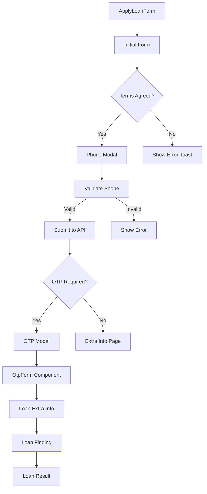

# ApplyLoanForm Component - Phase 1: Discovery & Structure

## Overview
Comprehensive analysis of the ApplyLoanForm component located at `docs/old-code/modules/ApplyLoanForm/index.tsx`. This is a sophisticated multi-step loan application form with modal overlays, API integration, and robust validation.

## File Structure
```
docs/old-code/modules/ApplyLoanForm/
├── index.tsx                 # Main component file
└── style.module.scss         # Component-specific styles
```

## Component Architecture

### Form Flow Diagram


## Dependencies

### External Libraries
- **react** & **react-dom**: Core React library
- **next/navigation**: Next.js router for navigation
- **react-toastify**: Toast notifications
- **axios**: HTTP client for API calls
- **react-select**: Select dropdown component
- **react-input-slider**: Custom slider component
- **zustand**: State management
- **md5**: MD5 hashing

### Internal Dependencies
- `@app/components/Slider`: Custom slider wrapper
- `@app/components/Button/button`: Reusable button component
- `@app/components/Modal/modal`: Modal overlay component
- `@app/components/TextInput/text-input`: Text input field
- `@app/components/SelectGroup/select-group`: Custom select dropdown
- `@app/modules/OtpForm`: OTP verification component
- `@app/states/zu-store`: Zustand stores (useLoanStore, useAppStore)
- `@app/states/zu-action`: Action context for API calls
- `@app/helpers/*`: Utility functions for validation, tracking, etc.

## API Integration

### Key API Endpoints
```javascript
- NEW_LEAD: `${BASE_API_URL}/upl/new` - Create new loan lead
- SUBMIT_OTP: `${BASE_API_URL}/otp/submit` - Verify OTP
- REQUEST_NEW_OTP: `${BASE_API_URL}/otp/renew` - Resend OTP
- SUBMIT_LEAD: `${BASE_API_URL}/upl/submit-info` - Submit additional info
- FORWARD_LEAD: `${BASE_API_URL}/upl/forward` - Forward to partner
```

### API Flow
1. **Initial Submission** (applyLoanOnHomePage)
   - Validates form data
   - Executes reCAPTCHA
   - POST to `NEW_LEAD` endpoint
   - Response determines if OTP is needed

2. **OTP Verification** (submitOtp)
   - POST to `SUBMIT_OTP` with OTP code
   - Includes JWT authorization header
   - Success navigates to extra info page

3. **Extra Info Submission** (startSubmittingAndFindingLoan)
   - POST to `SUBMIT_LEAD` with additional user data
   - Returns available loan products

## State Management

### Zustand Store Structure
```typescript
interface ILoanState {
  currentLoanStep: LOAN_STEPS;
  userData: IUserData;
  userDataValidate: IUserDataValidate;
  leadData: {
    leadId: string;
    otpStatus: OtpStatus;
    sessionToken: string;
    providers: IProvider[];
  };
  isSubmitting: boolean;
}
```

### Local Component State
```typescript
- showPhoneModal: boolean - Controls phone number modal visibility
- showOTPModal: boolean - Controls OTP modal visibility
- isAgree: boolean - Terms agreement state
- agreeStatus: "0" | "1" | "" - Radio button value
- formId: string - Unique form identifier
```

## UI Components

### Form Fields
1. **Loan Amount Slider**
   - Range: 5M - 90M VND
   - Step: 5M VND
   - Custom thumb: dollar-circle.png

2. **Loan Period Slider**
   - Range: 3 - 36 months
   - Step: 1 month
   - Custom thumb: calendar.png

3. **Loan Purpose Dropdown**
   - SelectGroup + react-select
   - Vietnamese loan purposes
   - Custom styling

4. **Terms Agreement**
   - Radio buttons (Agree/Disagree)
   - Required for submission

### Modals
1. **Phone Number Modal**
   - TextInput component
   - Vietnamese telco validation
   - Real-time feedback

2. **OTP Modal**
   - OtpForm component
   - 4-digit OTP
   - Auto-focus management

## Key Features
- Multi-step form with modal overlays
- Real-time validation
- API integration with reCAPTCHA
- State management via Zustand
- Comprehensive event tracking
- Responsive design
- Accessibility support

---
*Analysis completed: Phase 1 of 2*