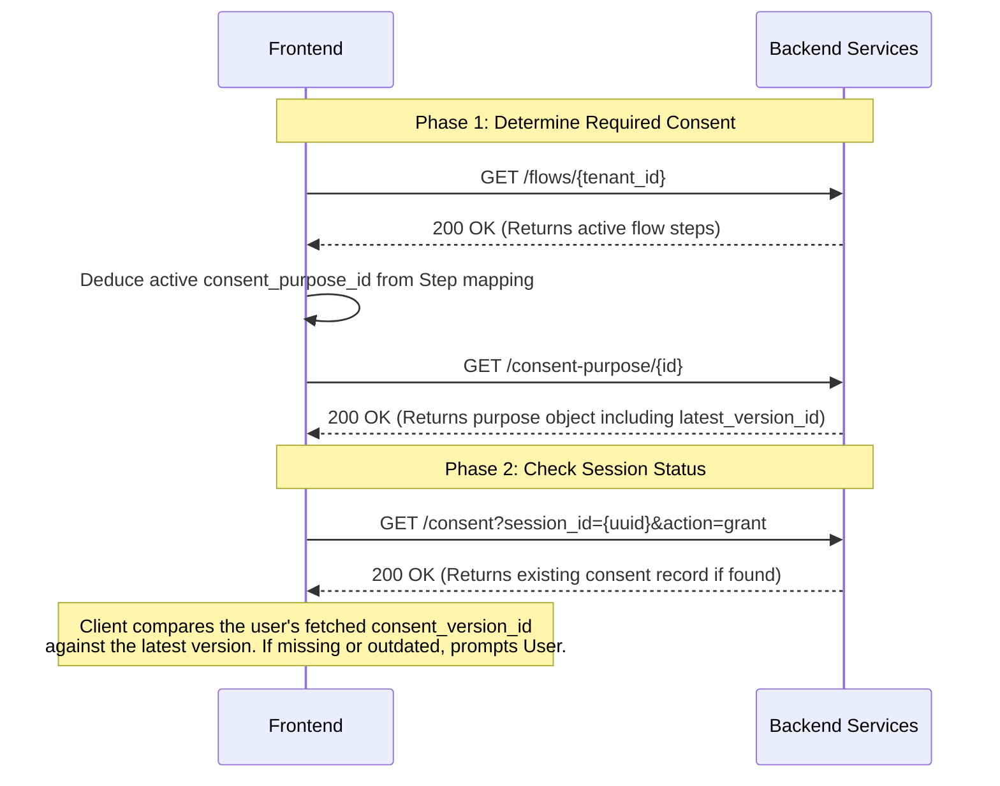
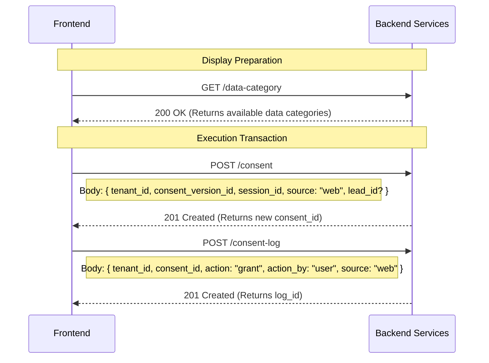
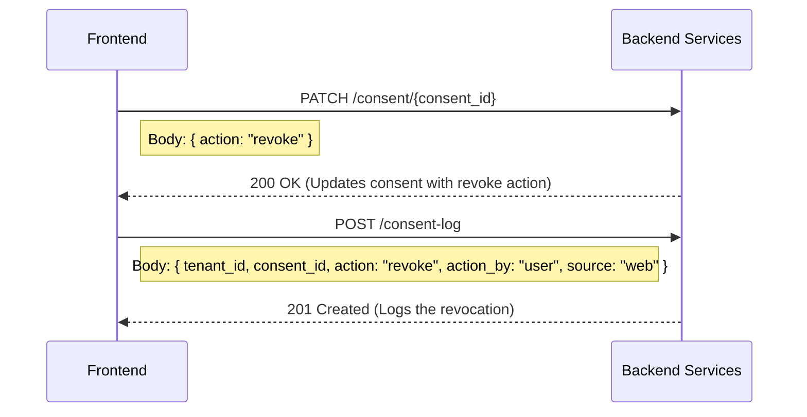

# Consent System: API Integration & Backend Flow

## 1. Initial Load & Verification Flow

When a user visits a page, the client must determine if the user needs to sign a consent agreement by resolving the required `consent_purpose_id` and checking their current status against their active `session_id`.

## 2. User Action: Agree to Terms

If the user evaluates the modal and decides to accept the terms, the frontend creates a new consent record and logs the action.

## 3. User Action: Reject / Revoke Consent

### Case A: User has existing consent and wants to revoke

If a user comes back and explicitly revokes consent (already agreed before).

### Case B: User rejects on initial prompt (no consent yet)

If user clicks "Reject" when no consent record exists, the modal simply closes with no API calls.

---
