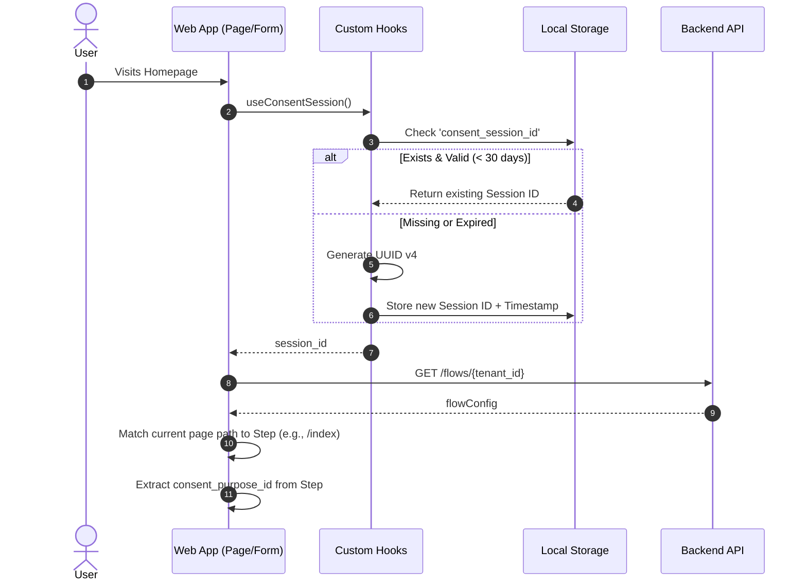
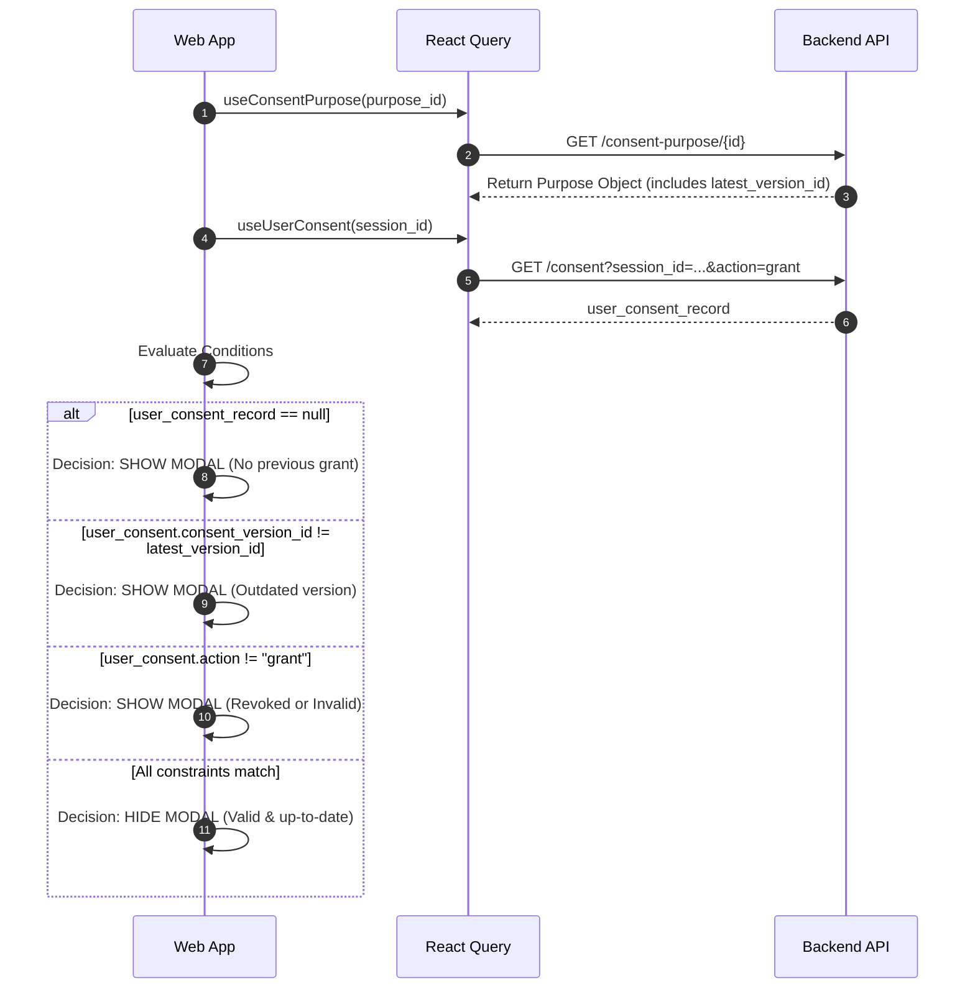
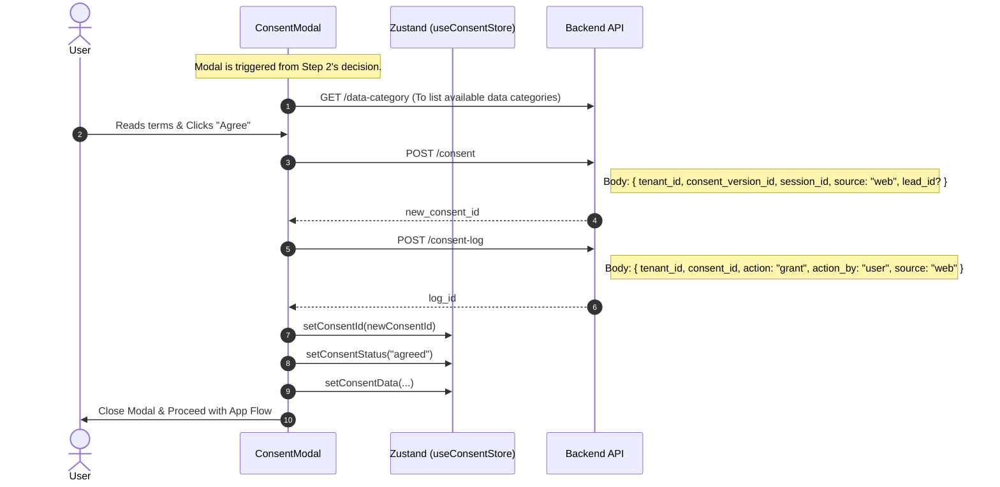
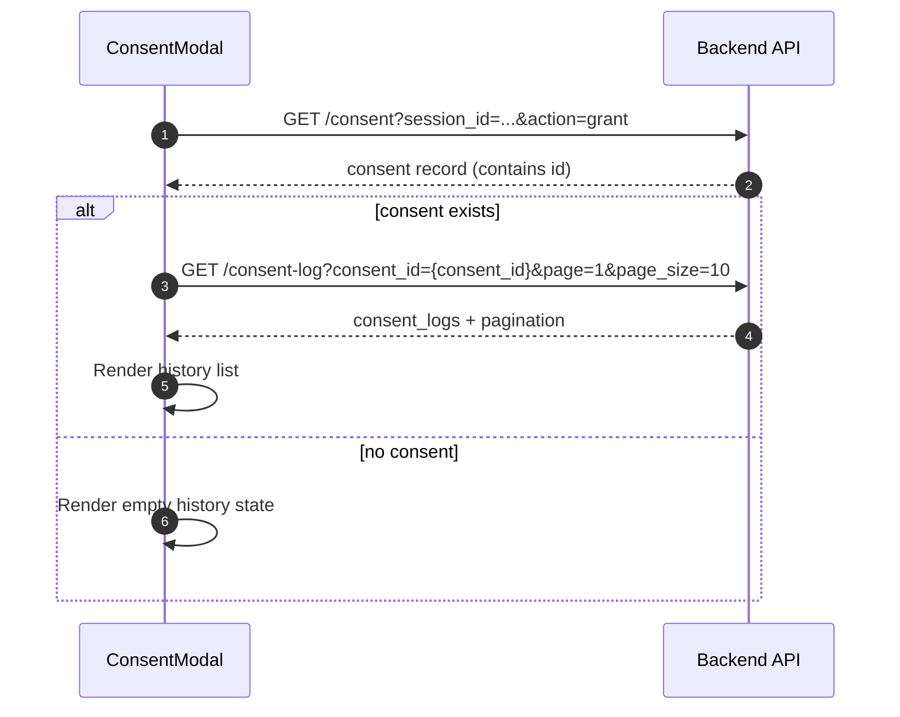

# Consent System Flow Analysis

This document describes the exact implementation of the Consent checking and tracking system inside `dop-fe` for anonymous users via Session IDs, traced directly from the source code implementation.

### High-Level Concepts
The application checks for consent using a `session_id`, bypassing the need for an authenticated user for early-stage consent agreements (like tracking cookies or terms of usage).

The decision to show the `ConsentModal` happens actively at the page or form level, specifically by cross-referencing:
1. The required **Consent Purpose** dictated by the Tenant's active Flow Step.
2. The latest **Consent Version** associated with that Consent Purpose.
3. The actual **User Consent** record tagged to the visitor's locally stored `session_id`.

---

## 1. Application Initialization 

When a user visits a generic entry point (e.g., `app/[locale]/page.tsx` or loads the `DynamicLoanForm`), a few background tasks automatically trigger in parallel via React Query hooks.

---

## 2. Consent Verification & Modal Trigger

Once the `consent_purpose_id` and `session_id` are loaded, the app evaluates whether the user has previously yielded to the exact, most recent version of this purpose.

---

## 3. User Interaction Handling (The Modal)

If the active constraints require action, `<ConsentModal />` is rendered. This modal retrieves data categories and consent terms to display the legal language, then handles user decisions.

### User Actions Breakdown

**Scenario 1: User Agrees (New Consent)**
- User has no previous consent record → Modal shown
- User clicks "Agree" → FE calls `POST /consent` (creates new record)
- FE calls `POST /consent-log` with `action: "grant"` (audit trail)
- Modal closes, app proceeds

**Scenario 2: User Rejects (When Consent Already Exists)**
- User has previous consent record (e.g., already agreed before)
- User clicks "Reject" → FE calls `PATCH /consent/{id}` with `action: "revoke"`
- FE calls `POST /consent-log` with `action: "revoke"` (audit trail)
- Modal closes

**Scenario 3: User Rejects (No Consent Yet)**
- User has no previous consent record
- User clicks "Reject" → Modal simply closes, no API calls (no record to revoke)

---

## 4. Consent History Tab (Form đồng thuận > Lịch sử đồng thuận)

The history tab can read data from `GET /consent-log`, but this endpoint currently requires `consent_id` as the filter key.

### Notes

- In current `consent.yaml`, `GET /consent-log` supports query params: `search`, `consent_id`, `action`, `page`, `page_size`.
- `session_id` and `lead_id` are not available as query filters for this endpoint in the current spec.
