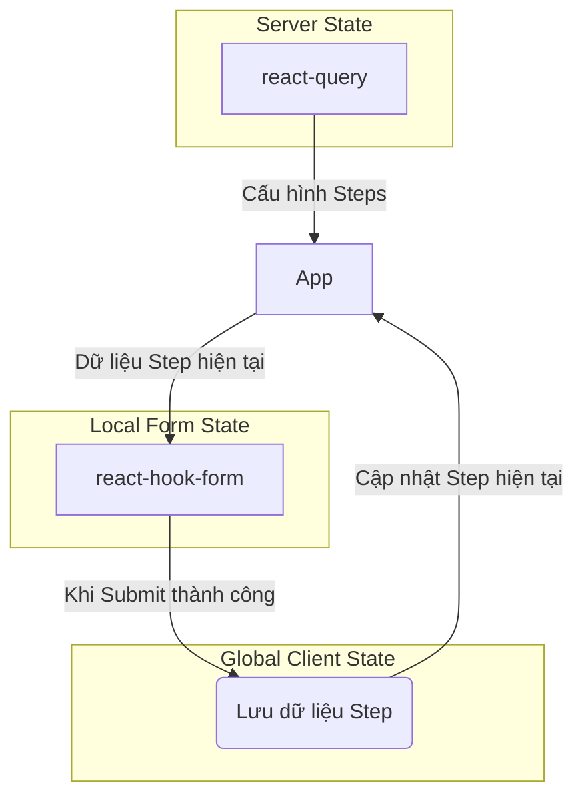

# Các Mẫu Nâng cao & Quản lý State

Tài liệu này thảo luận các chủ đề nâng cao, bao gồm cách xử lý các component phức tạp, chiến lược quản lý state cho các luồng nhiều bước, và các mẫu thiết kế khác để tăng cường sức mạnh cho kiến trúc Data-Driven UI.

## 1. Xử lý Component Phức tạp (Component Wrappers)

Không phải tất cả các component đều có API props đơn giản như `<Input />`. Một số component từ các thư viện UI (như `Select` của shadcn/ui) có cấu trúc lồng nhau và yêu cầu nhiều sub-component. Việc bắt Backend phải hiểu và gửi về cấu trúc phức tạp này là không thực tế.

**Giải pháp:** Sử dụng **Component Wrapper** (hay còn gọi là **Adapter**).

Component Wrapper là một component do bạn tự tạo, nó "bọc" lấy component phức tạp và cung cấp một API props đơn giản, phẳng (flat) hơn để tương tác.

### Ví dụ: Xử lý `Select` của shadcn/ui

**Vấn đề:** Một `Select` hoàn chỉnh cần `SelectTrigger`, `SelectValue`, `SelectContent`, `SelectItem`...

**Giải pháp:** Tạo một component `CustomSelect`.

```tsx
// src/components/wrappers/CustomSelect.tsx
import {
  Select,
  SelectContent,
  SelectItem,
  SelectTrigger,
  SelectValue,
} from "@/components/ui/select";

// Định nghĩa props đơn giản mà wrapper sẽ nhận
interface CustomSelectProps {
  options: Array<{ value: string; label: string }>;
  placeholder?: string;
  value?: string;
  onValueChange?: (value: string) => void;
}

export const CustomSelect = ({ options, placeholder, value, onValueChange }: CustomSelectProps) => {
  return (
    <Select value={value} onValueChange={onValueChange}>
      <SelectTrigger>
        <SelectValue placeholder={placeholder} />
      </SelectTrigger>
      <SelectContent>
        {options?.map(option => (
          <SelectItem key={option.value} value={option.value}>
            {option.label}
          </SelectItem>
        ))}
      </SelectContent>
    </Select>
  );
};
```

**Tích hợp vào hệ thống:**

1.  **Đăng ký Wrapper:** Đăng ký `CustomSelect` vào `ComponentRegistry.ts` thay vì `Select` gốc.

    ```typescript
    // ComponentRegistry.ts
    import { CustomSelect } from '@/components/wrappers/CustomSelect';
    
    export const ComponentRegistry = {
      // ...
      Select: CustomSelect, // <-- Sử dụng wrapper
    };
    ```

2.  **Cấu hình từ Backend:** Backend giờ đây chỉ cần gửi một cấu trúc props đơn giản.

    ```json
    {
      "fieldName": "province",
      "component": "Select", // <-- Gọi tên đã đăng ký
      "props": {
        "labelKey": "form.field.province.label",
        "placeholderKey": "form.field.province.placeholder",
        "options": [
          { "value": "hcm", "label": "Hồ Chí Minh" },
          { "value": "hn", "label": "Hà Nội" }
        ]
      }
    }
    ```

## 2. Quản lý State cho Luồng nhiều bước (Multi-step Flow)

Trong một luồng có nhiều bước, chúng ta cần quản lý nhiều loại state khác nhau. Việc phân chia rõ ràng trách nhiệm của từng công cụ là rất quan trọng.

### Các loại State

1.  **Server State (Trạng thái từ Server):**
    -   **Nội dung:** Cấu hình của các steps/fields.
    -   **Công cụ:** `@tanstack/react-query`.
    -   **Lý do:** `react-query` giúp cache, tự động fetch lại, và quản lý trạng thái loading/error một cách hiệu quả.

2.  **Global Client State (Trạng thái chung của Client):**
    -   **Nội dung:** Dữ liệu của toàn bộ luồng, ví dụ: step hiện tại là gì, dữ liệu đã submit của các step trước đó.
    -   **Công cụ:** `zustand`.
    -   **Lý do:** `zustand` nhẹ, đơn giản, và cho phép truy cập state từ bất kỳ component nào mà không cần prop-drilling.

3.  **Local Form State (Trạng thái của Form hiện tại):**
    -   **Nội dung:** Giá trị các trường, trạng thái validation, trạng thái touched/dirty của form trong step hiện tại.
    -   **Công cụ:** `react-hook-form`.
    -   **Lý do:** Đây là thư viện chuyên dụng và tối ưu nhất cho việc quản lý form phức tạp.

### Sơ đồ tương tác



### Ví dụ về `zustand` store

```typescript
// src/store/use-multi-step-form-store.ts
import { create } from 'zustand';

interface MultiStepState {
  currentStep: number;
  formData: Record<string, any>; // Lưu dữ liệu của tất cả các step
  setCurrentStep: (step: number) => void;
  updateFormData: (data: Record<string, any>) => void;
}

export const useMultiStepFormStore = create<MultiStepState>((set) => ({
  currentStep: 0,
  formData: {},
  setCurrentStep: (step) => set({ currentStep: step }),
  updateFormData: (data) => set((state) => ({
    formData: { ...state.formData, ...data },
  })),
}));
```

## 3. Mẫu nâng cao khác: Field phụ thuộc (Conditional Fields)

**Bài toán:** Hiển thị field B chỉ khi field A có một giá trị nhất định.

**Giải pháp:** Mở rộng cấu hình Backend để chứa thông tin điều kiện.

```json
{
  "fieldName": "otherReason",
  "component": "Input",
  "props": { /* ... */ },
  "condition": {
    "fieldName": "reason",
    "operator": "equals",
    "value": "other"
  }
}
```

**Triển khai ở Frontend:**

-   Trong `FormRenderer`, trước khi render `FieldRenderer`, ta kiểm tra `field.condition`.
-   Sử dụng hook `watch` của `react-hook-form` để theo dõi giá trị của field điều kiện (`reason`).
-   Chỉ render `FieldRenderer` cho `otherReason` nếu điều kiện được thỏa mãn.

```tsx
// Trong FormRenderer
const { watch } = useFormContext();
const watchedValues = watch(); // Lấy tất cả giá trị hiện tại

// ... trong vòng lặp các field
fields.map(field => {
  if (field.condition) {
    const valueOfConditionalField = watchedValues[field.condition.fieldName];
    if (valueOfConditionalField !== field.condition.value) {
      return null; // Không render field nếu điều kiện không đúng
    }
  }
  return <FieldRenderer key={field.fieldName} fieldConfig={field} />;
})
```
