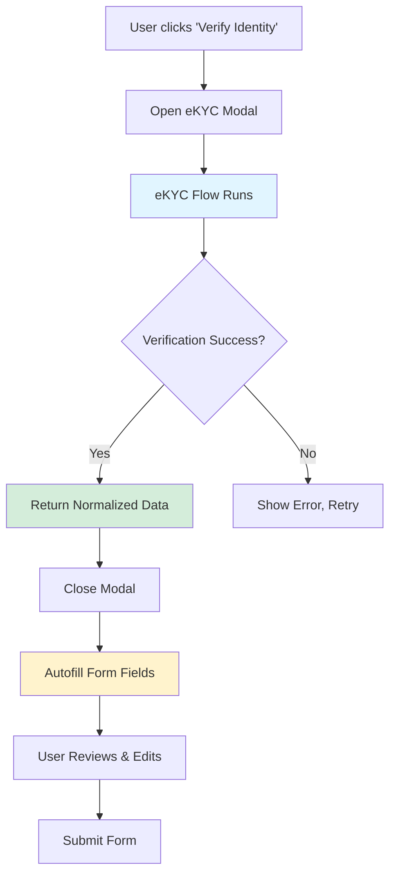

# eKYC Integration Architecture - Smart Strategy

## Executive Summary

Thiết kế kiến trúc thông minh để tích hợp eKYC vào form-generation library với các nguyên tắc:
- **Provider-Agnostic**: Dễ dàng thay đổi từ VNPT sang bất kỳ nhà cung cấp nào
- **Decoupled Flow**: Quá trình xác thực tách biệt hoàn toàn khỏi form
- **Data-Only Return**: eKYC chỉ trả về dữ liệu, form quyết định cách sử dụng
- **Declarative Configuration**: Config đơn giản như tracking system

---

## User Concerns Addressed

### ❓ "Lỡ sau này thay đổi provider không phải VNPT thì sao?"
**Giải pháp**: Abstraction Pattern với Provider Interface

```typescript
// Generic provider interface - bất kỳ provider nào cũng implement được
interface VerificationProvider {
  name: string;
  initialize(config: ProviderConfig): Promise<void>;
  startVerification(options: VerificationOptions): Promise<VerificationSession>;
  getResult(sessionId: string): Promise<VerificationResult>;
  cleanup(): void;
}

// VNPT implementation
class VNPTVerificationProvider implements VerificationProvider {
  // ... VNPT specific logic
}

// Future: Citizen ID implementation
class CitizenIDProvider implements VerificationProvider {
  // ... CitizenID specific logic
}

// Future: AWS Rekognition implementation
class AWSRekognitionProvider implements VerificationProvider {
  // ... AWS specific logic
}
```

### ❓ "Quá trình xác thực nên là 1 flow riêng, chỉ trả về dữ liệu cho form thôi đúng không?"
**Giải pháp**: Separation of Concerns - eKYC Modal → Data → Form Autofill



---

## Architecture Overview

### 1. Provider Abstraction Layer

```typescript
// ============================================================================
// Provider Interface (Provider-Agnostic)
// ============================================================================

/**
 * Normalized verification result - consistent across all providers
 */
export interface VerificationResult {
  success: boolean;
  sessionId: string;
  
  // Normalized personal data
  personalData: {
    fullName?: string;
    dateOfBirth?: string;      // ISO format
    gender?: "male" | "female" | "other";
    nationality?: string;
    idNumber?: string;
    
    // Address
    address?: {
      fullAddress?: string;
      city?: string;
      district?: string;
      ward?: string;
      street?: string;
    };
    
    // Document info
    documentType?: string;
    issuedDate?: string;       // ISO format
    expiryDate?: string;       // ISO format
    issuedBy?: string;
  };
  
  // Verification metadata
  verificationData: {
    confidence: number;          // 0-100
    livenessScore?: number;      // 0-100
    faceMatchScore?: number;     // 0-100
    documentQuality?: number;    // 0-100
    fraudDetection?: {
      isAuthentic: boolean;
      riskScore: number;
    };
  };
  
  // Raw provider data (for audit/debugging)
  rawData?: unknown;
  
  // Timestamps
  startedAt: string;
  completedAt: string;
}

/**
 * Generic provider interface
 */
export interface VerificationProvider {
  readonly name: string;
  readonly version: string;
  
  initialize(config: ProviderConfig): Promise<void>;
  startVerification(options: VerificationOptions): Promise<VerificationSession>;
  getStatus(sessionId: string): Promise<VerificationStatus>;
  getResult(sessionId: string): Promise<VerificationResult>;
  cleanup(): Promise<void>;
}

/**
 * Provider configuration
 */
export interface ProviderConfig {
  apiKey?: string;
  apiUrl?: string;
  environment: "development" | "staging" | "production";
  language?: string;
  customOptions?: Record<string, any>;
}

/**
 * Verification options
 */
export interface VerificationOptions {
  documentType?: string;       // CCCD, CMND, Passport, etc.
  flowType?: string;           // DOCUMENT_TO_FACE, FACE_TO_DOCUMENT
  enableLiveness?: boolean;
  enableFaceMatch?: boolean;
  metadata?: Record<string, any>;
}
```

### 2. Integration with Form System

**Concept**: eKYC Field Type với trigger button

```typescript
// ============================================================================
// Form Field Type: EKYC
// ============================================================================

export interface EkycFieldConfig extends BaseFieldConfig {
  type: FieldType.EKYC;
  
  /**
   * eKYC verification configuration
   */
  verification?: {
    /**
     * Which provider to use
     */
    provider: "vnpt" | "citizenid" | "custom";
    
    /**
     * Provider-specific options
     */
    providerOptions?: VerificationOptions;
    
    /**
     * Which fields to autofill after verification
     */
    autofillMapping: {
      [targetFieldId: string]: keyof VerificationResult["personalData"] | string;
    };
    
    /**
     * Callback when verification completes
     */
    onVerified?: (result: VerificationResult) => void;
    
    /**
     * Custom verification button text
     */
    buttonText?: string;
    
    /**
     * Require verification before form submission
     */
    required?: boolean;
  };
}
```

**Usage Example**:

```typescript
// Loan Wizard with eKYC integration
const wizardConfig: DynamicFormConfig = {
  id: "loan-application-wizard",
  steps: [
    {
      id: "personal",
      fields: [
        // eKYC verification field
        {
          id: "identity_verification",
          name: "identity_verification",
          type: FieldType.EKYC,
          label: "Xác thực danh tính",
          verification: {
            provider: "vnpt",
            providerOptions: {
              documentType: "CCCD_CHIP",
              flowType: "DOCUMENT_TO_FACE",
              enableLiveness: true,
              enableFaceMatch: true,
            },
            // Auto-fill these fields after verification
            autofillMapping: {
              "full_name": "fullName",
              "national_id": "idNumber",
              "date_of_birth": "dateOfBirth",
              "address": "address.fullAddress",
              "province": "address.city",
            },
            onVerified: (result) => {
              // Track verification success
              trackEvent("ekyc_verification_success", {
                confidence: result.verificationData.confidence,
                provider: "vnpt",
              });
            },
          },
        },
        
        // These fields will be auto-filled
        {
          id: "full_name",
          type: FieldType.TEXT,
          label: "Họ và tên",
          readOnly: true, // Lock after eKYC
        },
        {
          id: "national_id",
          type: FieldType.TEXT,
          label: "Số CCCD",
          readOnly: true,
        },
        // ... other fields
      ],
    },
  ],
};
```

---

## Implementation Plan

### Phase 1: Provider Abstraction

**Files to Create**:
- `src/lib/verification/types.ts` - Provider interfaces
- `src/lib/verification/providers/vnpt-provider.ts` - VNPT adapter
- `src/lib/verification/providers/index.ts` - Provider registry
- `src/lib/verification/manager.ts` - Verification manager

**Key Component**:
```typescript
// src/lib/verification/manager.ts
export class VerificationManager {
  private providers = new Map<string, VerificationProvider>();
  
  registerProvider(name: string, provider: VerificationProvider) {
    this.providers.set(name, provider);
  }
  
  async verify(
    providerName: string,
    options: VerificationOptions
  ): Promise<VerificationResult> {
    const provider = this.providers.get(providerName);
    if (!provider) throw new Error(`Provider ${providerName} not found`);
    
    const session = await provider.startVerification(options);
    return await provider.getResult(session.id);
  }
}
```

### Phase 2: Form Integration

**Files to Create/Modify**:
- `src/components/form-generation/fields/EkycField.tsx` - New field type
- [src/components/form-generation/types.ts](file:///Users/trung.ngo/Documents/projects/dop-fe/src/components/form-generation/types.ts) - Add `EkycFieldConfig`
- [src/components/form-generation/factory/FieldFactory.tsx](file:///Users/trung.ngo/Documents/projects/dop-fe/src/components/form-generation/factory/FieldFactory.tsx) - Register EKYC type

**EkycField Component**:
```typescript
export function EkycField({
  field,
  value,
  onChange,
}: FieldComponentProps<EkycFieldConfig>) {
  const [isVerifying, setIsVerifying] = useState(false);
  const [result, setResult] = useState<VerificationResult | null>(null);
  
  const handleVerify = async () => {
    setIsVerifying(true);
    
    try {
      // Open modal, run verification
      const result = await verificationManager.verify(
        field.verification.provider,
        field.verification.providerOptions
      );
      
      setResult(result);
      
      // Autofill mapped fields
      if (result.success && field.verification.autofillMapping) {
        autofillFields(result, field.verification.autofillMapping);
      }
      
      // Call callback
      field.verification.onVerified?.(result);
      
      // Update field value (store verification status)
      onChange({
        verified: true,
        sessionId: result.sessionId,
        confidence: result.verificationData.confidence,
      });
    } catch (error) {
      // Handle error
    } finally {
      setIsVerifying(false);
    }
  };
  
  return (
    <div>
      {!result && (
        <Button onClick={handleVerify} disabled={isVerifying}>
          {field.verification.buttonText || "Xác thực danh tính"}
        </Button>
      )}
      
      {result && (
        <VerificationResult result={result} />
      )}
    </div>
  );
}
```

### Phase 3: VNPT Provider Adapter

**Wrap existing eKYC code into provider interface**:

```typescript
// src/lib/verification/providers/vnpt-provider.ts
export class VNPTVerificationProvider implements VerificationProvider {
  name = "vnpt";
  version = "3.2.0";
  
  private sdkManager: EkycSdkManager;
  
  async initialize(config: ProviderConfig): Promise<void> {
    this.sdkManager = EkycSdkManager.getInstance();
    await this.sdkManager.initialize({
      authToken: config.apiKey,
      backendUrl: config.apiUrl,
      // ... other VNPT config
    });
  }
  
  async startVerification(
    options: VerificationOptions
  ): Promise<VerificationSession> {
    // Use existing EkycDialog/SDK
    const result = await this.sdkManager.startFlow({
      flowType: options.flowType,
      documentType: options.documentType,
      // ... map generic options to VNPT options
    });
    
    return {
      id: result.sessionId,
      status: "processing",
    };
  }
  
  async getResult(sessionId: string): Promise<VerificationResult> {
    const vnptResult = await this.sdkManager.getResult(sessionId);
    
    // Transform VNPT data to normalized format
    return this.normalizeVNPTResult(vnptResult);
  }
  
  private normalizeVNPTResult(vnptData: any): VerificationResult {
    return {
      success: vnptData.code === 200,
      sessionId: vnptData.sessionId,
      personalData: {
        fullName: vnptData.ocr?.object?.name,
        dateOfBirth: convertVietnameseDateToISO(
          vnptData.ocr?.object?.birth_day
        ),
        idNumber: vnptData.ocr?.object?.id,
        // ... map other fields
      },
      verificationData: {
        confidence: vnptData.ocr?.object?.confidence || 0,
        faceMatchScore: vnptData.compare?.similarity_score || 0,
        livenessScore: vnptData.liveness_face?.confidence || 0,
      },
      rawData: vnptData, // Keep original for audit
      startedAt: new Date().toISOString(),
      completedAt: new Date().toISOString(),
    };
  }
}
```

---

## Benefits of This Architecture

### 🔌 Provider Independence
- Switch from VNPT → CitizenID → AWS chỉ cần thay config
- Không cần sửa code form
- A/B test nhiều providers dễ dàng

### 🎯 Separation of Concerns
- eKYC flow tách biệt hoàn toàn
- Form chỉ nhận normalized data
- Dễ test từng phần riêng biệt

### 📝 Declarative & Clean
- Config như tracking system
- Autofill tự động
- Không cần viết logic ở form layer

### 🔒 Security Maintained
- Provider handle encryption riêng
- Form chỉ nhận clean data
- Audit trail đầy đủ

### 🚀 Future-Proof
- Dễ add providers mới
- Support multiple providers cùng lúc
- Extensible cho custom logic

---

## Migration Path (Existing eKYC → New Architecture)

### Step 1: Wrap Current VNPT Code
```typescript
// Keep existing code in lib/ekyc/
// Just add adapter layer
const vnptProvider = new VNPTVerificationProvider();
verificationManager.registerProvider("vnpt", vnptProvider);
```

### Step 2: Update Forms Gradually
```typescript
// Old way (still works)
import { useEkycAutofill } from '@/hooks/features/ekyc/use-autofill';

// New way (recommended)
<EkycField
  verification={{
    provider: "vnpt",
    autofillMapping: { ... }
  }}
/>
```

### Step 3: Documentation for Future Providers

**Purpose**: Hướng dẫn developers tự implement provider mới

**Documentation Required**:
1. **Provider Interface Guide**: Giải thích từng method trong `VerificationProvider`
2. **Data Normalization Guide**: Cách map provider-specific data → `VerificationResult`
3. **Testing Checklist**: Unit tests, integration tests cho provider
4. **Examples**: Template code cho common providers (CitizenID, AWS Rekognition)
5. **Best Practices**: Security, error handling, retry logic

**Notes**:
- Chỉ cần documentation, không implement code
- Developers tự implement khi có nhu cầu
- Keep interface stable, don't break backward compatibility

---

## Field Structure Configuration

### Configurable Rendering Modes

Developers có thể chọn cách render eKYC phù hợp với UI/UX của họ:

```typescript
export interface EkycFieldConfig extends BaseFieldConfig {
  type: FieldType.EKYC;
  
  /**
   * Rendering mode - developer chọn UI pattern phù hợp
   */
  renderMode?: "button" | "inline" | "modal" | "custom";
  
  verification: {
    // ... verification config
  };
  
  /**
   * Custom render function (for renderMode: "custom")
   */
  customRender?: (props: EkycRenderProps) => ReactNode;
}
```

### Mode Options

#### 1. Button Mode (Default)
```typescript
{
  id: "verify_identity",
  type: FieldType.EKYC,
  renderMode: "button", // Default
  verification: {
    provider: "vnpt",
    buttonText: "Xác thực danh tính",
    autofillMapping: { ... }
  }
}
```
**Use case**: Standard verification flow, clean UI

#### 2. Inline Mode
```typescript
{
  id: "verify_identity",
  type: FieldType.EKYC,
  renderMode: "inline",
  verification: {
    provider: "vnpt",
    showProgress: true,
    showResultPreview: true,
    autofillMapping: { ... }
  }
}
```
**Use case**: Embedded flow, wizard-style UI

#### 3. Modal Mode
```typescript
{
  id: "verify_identity",
  type: FieldType.EKYC,
  renderMode: "modal",
  verification: {
    provider: "vnpt",
    modalTitle: "Xác thực danh tính điện tử",
    modalSize: "lg",
    autofillMapping: { ... }
  }
}
```
**Use case**: Overlay experience, không làm gián đoạn form

#### 4. Custom Mode
```typescript
{
  id: "verify_identity",
  type: FieldType.EKYC,
  renderMode: "custom",
  customRender: ({ startVerification, result, isVerifying }) => (
    <MyCustomVerificationUI
      onVerify={startVerification}
      status={result}
      loading={isVerifying}
    />
  ),
  verification: {
    provider: "vnpt",
    autofillMapping: { ... }
  }
}
```
**Use case**: Fully custom UI/UX design

### Configuration in Theme

Developers cũng có thể set default mode ở theme level:

```typescript
// Theme configuration
export const myAppTheme: FormTheme = {
  ...defaultTheme,
  ekyc: {
    defaultRenderMode: "modal",
    defaultProvider: "vnpt",
    // ... other defaults
  }
};
```

---

## Detailed Implementation Checklist

### Phase 1: Provider Abstraction (3-4 hours)

#### Task 1.1: Create Type Definitions
**File**: `src/lib/verification/types.ts`

- [ ] Define `VerificationResult` interface
- [ ] Define `VerificationProvider` interface
- [ ] Define `ProviderConfig` interface
- [ ] Define `VerificationOptions` interface
- [ ] Define `VerificationSession` interface
- [ ] Define `VerificationStatus` enum
- [ ] Add JSDoc comments for all types

#### Task 1.2: Create Verification Manager
**File**: `src/lib/verification/manager.ts`

- [ ] Implement `VerificationManager` class
- [ ] Add `registerProvider()` method
- [ ] Add `verify()` method
- [ ] Add `getProvider()` method
- [ ] Add singleton pattern
- [ ] Add error handling for missing providers
- [ ] Add TypeScript strict mode compliance

#### Task 1.3: Create Provider Registry
**File**: `src/lib/verification/providers/index.ts`

- [ ] Export provider base interfaces
- [ ] Create provider factory pattern
- [ ] Add provider validation logic

---

### Phase 2: VNPT Provider Adapter (4-5 hours)

#### Task 2.1: Create VNPT Provider Class
**File**: `src/lib/verification/providers/vnpt-provider.ts`

- [ ] Create `VNPTVerificationProvider` class
- [ ] Implement `initialize()` method
  - [ ] Wrap `EkycSdkManager.initialize()`
  - [ ] Map generic config → VNPT config
  - [ ] Handle SDK loading
- [ ] Implement `startVerification()` method
  - [ ] Trigger existing eKYC flow
  - [ ] Return session ID
- [ ] Implement `getResult()` method
  - [ ] Wait for SDK result
  - [ ] Call normalization function
- [ ] Implement `getStatus()` method
- [ ] Implement `cleanup()` method

#### Task 2.2: Create Data Normalizer
**File**: `src/lib/verification/providers/vnpt-normalizer.ts`

- [ ] Create `normalizeVNPTResult()` function
- [ ] Map OCR data → `personalData`
  - [ ] Map `name` → [fullName](file:///Users/trung.ngo/Documents/projects/dop-fe/docs/old-code/modules/LoanExtraInfoForm/index.tsx#98-116)
  - [ ] Map `birth_day` → `dateOfBirth` (ISO format)
  - [ ] Map `gender` → `gender` (enum)
  - [ ] Map [id](file:///Users/trung.ngo/Documents/projects/dop-fe/src/components/form-generation/registry/ComponentRegistry.ts#71-86) → `idNumber`
  - [ ] Map address fields
  - [ ] Map document fields
- [ ] Map verification scores → `verificationData`
  - [ ] Extract confidence score
  - [ ] Extract liveness score
  - [ ] Extract face match score
  - [ ] Extract document quality
- [ ] Preserve raw data for audit
- [ ] Add unit tests for normalizer

#### Task 2.3: Update Existing eKYC Code
**Files**: `src/lib/ekyc/*.ts`

- [ ] **NO BREAKING CHANGES** - keep existing API
- [ ] Add adapter layer on top
- [ ] Export both old API and new provider
- [ ] Add deprecation warnings (optional)

---

### Phase 3: Form Integration (5-6 hours)

#### Task 3.1: Update Type Definitions
**File**: [src/components/form-generation/types.ts](file:///Users/trung.ngo/Documents/projects/dop-fe/src/components/form-generation/types.ts)

- [ ] Add `FieldType.EKYC` to enum
- [ ] Define `EkycFieldConfig` interface
  - [ ] Add `renderMode` property
  - [ ] Add `verification` object
  - [ ] Add `customRender` function
- [ ] Define `EkycRenderProps` interface
- [ ] Add to `AnyFieldConfig` union type

#### Task 3.2: Create EkycField Component
**File**: `src/components/form-generation/fields/EkycField.tsx`

- [ ] Create base `EkycField` component
- [ ] Implement render mode switch
  - [ ] Button mode component
  - [ ] Inline mode component
  - [ ] Modal mode component
  - [ ] Custom mode wrapper
- [ ] Add verification state management
  - [ ] `isVerifying` state
  - [ ] `result` state
  - [ ] `error` state
- [ ] Implement `handleVerify()` function
  - [ ] Call `VerificationManager.verify()`
  - [ ] Handle success
  - [ ] Handle error
  - [ ] Call autofill
  - [ ] Call callbacks
- [ ] Add loading states
- [ ] Add error display
- [ ] Add success display
- [ ] Make component memoized

#### Task 3.3: Create Autofill Logic
**File**: `src/components/form-generation/hooks/useEkycAutofill.ts`

- [ ] Create `useEkycAutofill` hook
- [ ] Implement field mapping logic
  - [ ] Parse `autofillMapping` config
  - [ ] Get values from `VerificationResult`
  - [ ] Support nested paths (e.g., `address.city`)
  - [ ] Transform data if needed
- [ ] Update form state via [DynamicForm](file:///Users/trung.ngo/Documents/projects/dop-fe/src/components/form-generation/types.ts#727-807) context
- [ ] Add validation after autofill
- [ ] Add tracking for autofill events

#### Task 3.4: Update FieldFactory
**File**: [src/components/form-generation/factory/FieldFactory.tsx](file:///Users/trung.ngo/Documents/projects/dop-fe/src/components/form-generation/factory/FieldFactory.tsx)

- [ ] Register `EKYC` field type
- [ ] Import `EkycField` component
- [ ] Add to component map
- [ ] Handle eKYC-specific props

#### Task 3.5: Update Theme System
**File**: [src/components/form-generation/themes/types.ts](file:///Users/trung.ngo/Documents/projects/dop-fe/src/components/form-generation/themes/types.ts)

- [ ] Add `ekyc` property to [FormTheme](file:///Users/trung.ngo/Documents/projects/dop-fe/src/components/form-generation/themes/types.ts#10-79)
- [ ] Define eKYC theme options
  - [ ] Default render mode
  - [ ] Default provider
  - [ ] Button styles
  - [ ] Modal styles
  - [ ] Result display styles

---

### Phase 4: UI Components (3-4 hours)

#### Task 4.1: Verification Button Component
**File**: `src/components/form-generation/fields/ekyc/VerificationButton.tsx`

- [ ] Create button component
- [ ] Add loading spinner
- [ ] Add icon (shield/checkmark)
- [ ] Support theme styling
- [ ] Add accessibility attributes

#### Task 4.2: Verification Result Display
**File**: `src/components/form-generation/fields/ekyc/VerificationResult.tsx`

- [ ] Create result component
- [ ] Show success state
  - [ ] Checkmark icon
  - [ ] Confidence score
  - [ ] Verified data preview
- [ ] Show error state
  - [ ] Error icon
  - [ ] Error message
  - [ ] Retry button
- [ ] Add animations

#### Task 4.3: Verification Modal
**File**: `src/components/form-generation/fields/ekyc/VerificationModal.tsx`

- [ ] Create modal wrapper
- [ ] Embed existing `EkycDialog` component
- [ ] Add header/footer
- [ ] Add close handling
- [ ] Add keyboard shortcuts (ESC)
- [ ] Add backdrop click handling

---

### Phase 5: Testing (4-5 hours)

#### Task 5.1: Unit Tests

**Provider Tests** (`src/lib/verification/__tests__/vnpt-provider.test.ts`):
- [ ] Test provider initialization
- [ ] Test verification flow
- [ ] Test data normalization
- [ ] Test error handling
- [ ] Test cleanup

**Normalizer Tests** (`src/lib/verification/__tests__/vnpt-normalizer.test.ts`):
- [ ] Test date conversion
- [ ] Test address mapping
- [ ] Test gender mapping
- [ ] Test edge cases (missing data)

**Field Tests** (`src/components/form-generation/fields/__tests__/EkycField.test.tsx`):
- [ ] Test render modes
- [ ] Test verification trigger
- [ ] Test autofill
- [ ] Test error states
- [ ] Test callbacks

#### Task 5.2: Integration Tests

**End-to-End Flow** (`src/components/form-generation/__tests__/ekyc-integration.test.tsx`):
- [ ] Test full verification → autofill flow
- [ ] Test form submission with eKYC data
- [ ] Test validation after autofill
- [ ] Test multiple eKYC fields

#### Task 5.3: Manual Testing

- [ ] Test in Loan Wizard
- [ ] Test all render modes
- [ ] Test error scenarios
- [ ] Test on mobile
- [ ] Test accessibility (screen reader)

---

### Phase 6: Documentation (2-3 hours)

#### Task 6.1: Developer Guide
**File**: `docs/form-generation/ekyc-integration.md`

- [ ] Overview of eKYC system
- [ ] Provider architecture explanation
- [ ] Usage examples for each render mode
- [ ] Autofill mapping guide
- [ ] Theme customization guide
- [ ] Troubleshooting section

#### Task 6.2: Provider Implementation Guide
**File**: `docs/form-generation/custom-provider-guide.md`

- [ ] `VerificationProvider` interface reference
- [ ] Data normalization guidelines
- [ ] Testing requirements
- [ ] Security best practices
- [ ] Example provider template

#### Task 6.3: Migration Guide
**File**: `docs/form-generation/ekyc-migration.md`

- [ ] Old API → New API mapping
- [ ] Step-by-step migration steps
- [ ] Breaking changes (if any)
- [ ] Backward compatibility notes

#### Task 6.4: API Reference
**File**: `docs/form-generation/api/ekyc-field.md`

- [ ] `EkycFieldConfig` reference
- [ ] All properties documented
- [ ] Code examples
- [ ] Type signatures

---

### Phase 7: Migration & Deployment (2-3 hours)

#### Task 7.1: Update Existing Forms

- [ ] Identify all forms using old eKYC
- [ ] Create migration PRs
- [ ] Add feature flags (if needed)
- [ ] Test each migrated form

#### Task 7.2: Deprecation Strategy

- [ ] Add deprecation warnings to old API
- [ ] Set deprecation timeline (e.g., 3 months)
- [ ] Notify team/stakeholders
- [ ] Update CHANGELOG

#### Task 7.3: Monitoring

- [ ] Add analytics for eKYC usage
- [ ] Track success/failure rates
- [ ] Monitor performance metrics
- [ ] Set up alerts for errors

---

## Testing Strategy

### Unit Tests Coverage
- Provider abstraction: 100%
- Data normalization: 100%
- Field component: 90%+
- Autofill logic: 100%

### Integration Tests
- Full verification flow: ✅
- Multiple providers: ✅
- Form submission: ✅
- Error recovery: ✅

### E2E Tests
- Loan Wizard flow: ✅
- Mobile experience: ✅
- Accessibility: ✅

---

## Migration Guide for Developers

### Before (Old API)
```typescript
import { useEkycAutofill } from '@/hooks/features/ekyc/use-autofill';
import { EkycDialog } from '@/components/ekyc/ekyc-dialog';

function MyForm() {
  const [showEkyc, setShowEkyc] = useState(false);
  const { formData } = useEkycAutofill(ekycResult);
  
  return (
    <>
      <Button onClick={() => setShowEkyc(true)}>Verify</Button>
      <EkycDialog open={showEkyc} onClose={() => setShowEkyc(false)} />
      <TextField value={formData.fullName} />
    </>
  );
}
```

### After (New API)
```typescript
const formConfig: DynamicFormConfig = {
  fields: [
    {
      id: "verify_identity",
      type: FieldType.EKYC,
      renderMode: "button", // Choose your mode!
      verification: {
        provider: "vnpt",
        autofillMapping: {
          "full_name": "fullName",
        }
      }
    },
    {
      id: "full_name",
      type: FieldType.TEXT,
      readOnly: true,
    }
  ]
};
```

### Benefits of New API
- ✅ 80% less boilerplate code
- ✅ Declarative configuration
- ✅ Provider independence
- ✅ Better type safety
- ✅ Automatic autofill
- ✅ Built-in error handling

---

**Status**: 🟡 PENDING USER APPROVAL
**Estimated Effort**: Medium (3-4 days)
**Risk**: Low (backward compatible, gradual migration)
