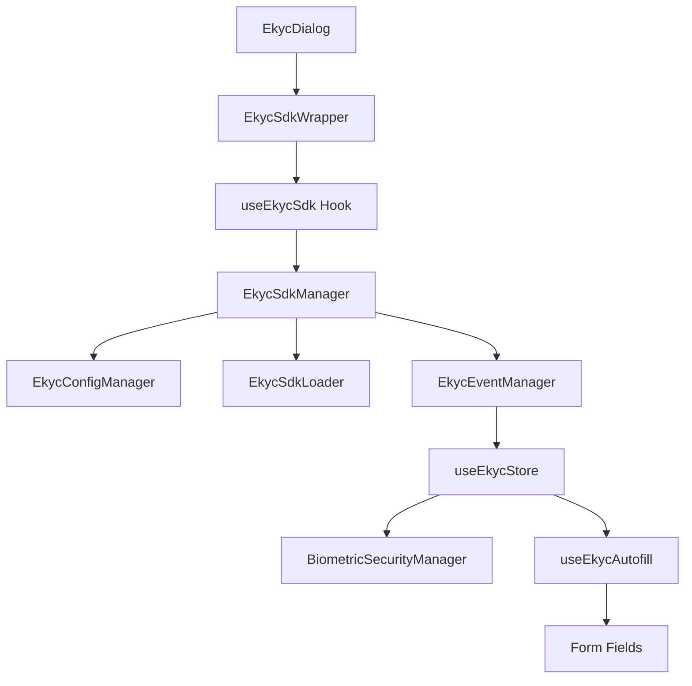

# Phase 1: Discovery & Structure - eKYC Analysis

## Overview
This document captures the discovery phase of exploring the eKYC (electronic Know Your Customer) functionality in the application. The eKYC system is built as a comprehensive integration with VNPT's eKYC SDK, providing Vietnamese identity verification capabilities.

## File Inventory

### Core eKYC Library (`/src/lib/ekyc/`)
- **types.ts** - TypeScript interfaces for all eKYC data structures
- **index.ts** - Main exports and public API
- **sdk-manager.ts** - Main orchestrator for VNPT eKYC SDK integration
- **sdk-config.ts** - Centralized configuration builder
- **sdk-loader.ts** - Handles loading of SDK assets
- **sdk-events.ts** - Event management system
- **config-manager.ts** - Manages credentials and environment configs
- **ekyc-data-mapper.ts** - Maps eKYC results to form data
- **document-types.ts** - Vietnamese document type definitions and validation
- **__test-mapper.ts** - Test utility for data mapper

### Components (`/src/components/`)
- **ekyc/ekyc-dialog.tsx** - Modal dialog for eKYC process
- **ekyc/ekyc-progress.tsx** - Progress indicator component
- **ekyc/ekyc-result-display.tsx** - Results display component
- **features/ekyc/ekyc-sdk-wrapper.tsx** - React wrapper for SDK
- **features/ekyc/ekyc-example.tsx** - Demo component
- **wrappers/CustomEkyc.tsx** - Custom wrapper component

### State Management (`/src/store/`)
- **use-ekyc-store.ts** - Zustand store for eKYC state with biometric security

### Hooks (`/src/hooks/`)
- **features/ekyc/use-sdk.ts** - React hook for SDK integration
- **features/ekyc/use-autofill.ts** - Hook for form autofill from eKYC data

### Security (`/src/lib/security/`)
- **biometric-security.ts** - Client-side encryption for biometric data
- **file-validation.ts** - File upload security validation

## Architecture

### Layered Architecture
```
┌─────────────────────────────────────────┐
│           UI Components                │
│  (EkycDialog, EkycSdkWrapper, etc.)   │
├─────────────────────────────────────────┤
│            React Hooks                 │
│     (useEkycSdk, useEkycAutofill)     │
├─────────────────────────────────────────┤
│          State Management              │
│         (useEkycStore)                │
├─────────────────────────────────────────┤
│         eKYC Library Core              │
│  (SdkManager, ConfigManager, etc.)    │
├─────────────────────────────────────────┤
│        VNPT eKYC SDK (External)        │
│    (web-sdk-version-3.2.0.0.js)      │
└─────────────────────────────────────────┘
```

### Data Flow
1. **Initialization**: ConfigManager loads credentials from environment or API
2. **SDK Loading**: EkycSdkLoader dynamically loads VNPT SDK assets
3. **Configuration**: EkycConfigBuilder creates configuration with callbacks
4. **Execution**: EkycSdkManager orchestrates the verification flow
5. **Result Processing**: Data maps to form format and stores securely
6. **UI Updates**: Components react to state changes and display results

## Key Features

### Supported Document Types
- **CCCD_CHIP**: Chip-based Citizen ID (12 digits)
- **CCCD_NO_CHIP**: Citizen ID Card without chip
- **CMND_12**: 12-digit National ID Card
- **CMND_9**: 9-digit National ID Card (legacy)
- **PASSPORT**: Vietnamese Passport
- **DRIVER_LICENSE**: Driver's License
- **MILITARY_ID**: Military Identity Card
- **HEALTH_INSURANCE**: Health Insurance Card

### Verification Flow Types
- **DOCUMENT_TO_FACE**: Document scan → Face verification
- **FACE_TO_DOCUMENT**: Face verification → Document scan
- **DOCUMENT**: Document OCR only
- **FACE**: Face verification only

### Security Features
- AES-256-GCM encryption for biometric data
- Session-based data retention (30 minutes)
- Vietnamese Decree 13/2023 compliance
- File validation with magic number detection
- Malicious content scanning
- GPS/metadata stripping for privacy

## Third-Party Integrations

### VNPT eKYC SDK
- **Location**: `/public/web-sdk-version-3.2.0.0.js`
- **Version**: 3.2.0.0
- **Additional libraries**: QR scanner, Browser SDK
- **API endpoint**: `https://api.idg.vnpt.vn`

## Component Relationships



## Integration Points

### With Onboarding Flow
- **Location**: `src/components/onboarding/ConfirmationStep.tsx`
- **Purpose**: Auto-fill user data from eKYC verification
- **Implementation**: Uses `useEkycAutofill` hook to populate forms

### With User Management
- **Field Builders**: `src/components/user-onboarding/builders/identity-fields.ts`
- **Form Integration**: Maps OCR data to form fields (fullName, dateOfBirth, address, etc.)

## Security Considerations

### Positive Security Measures
- ✅ Client-side encryption for biometric data
- ✅ Session-based data expiration
- ✅ File signature validation
- ✅ Malicious content scanning
- ✅ Vietnamese data protection compliance
- ✅ Audit logging for all operations
- ✅ Secure credential management

### Areas of Attention
- ⚠️ SDK loaded from external CDN (consider hosting locally)
- ⚠️ Auth tokens in environment variables (ensure proper protection)
- ⚠️ Biometric data stored in memory during session (acceptable trade-off)

## Configuration

### Environment Variables
```bash
NEXT_PUBLIC_EKYC_AUTH_TOKEN    # Main authentication token
NEXT_PUBLIC_EKYC_BACKEND_URL   # API backend URL
NEXT_PUBLIC_EKYC_TOKEN_KEY     # Token encryption key
NEXT_PUBLIC_EKYC_TOKEN_ID      # Token identifier
```

### Runtime Configuration
- Flow types and document types configurable
- Language support (Vietnamese, English)
- UI theming options
- API endpoint toggles

## Test Coverage
- Unit tests for data mapper (`__test-mapper.ts`)
- Integration example component (`ekyc-example.tsx`)
- Test data files (`docs/log.json`, `docs/log-callback.json`)

---

*Phase 1 Complete - Proceeding to Phase 2 for detailed code analysis*