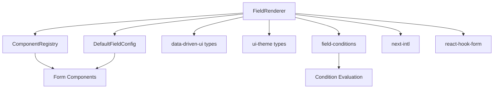
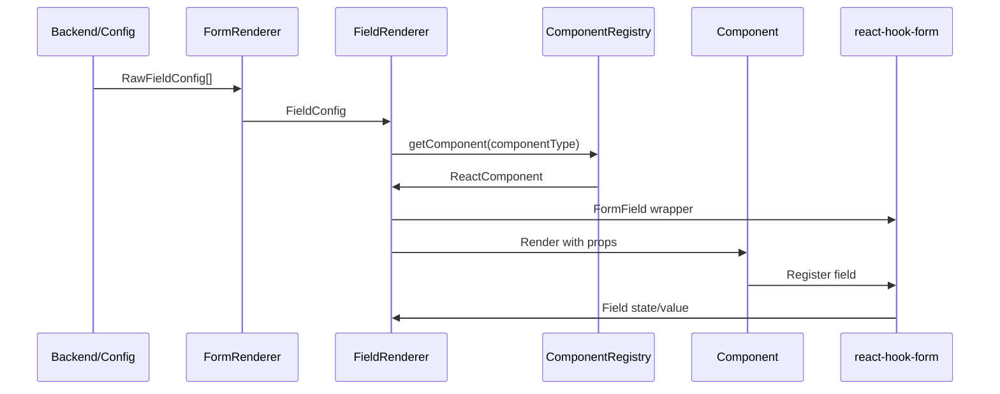

# Phase 2: Structure Analysis - FieldRenderer

**Date**: 2025-01-08
**Based on**: [phase-1-discovery.md](./phase-1-discovery.md)

---

## Component Hierarchy

```
FormRenderer (Form orchestration)
└── FieldRenderer (for each field configuration)
    ├── FormField (react-hook-form wrapper)
    ├── ComponentRegistry.resolve()
    │   └── Component Factory (returns component by name)
    ├── Translation Handler (next-intl)
    │   ├── Root-level translations (default)
    │   └── Namespaced translations (page specific)
    ├── Special Component Handler
    │   ├── Button (non-form)
    │   ├── Label (non-form)
    │   ├── Badge (non-form)
    │   ├── Separator (non-form)
    │   ├── Progress (non-form)
    │   └── Confirmation (non-form)
    └── Standard Form Components
        ├── Input (text, email, password, etc.)
        ├── Textarea
        ├── Select (single/multiple)
        ├── RadioGroup
        ├── Checkbox (single/group)
        ├── Switch
        ├── Slider
        ├── DatePicker
        ├── DateRangePicker
        ├── ToggleGroup
        └── InputOTP
```

### Key Relationships

1. **FormRenderer → FieldRenderer**
   - FormRenderer maps over FieldConfig array
   - Passes each field config to FieldRenderer
   - Handles form-level concerns (validation, submission)

2. **FieldRenderer → ComponentRegistry**
   - Resolves component name to React component
   - Provides extensible component system
   - Supports custom component registration

3. **FieldRenderer → react-hook-form**
   - Wraps components in FormField
   - Manages field state and validation
   - Integrates with form context

---

## Dependencies

### External Libraries

| Library | Version | Purpose | Usage in FieldRenderer |
|---------|---------|---------|------------------------|
| react | 19.1.0 | Core UI library | Component rendering |
| react-hook-form | 7.63.0 | Form state management | FormField, Controller |
| next-intl | 4.3.9 | Internationalization | useTranslations |
| zod | 4.1.11 | Schema validation | Type validation |
| @hookform/resolvers | 5.2.2 | Form validation adapters | zodResolver |
| clsx | 2.1.1 | Conditional classes | Styling logic |

### Internal Dependencies



#### Critical Internal Dependencies

1. **ComponentRegistry** ([`ComponentRegistry.ts`](../../src/components/renderer/ComponentRegistry.ts))
   - Maps component names (string) to React components
   - Provides extensibility point for custom components
   - Used in `getComponent()` method

2. **DefaultFieldConfig** ([`DefaultFieldConfig.ts`](../../src/configs/DefaultFieldConfig.ts))
   - Provides default props for each component type
   - Merged with field-specific props
   - Ensures consistent styling and behavior

3. **Type System** ([`types/`](../../src/components/renderer/types/))
   - `FieldConfig`: Core field configuration interface
   - `FieldProps`: Component-specific props
   - `ComponentVariant`: Theme variant types
   - `ResponsiveValue`: Responsive configuration

---

## Architecture Pattern

### Primary Pattern: Renderer + Registry + Factory

The FieldRenderer system combines three powerful patterns:

1. **Renderer Pattern**
   ```typescript
   FieldConfig → FieldRenderer → Component → Rendered Field
   ```
   - Declarative configuration drives rendering
   - Single component handles 20+ field types
   - Consistent API across all field types

2. **Registry Pattern**
   ```typescript
   ComponentName → ComponentRegistry → ReactComponent
   ```
   - Extensible component registration
   - Runtime component resolution
   - Supports custom components

3. **Factory Pattern**
   ```typescript
   RawFieldConfig → FieldBuilder → FieldConfig
   ```
   - Type-safe field creation
   - Default value assignment
   - Validation integration

### Data Flow Architecture



### Design Principles

| Principle | Implementation | Example |
|-----------|----------------|---------|
| **Declarative UI** | Configuration objects | `{ name: 'email', component: 'Input', type: 'email' }` |
| **Type Safety** | TypeScript everywhere | `FieldConfig<ComponentType>` |
| **Composability** | Registry pattern | `ComponentRegistry.register('CustomInput', CustomInput)` |
| **Internationalization** | Built-in i18n support | `t('fields.email.label')` |
| **Responsive Design** | Breakpoint props | `{ mobile: { size: 'sm' }, desktop: { size: 'md' } }` |
| **Theme Support** | Variant system | `{ variant: { size: 'md', color: 'primary' } }` |

---

## Folder Structure Analysis

```
src/components/renderer/
├── index.ts                 # 🚫 Missing - barrel export
├── FieldRenderer.tsx       # ✅ Main component (493 lines)
├── FormRenderer.tsx        # ✅ Form orchestration
├── ComponentRegistry.ts    # ✅ Component mapping
├── builders/               # ✅ Configuration helpers
│   ├── field-builder.ts    # Type-safe field creation
│   ├── condition-builder.ts # Field conditions
│   └── zod-generator.ts    # Schema generation
├── types/                  # ✅ Type definitions
│   ├── data-driven-ui.d.ts # Core types
│   ├── ui-theme.d.ts       # Theme types
│   └── ...                 # Other types
├── layouts/               # ✅ Layout components
│   ├── Container.tsx      # Generic container
│   ├── Grid.tsx          # CSS Grid wrapper
│   ├── Flex.tsx          # Flexbox wrapper
│   └── Stack.tsx         # Stack layout
├── theme/                 # ✅ Theme system
│   ├── context.tsx       # Theme context
│   ├── themes/           # Predefined themes
│   └── utils.ts          # Theme utilities
├── animations/           # ✅ Animation utilities
│   └── transitions.tsx   # Transition components
└── styles/              # ✅ CSS files
    ├── globals.css       # Global styles
    └── themes.css        # Theme-specific styles
```

### Organization Conventions

1. **Flat Core, Nested Utilities**
   - Main components at root level
   - Supporting utilities in subfolders

2. **Type-First Approach**
   - Comprehensive TypeScript definitions
   - Separate type files for each concern

3. **Feature-Based Grouping**
   - All renderer code in one module
   - Clear separation from UI components

4. **Builder Pattern Support**
   - Dedicated builders for complex configurations
   - Type-safe helpers for common operations

### Integration Points

#### API Integration
- Receives `FieldConfig` arrays from backend
- Backend sends component names and props
- Frontend resolves and renders components

#### Form Integration
- Deep react-hook-form integration
- Automatic field registration
- Validation state management

#### Theme Integration
- Consumes theme context
- Applies variant-based styling
- Supports responsive themes

#### Translation Integration
- Namespaced translation support
- Automatic key resolution
- Fallback to root translations

---

## Next Phase

→ **Phase 3** will deep-dive into the implementation details, business logic, and patterns used in FieldRenderer.

*[phase-3-analysis.md](./phase-3-analysis.md) (not yet created)*