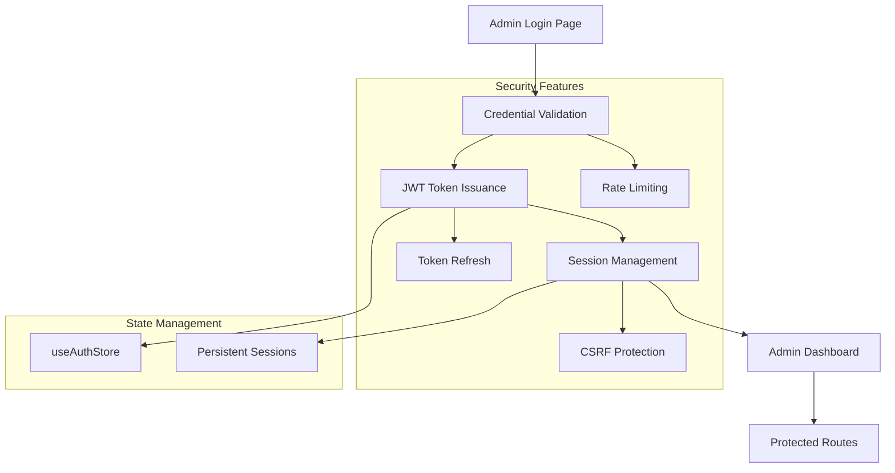
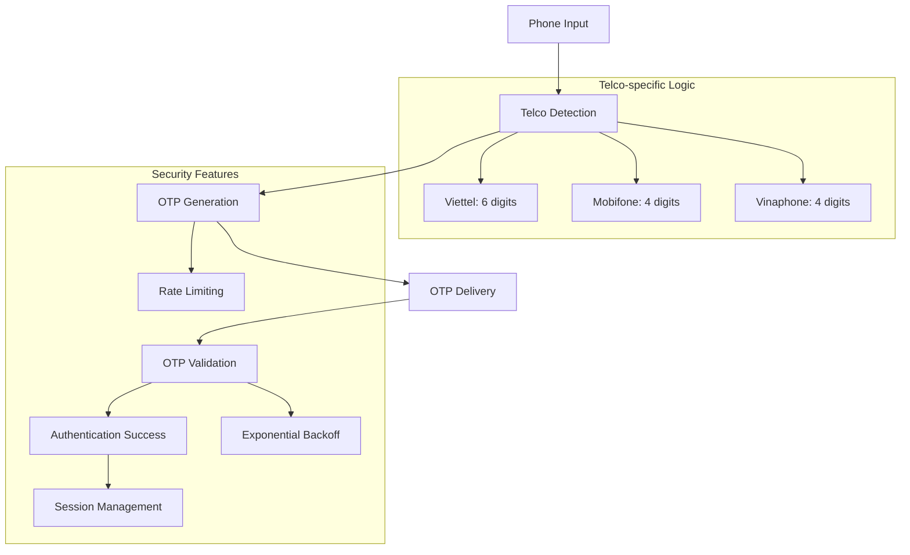
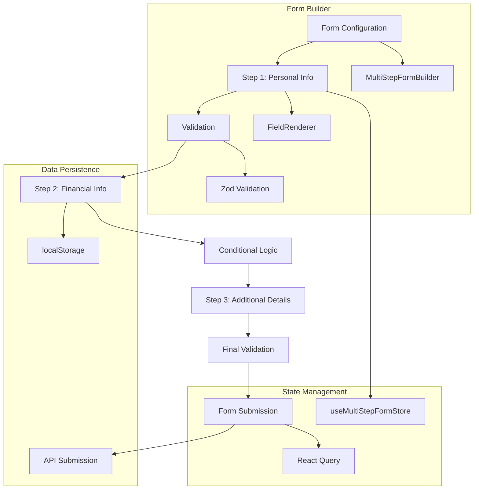
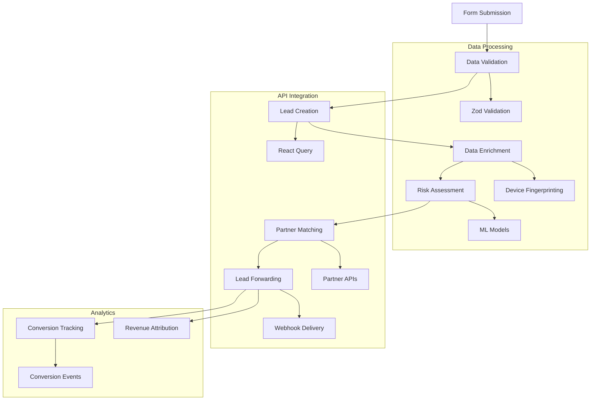
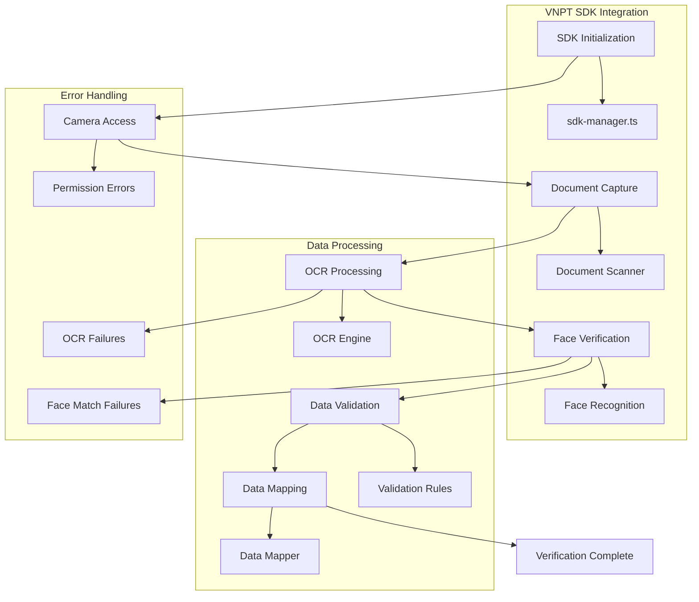
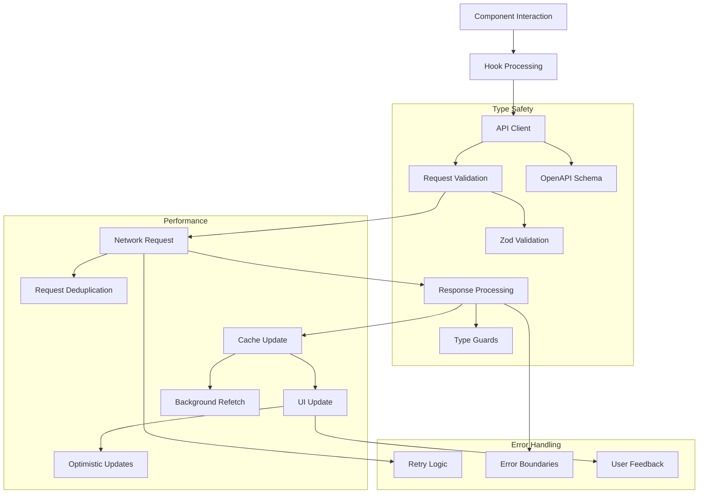

# Business Flows and Processes

## Table of Contents
- [Overview](#overview)
- [User Journey Flows](#user-journey-flows)
  - [Loan Application Flow](#loan-application-flow)
  - [Credit Card Application Flow](#credit-card-application-flow)
  - [Insurance Purchase Flow](#insurance-purchase-flow)
- [Authentication and Security Flows](#authentication-and-security-flows)
  - [Admin Authentication Flow](#admin-authentication-flow)
  - [User OTP Verification Flow](#user-otp-verification-flow)
- [Data Processing Flows](#data-processing-flows)
  - [Multi-Step Form Flow](#multi-step-form-flow)
  - [Lead Submission and Processing Flow](#lead-submission-and-processing-flow)
- [Integration Flows](#integration-flows)
  - [eKYC Verification Flow](#ekyc-verification-flow)
  - [API Integration Patterns](#api-integration-patterns)
- [Flow Management System](#flow-management-system)
- [Error Handling and Recovery](#error-handling-and-recovery)
- [Security and Compliance](#security-and-compliance)
- [Cross-references](#cross-references)

## Overview

DOP-FE implements a comprehensive flow-based system that transforms traditional financial service applications into dynamic, configurable user journeys. The system leverages modern technologies including Next.js 15.5.4 App Router, React Query for server state management, VNPT eKYC SDK for identity verification, and a multi-step form system with Zod validation.

The architecture replaces hardcoded routes with dynamic, configurable business processes managed through an admin panel, enabling rapid iteration and business process changes without requiring code modifications.

### Key Architecture Components

| Component | Technology | Purpose |
|-----------|------------|---------|
| **Flow Engine** | Custom React hooks + Zustand | Dynamic flow navigation and state management |
| **Form System** | React Hook Form + Zod | Type-safe multi-step forms with validation |
| **eKYC Integration** | VNPT SDK | Identity verification with OCR and face matching |
| **State Management** | Zustand + React Query | Client and server state synchronization |
| **UI Components** | shadcn/ui + Tailwind CSS 4 | Consistent design system with accessibility |

## User Journey Flows

### Loan Application Flow

The loan application flow guides users through a comprehensive journey from initial application to loan product matching and selection.

#### Flow Diagram

```mermaid
flowchart TD
    A[Homepage] --> B[Initial Loan Application]
    B --> C[OTP Verification]
    C --> D[eKYC Verification]
    D --> E[Additional Information]
    E --> F[Loan Results]
    F --> G[Product Selection]
    G --> H[Application Completion]
    
    subgraph "App Router Pages"
        A --> A1[src/app/[locale]/page.tsx]
        E --> E1[src/app/[locale]/user-onboarding/page.tsx]
    end
    
    subgraph "Components"
        B --> B1[OnboardingCard]
        D --> D1[EkycDialog]
        E --> E2[MultiStepFormRenderer]
    end
    
    subgraph "State Management"
        C --> C1[useAuthStore]
        D --> D2[useEkycStore]
        E --> E3[useMultiStepFormStore]
    end
```

#### Implementation Details

| Step | Component | Technology | Data Flow |
|------|-----------|------------|-----------|
| **Initial Application** | [`OnboardingCard`](src/components/organisms/homepage/onboarding-card.tsx:1) | React Hook Form + Zod | Loan amount, period, purpose |
| **OTP Verification** | Custom OTP component | Telco-specific validation | Phone verification |
| **eKYC Verification** | [`EkycDialog`](src/components/ekyc/ekyc-dialog.tsx:1) | VNPT SDK + WebRTC | Identity verification |
| **Additional Information** | [`MultiStepFormRenderer`](src/components/renderer/MultiStepFormRenderer.tsx:1) | Dynamic form rendering | Personal, financial details |
| **Loan Results** | Dynamic results page | React Query + API | Product matching |

#### Step-by-Step Process

| Step | Description | Validation | Data Storage |
|------|-------------|------------|--------------|
| **1. Initial Application** | User selects loan parameters (5-90M VND, 3-36 months) | Zod schema validation | [`useMultiStepFormStore`](src/store/use-multi-step-form-store.ts:1) |
| **2. OTP Verification** | Telco-specific OTP validation (4-6 digits) | Real-time validation | [`useAuthStore`](src/store/use-auth-store.ts:1) |
| **3. eKYC Verification** | Document capture + face matching | VNPT SDK validation | [`useEkycStore`](src/store/use-ekyc-store.ts:1) |
| **4. Additional Information** | Multi-step form with conditional fields | Step-by-step validation | Persistent form state |
| **5. Loan Results** | Product matching and comparison | API response validation | React Query cache |

#### Technology Integration

```typescript
// Flow state management with App Router
const loanFlow = {
  steps: [
    { id: 'initial', path: '/', component: 'OnboardingCard' },
    { id: 'verification', path: '/ekyc', component: 'EkycDialog' },
    { id: 'additional', path: '/user-onboarding', component: 'MultiStepFormRenderer' },
    { id: 'results', path: '/loan-results', component: 'LoanResults' }
  ],
  navigation: 'useFlow', // Custom hook for flow management
  persistence: 'localStorage', // Form data persistence
  validation: 'zod' // Schema validation
};
```

### Credit Card Application Flow

The credit card flow enables users to search, compare, and apply for credit cards from various financial institutions.

#### Flow Diagram

```mermaid
flowchart TD
    A[Homepage] --> B[Credit Card Module]
    B --> C[Search/Filter Cards]
    C --> D[Compare Cards]
    D --> E[Card Details]
    E --> F[Application/Redirect]
    
    subgraph "App Router Pages"
        B --> B1[src/app/[locale]/credit-cards/page.tsx]
        E --> E1[src/app/[locale]/credit-cards/[id]/page.tsx]
    end
    
    subgraph "Components"
        C --> C1[CardFilter]
        D --> D1[CardComparison]
        E --> E2[CardDetails]
    end
    
    subgraph "Data Management"
        C --> C2[React Query]
        D --> D3[useAsyncOptions]
        F --> F4[Lead Management]
    end
```

#### Implementation Details

| Step | Component | Technology | Integration |
|------|-----------|------------|-------------|
| **Card Selection** | Dynamic card listing | React Query + DataTable | API integration |
| **Filtering** | Advanced filtering system | [`useAsyncOptions`](src/hooks/form/use-async-options.ts:1) | Dynamic options loading |
| **Comparison** | Side-by-side comparison | State management | Local state |
| **Application** | Partner redirection | Lead tracking | Analytics integration |

#### Step-by-Step Process

| Step | Description | Features | Data Flow |
|------|-------------|----------|-----------|
| **1. Card Search** | Filter by benefits, fees, requirements | Real-time filtering | API calls with React Query |
| **2. Card Comparison** | Compare up to 3 cards side-by-side | Feature comparison table | Local state management |
| **3. Card Details** | Detailed product information | Interactive features | API data + analytics |
| **4. Application** | Redirect to partner application | Lead tracking | Conversion tracking |

### Insurance Purchase Flow

The insurance flow guides users through product selection, comparison, and purchase of various insurance products.

#### Flow Diagram

```mermaid
flowchart TD
    A[Homepage] --> B[Insurance Module]
    B --> C[Product Category]
    C --> D[Product Selection]
    D --> E[Product Details]
    E --> F[Quotation]
    F --> G[Purchase]
    
    subgraph "App Router Pages"
        B --> B1[src/app/[locale]/insurance/page.tsx]
        D --> D1[src/app/[locale]/insurance/[category]/page.tsx]
        E --> E1[src/app/[locale]/insurance/[category]/[id]/page.tsx]
    end
    
    subgraph "Theme System"
        B --> B2[Theme Context]
        D --> D2[Product-specific theming]
    end
    
    subgraph "Internationalization"
        A --> A1[next-intl]
        G --> G1[Multi-language support]
    end
```

#### Implementation Details

| Step | Component | Technology | Features |
|------|-----------|------------|----------|
| **Category Selection** | Product catalog | Dynamic routing | Multi-theme support |
| **Product Details** | Information pages | Data-driven UI | Interactive calculators |
| **Quotation** | Price calculation | API integration | Real-time pricing |
| **Purchase** | Transaction flow | Payment integration | Secure processing |

## Authentication and Security Flows

### Admin Authentication Flow

Admin authentication provides secure access to the admin panel for flow management and system configuration.

#### Flow Diagram



#### Implementation Details

| Component | File | Technology | Security Features |
|-----------|------|------------|-------------------|
| **Login Page** | [`src/app/[locale]/admin/login/page.tsx`](src/app/[locale]/admin/login/page.tsx:1) | React Hook Form + Zod | Input validation |
| **Auth Store** | [`src/store/use-auth-store.ts`](src/store/use-auth-store.ts:1) | Zustand | Token management |
| **Protected Routes** | [`src/components/auth/protected-route.tsx`](src/components/auth/protected-route.tsx:1) | Higher-order component | Route guards |

#### Security Implementation

```typescript
// JWT-based authentication with refresh tokens
const authConfig = {
  tokenExpiry: '15m',
  refreshTokenExpiry: '7d',
  secureStorage: 'httpOnly cookies',
  csrfProtection: true,
  rateLimiting: {
    maxAttempts: 5,
    windowMs: 15 * 60 * 1000, // 15 minutes
    blockDuration: 30 * 60 * 1000 // 30 minutes
  }
};
```

### User OTP Verification Flow

OTP verification provides secure user authentication for loan applications and other financial transactions.

#### Flow Diagram



#### Implementation Details

| Telco | OTP Length | Timeout | Max Attempts |
|-------|------------|---------|--------------|
| **Viettel** | 6 digits | 60 seconds | 3 |
| **Mobifone** | 4 digits | 60 seconds | 3 |
| **Vinaphone** | 4 digits | 60 seconds | 3 |

#### Technology Integration

```typescript
// OTP state management with React Query
const useOtpVerification = (phoneNumber: string) => {
  return useMutation({
    mutationFn: (otp: string) => verifyOtp(phoneNumber, otp),
    retry: (failureCount, error) => {
      if (error.type === 'INVALID_OTP') return false;
      return failureCount < 3;
    },
    retryDelay: (attemptIndex) => Math.min(1000 * 2 ** attemptIndex, 30000)
  });
};
```

## Data Processing Flows

### Multi-Step Form Flow

The multi-step form system provides a flexible, data-driven approach to complex form handling with validation and persistence.

#### Flow Diagram



#### Implementation Details

| Component | File | Technology | Features |
|-----------|------|------------|----------|
| **Form Builder** | [`src/lib/builders/multi-step-form-builder.ts`](src/lib/builders/multi-step-form-builder.ts:1) | TypeScript | Dynamic form generation |
| **Field Renderer** | [`src/components/renderer/FieldRenderer.tsx`](src/components/renderer/FieldRenderer.tsx:1) | React | Dynamic field rendering |
| **Form Store** | [`src/store/use-multi-step-form-store.ts`](src/store/use-multi-step-form-store.ts:1) | Zustand + persist | State persistence |

#### Form Configuration Example

```typescript
// Dynamic form configuration with validation
const loanFormConfig = {
  steps: [
    {
      id: 'personal-info',
      title: 'Personal Information',
      fields: [
        FieldBuilder.text('fullName').required().build(),
        FieldBuilder.select('province').options(provinces).build(),
        FieldBuilder.ekyc('identity').required().build()
      ],
      validation: z.object({
        fullName: z.string().min(2),
        province: z.string().min(1),
        identity: z.object({
          idNumber: z.string().regex(/^[0-9]{12}$/),
          dateOfBirth: z.string().datetime()
        })
      })
    },
    {
      id: 'financial-info',
      title: 'Financial Information',
      fields: [
        FieldBuilder.slider('income').min(0).max(100000000).build(),
        FieldBuilder.radio('employment').options(employmentTypes).build()
      ],
      validation: z.object({
        income: z.number().min(0),
        employment: z.string().min(1)
      }),
      dependencies: ['personal-info']
    }
  ]
};
```

### Lead Submission and Processing Flow

The lead management system handles user data submission, validation, enrichment, and forwarding to financial partners.

#### Flow Diagram



#### Implementation Details

| Step | Component | Technology | Features |
|------|-----------|------------|----------|
| **Lead Creation** | API client | React Query | Optimistic updates |
| **Data Enrichment** | Service layer | Device fingerprinting | User profiling |
| **Risk Assessment** | ML integration | Risk scoring | Fraud detection |
| **Partner Matching** | Algorithm | Business rules | Product matching |

#### Lead Processing Pipeline

```typescript
// Lead processing with React Query
const useLeadSubmission = () => {
  return useMutation({
    mutationFn: async (leadData: LeadData) => {
      // Validate with Zod schema
      const validatedLead = leadSchema.parse(leadData);
      
      // Enrich with device data
      const enrichedLead = await enrichLeadData(validatedLead);
      
      // Assess risk
      const riskScore = await assessRisk(enrichedLead);
      
      // Match with partners
      const matchedPartners = await matchPartners(enrichedLead, riskScore);
      
      // Forward to partners
      return Promise.all(
        matchedPartners.map(partner => 
          forwardLeadToPartner(enrichedLead, partner)
        )
      );
    },
    onSuccess: (results) => {
      // Track conversion events
      trackConversion(results);
      
      // Update analytics
      updateLeadAnalytics(results);
    }
  });
};
```

## Integration Flows

### eKYC Verification Flow

The eKYC integration provides comprehensive identity verification using VNPT SDK with OCR, face matching, and liveness detection.

#### Flow Diagram



#### Implementation Details

| Component | File | Technology | Features |
|-----------|------|------------|----------|
| **SDK Manager** | [`src/lib/ekyc/sdk-manager.ts`](src/lib/ekyc/sdk-manager.ts:1) | Dynamic loading | Error recovery |
| **Config Manager** | [`src/lib/ekyc/config-manager.ts`](src/lib/ekyc/config-manager.ts:1) | Environment config | Runtime configuration |
| **Data Mapper** | [`src/lib/ekyc/ekyc-data-mapper.ts`](src/lib/ekyc/ekyc-data-mapper.ts:1) | Data transformation | Field mapping |
| **Event Handler** | [`src/lib/ekyc/sdk-events.ts`](src/lib/ekyc/sdk-events.ts:1) | Event system | Lifecycle management |

#### eKYC Configuration

```typescript
// VNPT eKYC SDK configuration
const ekycConfig = {
  authToken: process.env.NEXT_PUBLIC_EKYC_AUTH_TOKEN,
  backendUrl: process.env.NEXT_PUBLIC_EKYC_BACKEND_URL,
  tokenKey: process.env.NEXT_PUBLIC_EKYC_TOKEN_KEY,
  tokenId: process.env.NEXT_PUBLIC_EKYC_TOKEN_ID,
  
  // SDK options
  options: {
    enableLiveness: true,
    enableFaceMatching: true,
    enableOCR: true,
    maxRetries: 3,
    timeout: 30000,
    imageQuality: {
      minWidth: 800,
      minHeight: 600,
      maxFileSize: 5 * 1024 * 1024 // 5MB
    }
  },
  
  // Field mapping configuration
  fieldMappings: {
    'fullName': 'fullName',
    'idNumber': 'nationalId',
    'dateOfBirth': 'dateOfBirth',
    'placeOfOrigin': 'province',
    'address': 'address'
  }
};
```

### API Integration Patterns

The API integration system provides type-safe, optimized communication with backend services using OpenAPI schema and React Query.

#### Flow Diagram



#### Implementation Details

| Component | File | Technology | Features |
|-----------|------|------------|----------|
| **API Client** | [`src/lib/api/client.ts`](src/lib/api/client.ts:1) | OpenAPI-fetch | Type safety |
| **Query Client** | [`src/lib/query-client.ts`](src/lib/query-client.ts:1) | React Query | Caching, optimistic updates |
| **Schema Types** | [`src/lib/api/schema.yaml`](src/lib/api/schema.yaml:1) | OpenAPI | Auto-generated types |
| **Mock Responses** | [`src/lib/api/mock-responses.ts`](src/lib/api/mock-responses.ts:1) | Development tool | Offline development |

#### Query Configuration

```typescript
// Optimized React Query configuration
const queryClient = new QueryClient({
  defaultOptions: {
    queries: {
      staleTime: 5 * 60 * 1000, // 5 minutes
      cacheTime: 10 * 60 * 1000, // 10 minutes
      retry: 3,
      retryDelay: attemptIndex => Math.min(1000 * 2 ** attemptIndex, 30000),
      refetchOnWindowFocus: false,
      refetchOnReconnect: true,
      structuralSharing: true // Optimizes re-renders
    },
    mutations: {
      retry: 1,
      onError: (error) => {
        // Global error handling
        console.error('Mutation error:', error);
        showErrorToast(error.message);
      },
      onSuccess: () => {
        // Success feedback
        showSuccessToast('Operation completed successfully');
      }
    }
  }
});
```

## Flow Management System

The flow management system enables dynamic configuration and execution of business processes through an admin interface.

#### Flow Configuration Schema

```typescript
interface FlowConfiguration {
  id: string;
  name: string;
  description: string;
  version: string;
  status: 'active' | 'inactive' | 'draft';
  steps: FlowStep[];
  conditions: FlowCondition[];
  integrations: FlowIntegration[];
  analytics: FlowAnalytics;
}

interface FlowStep {
  id: string;
  type: 'form' | 'verification' | 'display' | 'redirect';
  title: string;
  component: string;
  validation?: ValidationRule[];
  nextSteps: NextStepRule[];
  skipConditions?: SkipCondition[];
  metadata?: Record<string, any>;
}
```

#### Admin Flow Management

| Feature | Component | Technology | Benefits |
|---------|-----------|------------|----------|
| **Flow Builder** | Visual interface | React + DnD | Drag-and-drop flow creation |
| **Version Control** | Flow versioning | Git-like system | Rollback capabilities |
| **A/B Testing** | Flow variations | Analytics integration | Performance optimization |
| **Real-time Updates** | Live configuration | WebSocket | Immediate changes |

## Error Handling and Recovery

### Error Boundary Implementation

The application implements comprehensive error handling with React Error Boundaries and recovery mechanisms.

```typescript
// Error boundary with retry functionality
const RetryableErrorBoundary = ({ children, fallback, onRetry }) => {
  return (
    <ErrorBoundary
      fallback={fallback}
      onError={(error, errorInfo) => {
        // Log error to monitoring service
        console.error('Error caught by boundary:', error, errorInfo);
        
        // Track error in analytics
        trackError(error, errorInfo);
      }}
      onReset={() => {
        // Retry the failed operation
        onRetry?.();
      }}
    >
      {children}
    </ErrorBoundary>
  );
};
```

### Error Recovery Strategies

| Error Type | Recovery Strategy | Implementation |
|------------|------------------|----------------|
| **Network Errors** | Exponential backoff retry | React Query configuration |
| **Validation Errors** | Inline validation messages | Zod error mapping |
| **Authentication Errors** | Token refresh | Auth store middleware |
| **eKYC Errors** | Alternative verification methods | Fallback flows |

## Security and Compliance

### Security Implementation

The application implements comprehensive security measures for financial data handling:

```typescript
// Security headers configuration
const securityHeaders = [
  {
    key: 'X-DNS-Prefetch-Control',
    value: 'on'
  },
  {
    key: 'Strict-Transport-Security',
    value: 'max-age=63072000; includeSubDomains; preload'
  },
  {
    key: 'X-XSS-Protection',
    value: '1; mode=block'
  },
  {
    key: 'X-Frame-Options',
    value: 'DENY'
  },
  {
    key: 'X-Content-Type-Options',
    value: 'nosniff'
  },
  {
    key: 'Referrer-Policy',
    value: 'origin-when-cross-origin'
  }
];
```

### Compliance Features

| Feature | Implementation | Compliance |
|---------|----------------|------------|
| **Data Privacy** | GDPR-compliant data handling | GDPR |
| **Consent Management** | Explicit user consent tracking | Local regulations |
| **Audit Logging** | Comprehensive audit trail | Financial regulations |
| **Data Retention** | Automated retention policies | Legal requirements |
| **Access Control** | Role-based access control | Security standards |
| **Data Anonymization** | Automatic data anonymization | Privacy regulations |

## Cross-references

### Related Documentation

- **[Project Architecture Overview](project-architecture-overview.md)** - Complete system architecture and technology stack
- **[Application Replication Guide](../migration/new-project/application-replication-guide.md)** - Development setup and deployment instructions
- **[Consolidated Dependencies and Integrations](consolidated-dependencies-and-integrations.md)** - Complete dependency analysis
- **[Content Mapping Matrix](content-mapping-matrix.md)** - Migration mapping from old to new project

### Implementation Resources

- **[Multi-Step Form Builder](../migration/extracted/data-models-and-structures.md#multi-step-form-data)** - Dynamic form configuration
- **[eKYC Integration](../migration/extracted/business-flows-and-processes.md#ekyc-integration-flow)** - VNPT SDK integration details
- **[Admin API Documentation](../migration/extracted/application-pages-and-components.md#admin-interface)** - Admin panel implementation
- **[Theme System](../migration/extracted/data-models-and-structures.md#theme-system)** - Multi-theme architecture

### Technical References

- **[Next.js App Router Documentation](https://nextjs.org/docs/app)** - Routing and layout patterns
- **[React Query Documentation](https://tanstack.com/query/latest)** - Server state management
- **[Zod Documentation](https://zod.dev/)** - Schema validation and type safety
- **[shadcn/ui Documentation](https://ui.shadcn.com/)** - Component library documentation

This flow-based architecture provides a solid foundation for building a modern, scalable financial platform with excellent user experience, developer productivity, and business agility. The dynamic flow system enables rapid business process changes without requiring code modifications, while modern technology stack ensures performance, security, and maintainability.