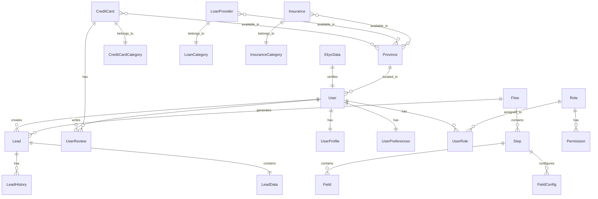

# Data Models and Structures

## Table of Contents
- [Overview](#overview)
- [I. Entity Models](#i-entity-models)
  - [1. Core Domain Entities](#1-core-domain-entities)
  - [2. User Data Models](#2-user-data-models)
  - [3. Product Models](#3-product-models)
  - [4. Flow Management Models](#4-flow-management-models)
  - [5. Authentication Models](#5-authentication-models)
- [II. Zod Schemas](#ii-zod-schemas)
  - [1. Dynamic Schema Generation](#1-dynamic-schema-generation)
  - [2. Component-Specific Schemas](#2-component-specific-schemas)
  - [3. Validation Rules](#3-validation-rules)
  - [4. Type Inference](#4-type-inference)
- [III. Entity Relationships](#iii-entity-relationships)
  - [1. Relationship Diagram](#1-relationship-diagram)
  - [2. One-to-Many Relationships](#2-one-to-many-relationships)
  - [3. Many-to-Many Relationships](#3-many-to-many-relationships)
  - [4. Foreign Key References](#4-foreign-key-references)
- [IV. Data Migrations](#iv-data-migrations)
  - [1. Migration Path from Legacy Models](#1-migration-path-from-legacy-models)
  - [2. Data Transformation Functions](#2-data-transformation-functions)
  - [3. Migration Scripts](#3-migration-scripts)
  - [4. Validation and Testing](#4-validation-and-testing)
- [V. API Mappings](#v-api-mappings)
  - [1. Request/Response Mappings](#1-requestresponse-mappings)
  - [2. Data Transformation Layer](#2-data-transformation-layer)
  - [3. Error Handling](#3-error-handling)
  - [4. Type Safety in API Integration](#4-type-safety-in-api-integration)
- [VI. Cross-references](#vi-cross-references)

## Overview

DOP-FE implements a comprehensive data model architecture that combines legacy financial service models with modern TypeScript patterns and Zod validation. The system supports 15 core entities with dynamic schema generation, type-safe API integration, and robust data validation.

The architecture emphasizes:
- **Type Safety**: Comprehensive TypeScript with Zod validation
- **Dynamic Schemas**: Runtime schema generation from configurations
- **Data Integrity**: Validation at multiple layers
- **Migration Support**: Clear paths from legacy models
- **API Integration**: Type-safe request/response handling

## I. Entity Models

### 1. Core Domain Entities

#### Flow Management Entities

```typescript
// Flow management system
interface FlowDetail {
  id: string;
  name: string;
  description?: string;
  status: FlowStatus; // 'active' | 'inactive' | 'draft' | 'archived'
  createdAt: string;
  updatedAt: string;
  steps: StepListItem[];
}

interface StepDetail {
  id: string;
  stepOrder: number;
  name: string;
  description?: string;
  hasEkyc: boolean;
  hasOtp: boolean;
  status: StepStatus; // 'active' | 'inactive' | 'draft'
  flowId: string;
  fields: FieldListItem[];
}

interface FieldListItem {
  id: string;
  name: string;
  type: FieldType; // 'text' | 'email' | 'password' | 'number' | 'date' | 'select' | 'checkbox' | 'radio' | 'textarea' | 'file' | 'ekyc' | 'otp'
  visible: boolean;
  required: boolean;
  label?: string;
  placeholder?: string;
  validation?: {
    min?: number;
    max?: number;
    pattern?: string;
  };
}
```

#### Lead Management Entities

```typescript
// Lead processing system
interface Lead {
  id: string;
  flowId: string;
  status: LeadStatus; // 'pending' | 'processing' | 'completed' | 'failed'
  createdAt: string;
  updatedAt: string;
  userId?: string;
  data: LeadData;
  history: LeadHistory[];
}

interface LeadData {
  // Basic Information
  fullName?: string;
  phoneNumber?: string;
  email?: string;
  
  // Financial Information
  loanAmount?: number;
  loanPeriod?: number;
  income?: number;
  incomeType?: string;
  
  // Location Information
  province?: string;
  district?: string;
  
  // Additional Data
  trackingParams?: Record<string, any>;
  deviceInfo?: Record<string, any>;
}

interface LeadHistory {
  id: string;
  leadId: string;
  action: string;
  timestamp: string;
  data?: Record<string, any>;
  userId?: string;
}
```

### 2. User Data Models

#### User Profile Entity

```typescript
// User profile and identity
interface User {
  id: string;
  email?: string;
  phoneNumber?: string;
  isVerified: boolean;
  createdAt: string;
  updatedAt: string;
  profile: UserProfile;
  preferences: UserPreferences;
}

interface UserProfile {
  // Basic Information
  fullName?: string;
  gender?: Gender; // 'male' | 'female' | 'other'
  birthday?: string;
  avatar?: string;
  
  // Location Information
  province?: string;
  district?: string;
  address?: string;
  
  // Career Information
  careerStatus?: CareerStatus; // 'employed' | 'self_employed' | 'unemployed' | 'housewife' | 'retired'
  careerType?: string;
  companyName?: string;
  
  // Financial Information
  income?: number;
  incomeType?: string;
  expectedAmount?: number;
  loanPeriod?: number;
  loanPurpose?: string;
  
  // Credit History
  havingLoan?: HavingLoan; // 'no_loan' | 'one_loan' | 'two_loans' | 'three_loans' | 'more_than_three_loans'
  creditStatus?: CreditStatus; // 'no_bad_debt' | 'bad_debt' | 'bad_debt_last3_year'
  
  // Identity Verification
  nationalId?: string;
  nationalIdFrontKey?: string;
  nationalIdBackKey?: string;
  ekycVerified?: boolean;
  ekycData?: EkycData;
}

interface UserPreferences {
  language: string;
  theme: string;
  notifications: NotificationPreferences;
  privacy: PrivacyPreferences;
}

interface NotificationPreferences {
  email: boolean;
  sms: boolean;
  push: boolean;
  marketing: boolean;
}

interface PrivacyPreferences {
  dataSharing: boolean;
  analytics: boolean;
  personalization: boolean;
}
```

#### eKYC Data Model

```typescript
// Electronic KYC verification data
interface EkycData {
  sessionId: string;
  verifiedAt: string;
  status: EkycStatus; // 'pending' | 'verified' | 'failed' | 'expired'
  
  // Document Information
  documentType: string;
  documentNumber: string;
  documentFrontKey?: string;
  documentBackKey?: string;
  
  // Personal Information from OCR
  extractedData: {
    fullName?: string;
    dateOfBirth?: string;
    placeOfOrigin?: string;
    address?: string;
    issueDate?: string;
    expiryDate?: string;
  };
  
  // Face Verification
  faceImageKey?: string;
  faceMatchScore?: number;
  livenessScore?: number;
  
  // Verification Results
  ocrConfidence?: number;
  faceMatchConfidence?: number;
  livenessConfidence?: number;
  overallConfidence?: number;
}
```

### 3. Product Models

#### Credit Card Entity

```typescript
// Credit card products
interface CreditCard {
  id: number;
  name: string;
  clientCode: string;
  issuer: string;
  category: CreditCardCategory;
  
  // Application Requirements
  ageRequiredMin: number;
  ageRequiredMax: number;
  incomeRequired: number;
  isIncomeNeedingValidation: boolean;
  isOnlineApplication: boolean;
  
  // Financial Details
  creditLimit: number;
  interestRate: number;
  annualFee: number;
  withdrawalFee: number;
  minWithdrawalFee: number;
  overLimitFee: number;
  minOverLimitFee: number;
  installmentFee: number;
  fxFee: number;
  minFxFee: number;
  
  // Benefits and Features
  benefit: string[];
  drawback: string[];
  features: string[];
  openingGiftAmount: number;
  openingGiftDesc: string[];
  
  // Quality Metrics
  benefitRate: number;
  feeRate: number;
  serviceRate: number;
  procedureRate: number;
  customerRate: number;
  
  // Availability
  provinces: string[];
  provinceDescription: string;
  
  // Metadata
  link: string;
  imageLink: string;
  weight: number;
  updatedAt: string;
  
  // User-generated Content
  userReviews: UserReview[];
}

interface UserReview {
  id: string;
  userId: string;
  creditCardId: number;
  rating: number;
  title: string;
  content: string;
  pros: string[];
  cons: string[];
  createdAt: string;
  isVerified: boolean;
  helpfulCount: number;
}

interface CreditCardCategory {
  id: number;
  name: string;
  description: string;
  icon?: string;
}
```

#### Loan Provider Entity

```typescript
// Loan provider products
interface LoanProvider {
  id: number;
  name: string;
  clientCode: string;
  category: LoanCategory;
  
  // Loan Parameters
  minAmount: number;
  maxAmount: number;
  minPeriod: number;
  maxPeriod: number;
  interestRate: number;
  
  // Application Requirements
  ageRequiredMin: number;
  ageRequiredMax: number;
  incomeRequired: boolean;
  minIncome?: number;
  creditScoreRequired?: number;
  
  // Processing Details
  processingTime: string;
  requireDop: number;
  convertType: "forward" | "redirect";
  
  // Provider Information
  logo?: string;
  website?: string;
  hotline?: string;
  
  // Availability
  provinces: string[];
  
  // Features
  features: string[];
  requirements: string[];
  documents: string[];
  
  // Quality Metrics
  rating?: number;
  reviewCount?: number;
  
  // Metadata
  updatedAt: string;
}

interface LoanCategory {
  id: number;
  name: string;
  description: string;
  icon?: string;
}
```

#### Insurance Entity

```typescript
// Insurance products
interface Insurance {
  id: number;
  name: string;
  clientCode: string;
  issuer: string;
  category: InsuranceCategory;
  
  // Coverage Details
  fee: number;
  bodyLimit: number;
  propertyLimit: number;
  coverage: string;
  benefit: string;
  exclusion: string;
  
  // Target and Profile
  target: string;
  indemnityProfile: string;
  rate: string;
  
  // Application Details
  minAge?: number;
  maxAge?: number;
  healthRequirements?: string[];
  medicalExamRequired: boolean;
  
  // Provider Information
  logo?: string;
  website?: string;
  hotline?: string;
  
  // Features
  features: string[];
  benefits: string[];
  
  // Metadata
  link: string;
  imageLink: string;
  updatedAt: string;
  
  // Additional Data
  metadata: Record<string, any>;
}

interface InsuranceCategory {
  id: number;
  name: string;
  description: string;
  icon?: string;
}
```

### 4. Flow Management Models

#### Multi-Step Form Models

```typescript
// Multi-step form configuration
interface MultiStepFormConfig {
  id: string;
  name: string;
  description?: string;
  version: string;
  status: FormStatus; // 'active' | 'inactive' | 'draft'
  
  // Form Structure
  steps: StepConfig[];
  initialStep?: number;
  
  // Navigation Options
  allowBackNavigation?: boolean;
  showProgress?: boolean;
  progressStyle?: "steps" | "bar" | "dots";
  
  // Data Options
  persistData?: boolean;
  persistKey?: string;
  
  // Event Handlers
  onStepComplete?: (stepId: string, stepData: Record<string, any>) => void | Promise<void>;
  onComplete?: (allData: Record<string, any>) => void | Promise<void>;
  onStepChange?: (fromStep: number, toStep: number) => void;
  
  // Metadata
  createdAt: string;
  updatedAt: string;
}

interface StepConfig {
  id: string;
  title: string;
  description?: string;
  fields: FieldConfig[];
  
  // Validation
  stepValidation?: {
    validate?: (data: Record<string, any>) => Promise<boolean | string>;
  };
  
  // Options
  optional?: boolean;
  icon?: React.ReactNode;
  
  // Conditional Logic
  condition?: FieldCondition;
  dependencies?: string[];
}

interface FieldConfig {
  fieldName: string;
  component: string;
  props: FieldProps;
  condition?: FieldCondition;
}

interface FieldProps {
  labelKey?: string;
  placeholderKey?: string;
  descriptionKey?: string;
  validations?: ValidationRule[];
  disabled?: boolean;
  className?: string;
  
  // Async options configuration
  optionsFetcher?: {
    fetcher: (params?: any) => Promise<any[]>;
    transform?: (data: any[]) => Array<{ value: string; label: string; disabled?: boolean }>;
    cacheKey?: string;
    cacheDuration?: number;
    dependsOn?: string[];
  };
}

interface FieldCondition {
  field: string;
  operator: 'equals' | 'not_equals' | 'contains' | 'not_contains' | 'greater_than' | 'less_than' | 'exists' | 'not_exists';
  value: any;
  logicalOperator?: 'and' | 'or';
}

interface ValidationRule {
  type: string; // 'required', 'minLength', 'maxLength', 'min', 'max', 'email', 'regex', etc.
  value?: any;
  messageKey: string;
}
```

### 5. Authentication Models

#### Authentication System

```typescript
// Authentication and authorization
interface AuthState {
  user: User | null;
  isAuthenticated: boolean;
  isLoading: boolean;
  isHydrated: boolean;
  token?: string;
  refreshToken?: string;
  expiresAt?: string;
}

interface LoginCredentials {
  username: string;
  password: string;
  rememberMe?: boolean;
}

interface LoginResponse {
  user: User;
  token: string;
  refreshToken: string;
  expiresAt: string;
}

interface RefreshTokenRequest {
  refreshToken: string;
}

interface RefreshTokenResponse {
  token: string;
  refreshToken: string;
  expiresAt: string;
}

// OTP Verification
interface OtpRequest {
  target: string; // phone number or email
  type: OTPType; // 'sms' | 'email' | 'voice'
  purpose: OtpPurpose; // 'login' | 'registration' | 'transaction' | 'password_reset'
}

interface OtpVerification {
  token: string;
  otp: string;
  purpose: OtpPurpose;
}

interface OtpResponse {
  success: boolean;
  message: string;
  data?: any;
}

// Role-based Access Control
interface Role {
  id: string;
  name: string;
  description: string;
  permissions: Permission[];
}

interface Permission {
  id: string;
  name: string;
  resource: string;
  action: string;
  conditions?: Record<string, any>;
}

interface UserRole {
  userId: string;
  roleId: string;
  assignedAt: string;
  assignedBy: string;
  expiresAt?: string;
}
```

## II. Zod Schemas

### 1. Dynamic Schema Generation

#### Schema Generator

```typescript
// Dynamic Zod schema generation from field configurations
function generateZodSchema(
  fields: FieldConfig[],
  t: (key: string, values?: Record<string, any>) => string,
): z.ZodObject<any> {
  const schemaObject: Record<string, z.ZodTypeAny> = {};
  
  fields.forEach(field => {
    schemaObject[field.fieldName] = generateFieldSchema(field, t);
  });
  
  return z.object(schemaObject);
}

function generateFieldSchema(
  fieldConfig: FieldConfig,
  t: (key: string, values?: Record<string, any>) => string,
): z.ZodTypeAny {
  let fieldSchema: z.ZodTypeAny;
  
  // Base schema based on component type
  switch (fieldConfig.component) {
    case "Input":
    case "Textarea":
      fieldSchema = z.string();
      break;
    case "Number":
    case "Slider":
      fieldSchema = z.number();
      break;
    case "Checkbox":
    case "Switch":
      fieldSchema = z.boolean();
      break;
    case "DatePicker":
      fieldSchema = z.coerce.date();
      break;
    case "Select":
    case "RadioGroup":
    case "ToggleGroup":
      fieldSchema = z.string();
      break;
    case "Ekyc":
      fieldSchema = z
        .object({
          completed: z.boolean(),
          sessionId: z.string().optional(),
          data: z.any().optional(),
          timestamp: z.string().optional(),
        })
        .or(z.boolean());
      break;
    default:
      fieldSchema = z.any();
  }
  
  // Apply validations
  if (fieldConfig.props.validations) {
    fieldConfig.props.validations.forEach(validation => {
      switch (validation.type) {
        case "required":
          fieldSchema = (fieldSchema as z.ZodString | z.ZodNumber | z.ZodBoolean).refine(
            (value) => value !== undefined && value !== null && value !== "",
            { message: t(validation.messageKey) }
          );
          break;
        case "minLength":
          if (fieldSchema instanceof z.ZodString) {
            fieldSchema = fieldSchema.min(validation.value, {
              message: t(validation.messageKey, { min: validation.value })
            });
          }
          break;
        case "maxLength":
          if (fieldSchema instanceof z.ZodString) {
            fieldSchema = fieldSchema.max(validation.value, {
              message: t(validation.messageKey, { max: validation.value })
            });
          }
          break;
        case "min":
          if (fieldSchema instanceof z.ZodNumber) {
            fieldSchema = fieldSchema.min(validation.value, {
              message: t(validation.messageKey, { min: validation.value })
            });
          }
          break;
        case "max":
          if (fieldSchema instanceof z.ZodNumber) {
            fieldSchema = fieldSchema.max(validation.value, {
              message: t(validation.messageKey, { max: validation.value })
            });
          }
          break;
        case "email":
          if (fieldSchema instanceof z.ZodString) {
            fieldSchema = fieldSchema.email({
              message: t(validation.messageKey)
            });
          }
          break;
        case "regex":
          if (fieldSchema instanceof z.ZodString) {
            fieldSchema = fieldSchema.regex(new RegExp(validation.value), {
              message: t(validation.messageKey)
            });
          }
          break;
      }
    });
  }
  
  // Make optional if not required
  const isRequired = fieldConfig.props.validations?.some(v => v.type === "required");
  if (!isRequired) {
    fieldSchema = fieldSchema.optional();
  }
  
  return fieldSchema;
}
```

### 2. Component-Specific Schemas

#### User Data Schema

```typescript
// User profile validation schema
const userSchema = z.object({
  fullName: z.string().min(2, { message: "Full name must be at least 2 characters" }),
  email: z.string().email({ message: "Invalid email address" }).optional(),
  phoneNumber: z.string().regex(/^[0-9]{10,11}$/, { message: "Invalid phone number" }),
  gender: z.enum(["male", "female", "other"]).optional(),
  birthday: z.string().datetime({ message: "Invalid date format" }).optional(),
  province: z.string().min(1, { message: "Please select a province" }),
  district: z.string().optional(),
  address: z.string().optional(),
  
  // Career Information
  careerStatus: z.enum(["employed", "self_employed", "unemployed", "housewife", "retired"]).optional(),
  careerType: z.string().optional(),
  companyName: z.string().optional(),
  
  // Financial Information
  income: z.number().min(0, { message: "Income must be a positive number" }).optional(),
  incomeType: z.string().optional(),
  expectedAmount: z.number().min(1000000, { message: "Minimum loan amount is 1,000,000 VND" }).optional(),
  loanPeriod: z.number().min(3, { message: "Minimum loan period is 3 months" }).max(36, { message: "Maximum loan period is 36 months" }).optional(),
  loanPurpose: z.string().optional(),
  
  // Credit History
  havingLoan: z.enum(["no_loan", "one_loan", "two_loans", "three_loans", "more_than_three_loans"]).optional(),
  creditStatus: z.enum(["no_bad_debt", "bad_debt", "bad_debt_last3_year"]).optional(),
  
  // Identity Verification
  nationalId: z.string().regex(/^[0-9]{12}$/, { message: "National ID must be 12 digits" }).optional(),
});

// Type inference from schema
type UserFormData = z.infer<typeof userSchema>;
```

#### Lead Data Schema

```typescript
// Lead creation validation schema
const leadSchema = z.object({
  flowId: z.string().uuid({ message: "Invalid flow ID" }),
  userId: z.string().uuid().optional(),
  
  // Basic Information
  fullName: z.string().min(2, { message: "Full name is required" }),
  phoneNumber: z.string().regex(/^[0-9]{10,11}$/, { message: "Invalid phone number" }),
  email: z.string().email({ message: "Invalid email address" }).optional(),
  
  // Financial Information
  loanAmount: z.number().min(5000000, { message: "Minimum loan amount is 5,000,000 VND" }).max(90000000, { message: "Maximum loan amount is 90,000,000 VND" }),
  loanPeriod: z.number().min(3, { message: "Minimum loan period is 3 months" }).max(36, { message: "Maximum loan period is 36 months" }),
  income: z.number().min(0, { message: "Income must be a positive number" }).optional(),
  incomeType: z.string().optional(),
  
  // Location Information
  province: z.string().min(1, { message: "Province is required" }),
  district: z.string().optional(),
  
  // Additional Data
  trackingParams: z.record(z.any()).optional(),
  deviceInfo: z.record(z.any()).optional(),
});

// Type inference from schema
type LeadFormData = z.infer<typeof leadSchema>;
```

### 3. Validation Rules

#### Common Validation Rules

```typescript
// Common validation rule definitions
const commonValidations = {
  required: {
    type: "required" as const,
    messageKey: "validation.required",
  },
  
  email: {
    type: "email" as const,
    messageKey: "validation.email",
  },
  
  phoneNumber: {
    type: "regex" as const,
    value: "^[0-9]{10,11}$",
    messageKey: "validation.phoneNumber",
  },
  
  nationalId: {
    type: "regex" as const,
    value: "^[0-9]{12}$",
    messageKey: "validation.nationalId",
  },
  
  minLength: (min: number) => ({
    type: "minLength" as const,
    value: min,
    messageKey: "validation.minLength",
  }),
  
  maxLength: (max: number) => ({
    type: "maxLength" as const,
    value: max,
    messageKey: "validation.maxLength",
  }),
  
  min: (min: number) => ({
    type: "min" as const,
    value: min,
    messageKey: "validation.min",
  }),
  
  max: (max: number) => ({
    type: "max" as const,
    value: max,
    messageKey: "validation.max",
  }),
};
```

#### Field-Specific Validations

```typescript
// Field-specific validation configurations
const fieldValidations = {
  fullName: [commonValidations.required, commonValidations.minLength(2)],
  email: [commonValidations.email],
  phoneNumber: [commonValidations.required, commonValidations.phoneNumber],
  nationalId: [commonValidations.nationalId],
  loanAmount: [
    commonValidations.required,
    commonValidations.min(5000000),
    commonValidations.max(90000000),
  ],
  loanPeriod: [
    commonValidations.required,
    commonValidations.min(3),
    commonValidations.max(36),
  ],
  income: [commonValidations.min(0)],
  province: [commonValidations.required],
};
```

### 4. Type Inference

#### Schema Type Inference

```typescript
// Type inference utilities
type SchemaType<T extends z.ZodType> = z.infer<T>;
type SchemaError<T extends z.ZodType> = z.ZodIssue[];

// Form data types from schemas
type UserFormData = SchemaType<typeof userSchema>;
type LeadFormData = SchemaType<typeof leadSchema>;

// API request/response types
type CreateUserRequest = SchemaType<typeof createUserSchema>;
type CreateUserResponse = SchemaType<typeof createUserResponseSchema>;

// Validation error types
type ValidationError = SchemaError<typeof userSchema>;
```

## III. Entity Relationships

### 1. Relationship Diagram



### 2. One-to-Many Relationships

#### User to Lead Relationship

```typescript
// User creates multiple leads
interface User {
  id: string;
  // ... other user properties
  leads: Lead[]; // One user can have many leads
}

interface Lead {
  id: string;
  userId: string; // Foreign key to User
  // ... other lead properties
  user?: User; // Optional populated user object
}
```

#### Flow to Step Relationship

```typescript
// Flow contains multiple steps
interface Flow {
  id: string;
  // ... other flow properties
  steps: Step[]; // One flow can have many steps
}

interface Step {
  id: string;
  flowId: string; // Foreign key to Flow
  stepOrder: number;
  // ... other step properties
  flow?: Flow; // Optional populated flow object
}
```

#### CreditCard to UserReview Relationship

```typescript
// Credit card has multiple reviews
interface CreditCard {
  id: number;
  // ... other credit card properties
  userReviews: UserReview[]; // One credit card can have many reviews
}

interface UserReview {
  id: string;
  creditCardId: number; // Foreign key to CreditCard
  userId: string; // Foreign key to User
  // ... other review properties
  creditCard?: CreditCard; // Optional populated credit card object
  user?: User; // Optional populated user object
}
```

### 3. Many-to-Many Relationships

#### CreditCard to Province Relationship

```typescript
// Credit cards available in multiple provinces
interface CreditCardProvince {
  creditCardId: number; // Foreign key to CreditCard
  provinceId: string; // Foreign key to Province
  available: boolean;
  conditions?: string;
}

interface CreditCard {
  id: number;
  // ... other credit card properties
  provinces: Province[]; // Available provinces through junction table
}

interface Province {
  id: string;
  name: string;
  // ... other province properties
  creditCards: CreditCard[]; // Available credit cards through junction table
}
```

#### User to Role Relationship

```typescript
// Users can have multiple roles
interface UserRole {
  userId: string; // Foreign key to User
  roleId: string; // Foreign key to Role
  assignedAt: string;
  assignedBy: string;
  expiresAt?: string;
}

interface User {
  id: string;
  // ... other user properties
  roles: Role[]; // User roles through junction table
}

interface Role {
  id: string;
  // ... other role properties
  users: User[]; // Users with this role through junction table
}
```

### 4. Foreign Key References

#### Reference Implementation

```typescript
// UUID-based references for consistency
interface BaseEntity {
  id: string; // UUID primary key
  createdAt: string;
  updatedAt: string;
}

// Foreign key reference types
type UserId = string; // References User.id
type FlowId = string; // References Flow.id
type StepId = string; // References Step.id
type LeadId = string; // References Lead.id
type CreditCardId = number; // References CreditCard.id
type ProvinceId = string; // References Province.id

// Reference validation
function validateUserId(id: string): boolean {
  return /^[0-9a-f]{8}-[0-9a-f]{4}-[1-5][0-9a-f]{3}-[89ab][0-9a-f]{3}-[0-9a-f]{12}$/i.test(id);
}

function validateCreditCardId(id: number): boolean {
  return Number.isInteger(id) && id > 0;
}
```

## IV. Data Migrations

### 1. Migration Path from Legacy Models

#### User Data Migration

```typescript
// Migration from legacy IUserData to new UserData
function migrateUserData(oldUserData: IUserData): UserData {
  return {
    // Direct mapping
    fullName: oldUserData.full_name,
    gender: mapGender(oldUserData.gender),
    birthday: oldUserData.birthday,
    phoneNumber: oldUserData.phone_number,
    email: oldUserData.email,
    province: oldUserData.province,
    district: oldUserData.district,
    
    // Type transformations
    income: oldUserData.income ? Number(oldUserData.income) : undefined,
    expectedAmount: oldUserData.expected_amount ? Number(oldUserData.expected_amount) : undefined,
    loanPeriod: oldUserData.loan_period ? Number(oldUserData.loan_period) : undefined,
    
    // Enum mappings
    havingLoan: mapHavingLoan(oldUserData.having_loan),
    creditStatus: mapCreditStatus(oldUserData.credit_status),
    careerStatus: mapCareerStatus(oldUserData.career_status),
    
    // Preserve additional fields
    nationalId: oldUserData.national_id,
    nationalIdFrontKey: oldUserData.national_id_front_key,
    nationalIdBackKey: oldUserData.national_id_back_key,
    mandatoryDocs: oldUserData.mandatory_docs,
    extraDocs: oldUserData.extra_docs,
    deviceId: oldUserData.device_id,
  };
}

// Enum mapping functions
function mapGender(oldGender?: string): Gender | undefined {
  switch (oldGender) {
    case 'male': return 'male';
    case 'female': return 'female';
    case 'other': return 'other';
    default: return undefined;
  }
}

function mapHavingLoan(oldHavingLoan?: string): HavingLoan | undefined {
  switch (oldHavingLoan) {
    case 'no_loan': return 'no_loan';
    case 'one_loan': return 'one_loan';
    case 'two_loans': return 'two_loans';
    case 'three_loans': return 'three_loans';
    case 'more_than_three_loans': return 'more_than_three_loans';
    default: return undefined;
  }
}
```

#### Product Data Migration

```typescript
// Migration from legacy ICard to new CreditCard
function migrateCreditCardData(oldCard: ICard): CreditCard {
  return {
    // Direct mapping
    id: oldCard.id,
    name: oldCard.name,
    clientCode: oldCard.client_code,
    issuer: oldCard.issuer,
    link: oldCard.link,
    imageLink: oldCard.image_link,
    
    // Requirements
    ageRequiredMin: oldCard.age_required_min,
    ageRequiredMax: oldCard.age_required_max,
    incomeRequired: oldCard.income_required,
    isIncomeNeedingValidation: oldCard.is_income_needing_validation,
    isOnlineApplication: oldCard.is_online_application,
    
    // Financial details
    creditLimit: oldCard.credit_limit,
    waiveFeeCondition: oldCard.waive_fee_condition,
    interestRate: oldCard.interest_rate,
    annualFee: oldCard.annual_fee,
    withdrawalFee: oldCard.withdrawal_fee,
    minWithdrawalFee: oldCard.min_withdrawal_fee,
    overLimitFee: oldCard.over_limit_fee,
    minOverLimitFee: oldCard.min_over_limit_fee,
    installmentFee: oldCard.installment_fee,
    fxFee: oldCard.fx_fee,
    minFxFee: oldCard.min_fx_fee,
    
    // Benefits and features
    benefit: oldCard.benefit,
    drawback: oldCard.drawback,
    openingGiftAmount: oldCard.opening_gift_amount,
    openingGiftDesc: oldCard.opening_gift_desc,
    
    // Quality metrics
    benefitRate: oldCard.benefit_rate,
    feeRate: oldCard.fee_rate,
    serviceRate: oldCard.service_rate,
    procedureRate: oldCard.procedure_rate,
    customerRate: oldCard.customer_rate,
    
    // Availability
    categoryIds: oldCard.category_ids,
    categoryNames: oldCard.category_names,
    provinces: oldCard.provinces,
    provinceDescription: oldCard.province_description,
    
    // Metadata
    weight: oldCard.weight,
    features: oldCard.features,
    updatedAt: oldCard.updated_at,
    
    // Initialize empty arrays for new fields
    userReviews: [],
  };
}
```

### 2. Data Transformation Functions

#### Field Mapping Functions

```typescript
// Field mapping utilities
const fieldMappings = {
  // User field mappings
  user: {
    'full_name': 'fullName',
    'phone_number': 'phoneNumber',
    'national_id': 'nationalId',
    'national_id_front_key': 'nationalIdFrontKey',
    'national_id_back_key': 'nationalIdBackKey',
    'device_id': 'deviceId',
    'expected_amount': 'expectedAmount',
    'loan_period': 'loanPeriod',
    'having_loan': 'havingLoan',
    'credit_status': 'creditStatus',
    'career_status': 'careerStatus',
    'career_type': 'careerType',
  },
  
  // Credit card field mappings
  creditCard: {
    'client_code': 'clientCode',
    'age_required_min': 'ageRequiredMin',
    'age_required_max': 'ageRequiredMax',
    'income_required': 'incomeRequired',
    'is_income_needing_validation': 'isIncomeNeedingValidation',
    'is_online_application': 'isOnlineApplication',
    'credit_limit': 'creditLimit',
    'waive_fee_condition': 'waiveFeeCondition',
    'interest_rate': 'interestRate',
    'annual_fee': 'annualFee',
    'withdrawal_fee': 'withdrawalFee',
    'min_withdrawal_fee': 'minWithdrawalFee',
    'over_limit_fee': 'overLimitFee',
    'min_over_limit_fee': 'minOverLimitFee',
    'installment_fee': 'installmentFee',
    'fx_fee': 'fxFee',
    'min_fx_fee': 'minFxFee',
    'opening_gift_amount': 'openingGiftAmount',
    'opening_gift_desc': 'openingGiftDesc',
    'benefit_rate': 'benefitRate',
    'fee_rate': 'feeRate',
    'service_rate': 'serviceRate',
    'procedure_rate': 'procedureRate',
    'customer_rate': 'customerRate',
    'category_ids': 'categoryIds',
    'category_names': 'categoryNames',
    'province_description': 'provinceDescription',
    'updated_at': 'updatedAt',
    'image_link': 'imageLink',
  },
};

// Generic field mapping function
function mapFields<T>(data: Record<string, any>, mappings: Record<string, string>): T {
  const result: Record<string, any> = {};
  
  Object.entries(mappings).forEach(([oldField, newField]) => {
    if (data[oldField] !== undefined) {
      result[newField] = data[oldField];
    }
  });
  
  return result as T;
}
```

#### Data Type Conversions

```typescript
// Data type conversion utilities
function convertTypes(data: Record<string, any>, typeMap: Record<string, 'string' | 'number' | 'boolean' | 'date'>): Record<string, any> {
  const result: Record<string, any> = {};
  
  Object.entries(data).forEach(([key, value]) => {
    if (value !== undefined && value !== null) {
      const targetType = typeMap[key];
      
      switch (targetType) {
        case 'number':
          result[key] = Number(value);
          break;
        case 'boolean':
          result[key] = Boolean(value);
          break;
        case 'date':
          result[key] = new Date(value);
          break;
        case 'string':
        default:
          result[key] = String(value);
          break;
      }
    }
  });
  
  return result;
}

// User data type conversion
function convertUserDataTypes(oldUserData: Record<string, any>): Partial<UserData> {
  const typeMap = {
    'income': 'number',
    'expected_amount': 'number',
    'loan_period': 'number',
  };
  
  return convertTypes(oldUserData, typeMap);
}
```

### 3. Migration Scripts

#### Batch Migration Script

```typescript
// Batch migration script for user data
async function migrateUserDataBatch(
  oldUserDataRepository: OldUserDataRepository,
  newUserRepository: UserRepository,
  batchSize: number = 100,
): Promise<void> {
  let hasMoreData = true;
  let offset = 0;
  let totalMigrated = 0;
  let totalErrors = 0;
  
  while (hasMoreData) {
    try {
      // Get batch of old user data
      const oldUsersBatch = await oldUserDataRepository.getBatch(batchSize, offset);
      
      if (oldUsersBatch.length === 0) {
        hasMoreData = false;
        break;
      }
      
      // Migrate batch
      const migrationPromises = oldUsersBatch.map(async (oldUser) => {
        try {
          const newUser = migrateUserData(oldUser);
          await newUserRepository.create(newUser);
          return { success: true, id: oldUser.id };
        } catch (error) {
          console.error(`Failed to migrate user ${oldUser.id}:`, error);
          return { success: false, id: oldUser.id, error };
        }
      });
      
      const results = await Promise.allSettled(migrationPromises);
      
      // Count successes and failures
      results.forEach((result) => {
        if (result.status === 'fulfilled') {
          if (result.value.success) {
            totalMigrated++;
          } else {
            totalErrors++;
          }
        } else {
          totalErrors++;
        }
      });
      
      // Update offset for next batch
      offset += batchSize;
      
      // Log progress
      console.log(`Migrated ${totalMigrated} users, ${totalErrors} errors so far...`);
      
    } catch (error) {
      console.error('Batch migration error:', error);
      totalErrors++;
    }
  }
  
  console.log(`Migration complete. Total migrated: ${totalMigrated}, Total errors: ${totalErrors}`);
}
```

#### Validation Script

```typescript
// Post-migration validation script
async function validateMigratedData(
  oldUserDataRepository: OldUserDataRepository,
  newUserRepository: UserRepository,
): Promise<ValidationReport> {
  const report: ValidationReport = {
    totalOldUsers: 0,
    totalNewUsers: 0,
    missingUsers: [],
    dataInconsistencies: [],
    validationErrors: [],
  };
  
  try {
    // Get counts
    report.totalOldUsers = await oldUserDataRepository.count();
    report.totalNewUsers = await newUserRepository.count();
    
    // Check for missing users
    const oldUserIds = await oldUserDataRepository.getAllIds();
    const newUserIds = await newUserRepository.getAllIds();
    
    report.missingUsers = oldUserIds.filter(id => !newUserIds.includes(id));
    
    // Sample data for validation
    const sampleSize = Math.min(100, oldUserIds.length);
    const sampleIds = oldUserIds.slice(0, sampleSize);
    
    for (const id of sampleIds) {
      const oldUser = await oldUserDataRepository.findById(id);
      const newUser = await newUserRepository.findById(id);
      
      if (oldUser && newUser) {
        // Validate data consistency
        const inconsistencies = validateUserDataConsistency(oldUser, newUser);
        if (inconsistencies.length > 0) {
          report.dataInconsistencies.push({
            userId: id,
            issues: inconsistencies,
          });
        }
      }
    }
    
  } catch (error) {
    report.validationErrors.push({
      message: `Validation error: ${error.message}`,
      timestamp: new Date().toISOString(),
    });
  }
  
  return report;
}

function validateUserDataConsistency(oldUser: IUserData, newUser: UserData): string[] {
  const issues: string[] = [];
  
  // Check name consistency
  if (oldUser.full_name !== newUser.fullName) {
    issues.push('Name mismatch');
  }
  
  // Check phone number consistency
  if (oldUser.phone_number !== newUser.phoneNumber) {
    issues.push('Phone number mismatch');
  }
  
  // Check email consistency
  if (oldUser.email !== newUser.email) {
    issues.push('Email mismatch');
  }
  
  // Check numeric fields
  if (Number(oldUser.income) !== newUser.income) {
    issues.push('Income mismatch');
  }
  
  if (Number(oldUser.expected_amount) !== newUser.expectedAmount) {
    issues.push('Expected amount mismatch');
  }
  
  if (Number(oldUser.loan_period) !== newUser.loanPeriod) {
    issues.push('Loan period mismatch');
  }
  
  return issues;
}

interface ValidationReport {
  totalOldUsers: number;
  totalNewUsers: number;
  missingUsers: string[];
  dataInconsistencies: Array<{
    userId: string;
    issues: string[];
  }>;
  validationErrors: Array<{
    message: string;
    timestamp: string;
  }>;
}
```

### 4. Validation and Testing

#### Unit Tests for Migration

```typescript
// Unit tests for migration functions
describe('User Data Migration', () => {
  test('should migrate basic user data correctly', () => {
    const oldUser: IUserData = {
      full_name: 'John Doe',
      phone_number: '0123456789',
      email: 'john@example.com',
      income: '5000000',
      expected_amount: '10000000',
      loan_period: '12',
      having_loan: 'no_loan',
      credit_status: 'no_bad_debt',
      career_status: 'employed',
    };
    
    const newUser = migrateUserData(oldUser);
    
    expect(newUser.fullName).toBe('John Doe');
    expect(newUser.phoneNumber).toBe('0123456789');
    expect(newUser.email).toBe('john@example.com');
    expect(newUser.income).toBe(5000000);
    expect(newUser.expectedAmount).toBe(10000000);
    expect(newUser.loanPeriod).toBe(12);
    expect(newUser.havingLoan).toBe('no_loan');
    expect(newUser.creditStatus).toBe('no_bad_debt');
    expect(newUser.careerStatus).toBe('employed');
  });
  
  test('should handle undefined values correctly', () => {
    const oldUser: IUserData = {
      full_name: 'Jane Doe',
      // Other fields are undefined
    };
    
    const newUser = migrateUserData(oldUser);
    
    expect(newUser.fullName).toBe('Jane Doe');
    expect(newUser.income).toBeUndefined();
    expect(newUser.expectedAmount).toBeUndefined();
    expect(newUser.loanPeriod).toBeUndefined();
    expect(newUser.havingLoan).toBeUndefined();
    expect(newUser.creditStatus).toBeUndefined();
    expect(newUser.careerStatus).toBeUndefined();
  });
  
  test('should map enum values correctly', () => {
    const oldUser: IUserData = {
      full_name: 'Test User',
      gender: 'female',
      having_loan: 'two_loans',
      credit_status: 'bad_debt_last3_year',
      career_status: 'self_employed',
    };
    
    const newUser = migrateUserData(oldUser);
    
    expect(newUser.gender).toBe('female');
    expect(newUser.havingLoan).toBe('two_loans');
    expect(newUser.creditStatus).toBe('bad_debt_last3_year');
    expect(newUser.careerStatus).toBe('self_employed');
  });
});
```

## V. API Mappings

### 1. Request/Response Mappings

#### Lead Creation API

```typescript
// API request/response types
interface CreateLeadRequest {
  flowId: string;
  domain: string;
  deviceInfo: Record<string, any>;
  trackingParams: Record<string, any>;
  info: SubmitLeadInfoRequest;
}

interface SubmitLeadInfoRequest {
  flowId: string;
  stepId: string;
  phoneNumber?: string;
  email?: string;
  purpose?: string;
  loanAmount?: number;
  loanPeriod?: number;
  otpType?: OTPType;
  fullName?: string;
  nationalId?: string;
  gender?: Gender;
  location?: string;
  birthday?: string;
  incomeType?: string;
  income?: number;
  havingLoan?: HavingLoan;
  careerStatus?: CareerStatus;
  careerType?: string;
  creditStatus?: CreditStatus;
}

interface CreateLeadResponse {
  success: boolean;
  leadId: string;
  message: string;
  data?: any;
}

// Mapper functions
function mapFormToLeadRequest(
  formData: Record<string, any>,
  flowId: string,
  stepId: string,
  domain: string,
): CreateLeadRequest {
  return {
    flowId,
    domain,
    deviceInfo: formData.deviceInfo || {},
    trackingParams: formData.trackingParams || {},
    info: {
      flowId,
      stepId,
      phoneNumber: formData.phoneNumber,
      email: formData.email,
      purpose: formData.loanPurpose,
      loanAmount: formData.loanAmount,
      loanPeriod: formData.loanPeriod,
      fullName: formData.fullName,
      nationalId: formData.nationalId,
      gender: formData.gender,
      location: formData.province,
      birthday: formData.birthday,
      incomeType: formData.incomeType,
      income: formData.income,
      havingLoan: formData.havingLoan,
      careerStatus: formData.careerStatus,
      careerType: formData.careerType,
      creditStatus: formData.creditStatus,
    },
  };
}
```

#### OTP Verification API

```typescript
// OTP verification API types
interface SubmitOtpRequest {
  token: string;
  otp: string;
}

interface SubmitOtpResponse {
  success: boolean;
  message: string;
  data?: {
    verified: boolean;
    userId?: string;
    token?: string;
    refreshToken?: string;
  };
}

interface ResendOtpRequest {
  target: string; // phone number or email
  type: OTPType; // 'sms' | 'email' | 'voice'
}

interface ResendOtpResponse {
  success: boolean;
  message: string;
  data?: {
    token: string;
    expiresIn: number;
  };
}

// Mapper functions
function mapOtpVerification(
  token: string,
  otp: string,
): SubmitOtpRequest {
  return {
    token,
    otp,
  };
}

function mapOtpResend(
  target: string,
  type: OTPType,
): ResendOtpRequest {
  return {
    target,
    type,
  };
}
```

### 2. Data Transformation Layer

#### API Client Configuration

```typescript
// Type-safe API client configuration
import createClient from 'openapi-fetch';
import type { paths } from './v1';

export const apiClient = createClient<paths>({
  baseUrl: process.env.NEXT_PUBLIC_API_URL,
  headers: {
    'Content-Type': 'application/json',
  },
});

// API wrapper functions with error handling
export class ApiService {
  static async createLead(request: CreateLeadRequest): Promise<CreateLeadResponse> {
    try {
      const { data, error } = await apiClient.POST('/leads', {
        body: request,
      });
      
      if (error) {
        throw new Error(error.message || 'Failed to create lead');
      }
      
      return data as CreateLeadResponse;
    } catch (error) {
      console.error('Create lead error:', error);
      throw error;
    }
  }
  
  static async submitOtp(request: SubmitOtpRequest): Promise<SubmitOtpResponse> {
    try {
      const { data, error } = await apiClient.POST('/otp/verify', {
        body: request,
      });
      
      if (error) {
        throw new Error(error.message || 'OTP verification failed');
      }
      
      return data as SubmitOtpResponse;
    } catch (error) {
      console.error('OTP verification error:', error);
      throw error;
    }
  }
  
  static async resendOtp(request: ResendOtpRequest): Promise<ResendOtpResponse> {
    try {
      const { data, error } = await apiClient.POST('/otp/resend', {
        body: request,
      });
      
      if (error) {
        throw new Error(error.message || 'Failed to resend OTP');
      }
      
      return data as ResendOtpResponse;
    } catch (error) {
      console.error('Resend OTP error:', error);
      throw error;
    }
  }
}
```

#### Response Transformation

```typescript
// Response transformation utilities
function transformLeadResponse(apiResponse: any): Lead {
  return {
    id: apiResponse.id,
    flowId: apiResponse.flowId,
    status: apiResponse.status,
    createdAt: apiResponse.createdAt,
    updatedAt: apiResponse.updatedAt,
    userId: apiResponse.userId,
    data: {
      fullName: apiResponse.fullName,
      phoneNumber: apiResponse.phoneNumber,
      email: apiResponse.email,
      loanAmount: apiResponse.loanAmount,
      loanPeriod: apiResponse.loanPeriod,
      income: apiResponse.income,
      incomeType: apiResponse.incomeType,
      province: apiResponse.province,
      district: apiResponse.district,
      trackingParams: apiResponse.trackingParams,
      deviceInfo: apiResponse.deviceInfo,
    },
    history: apiResponse.history || [],
  };
}

function transformUserResponse(apiResponse: any): User {
  return {
    id: apiResponse.id,
    email: apiResponse.email,
    phoneNumber: apiResponse.phoneNumber,
    isVerified: apiResponse.isVerified,
    createdAt: apiResponse.createdAt,
    updatedAt: apiResponse.updatedAt,
    profile: {
      fullName: apiResponse.fullName,
      gender: apiResponse.gender,
      birthday: apiResponse.birthday,
      avatar: apiResponse.avatar,
      province: apiResponse.province,
      district: apiResponse.district,
      address: apiResponse.address,
      careerStatus: apiResponse.careerStatus,
      careerType: apiResponse.careerType,
      companyName: apiResponse.companyName,
      income: apiResponse.income,
      incomeType: apiResponse.incomeType,
      expectedAmount: apiResponse.expectedAmount,
      loanPeriod: apiResponse.loanPeriod,
      loanPurpose: apiResponse.loanPurpose,
      havingLoan: apiResponse.havingLoan,
      creditStatus: apiResponse.creditStatus,
      nationalId: apiResponse.nationalId,
      nationalIdFrontKey: apiResponse.nationalIdFrontKey,
      nationalIdBackKey: apiResponse.nationalIdBackKey,
      ekycVerified: apiResponse.ekycVerified,
      ekycData: apiResponse.ekycData,
    },
    preferences: {
      language: apiResponse.language || 'vi',
      theme: apiResponse.theme || 'default',
      notifications: {
        email: apiResponse.emailNotifications ?? true,
        sms: apiResponse.smsNotifications ?? true,
        push: apiResponse.pushNotifications ?? true,
        marketing: apiResponse.marketingNotifications ?? false,
      },
      privacy: {
        dataSharing: apiResponse.dataSharing ?? false,
        analytics: apiResponse.analytics ?? true,
        personalization: apiResponse.personalization ?? true,
      },
    },
  };
}
```

### 3. Error Handling

#### Error Types

```typescript
// API error types
interface ApiError {
  code: number;
  message: string;
  details?: Record<string, any>;
  field?: string;
}

interface ValidationError extends ApiError {
  field: string;
  validationRule: string;
}

interface NetworkError extends ApiError {
  retryable: boolean;
}

// Error handling utilities
function isApiError(error: unknown): error is ApiError {
  return (
    typeof error === 'object' &&
    error !== null &&
    'code' in error &&
    'message' in error
  );
}

function isValidationError(error: unknown): error is ValidationError {
  return (
    isApiError(error) &&
    'field' in error &&
    'validationRule' in error
  );
}

function isNetworkError(error: unknown): error is NetworkError {
  return (
    isApiError(error) &&
    'retryable' in error
  );
}

// Error transformation
function transformApiError(error: any): ApiError {
  return {
    code: error.code || 500,
    message: error.message || 'Unknown error occurred',
    details: error.details,
    field: error.field,
  };
}
```

#### Error Recovery

```typescript
// Error recovery strategies
class ErrorRecovery {
  static async withRetry<T>(
    operation: () => Promise<T>,
    maxRetries: number = 3,
    delay: number = 1000,
  ): Promise<T> {
    let lastError: any;
    
    for (let attempt = 0; attempt <= maxRetries; attempt++) {
      try {
        return await operation();
      } catch (error) {
        lastError = error;
        
        if (attempt === maxRetries) {
          break;
        }
        
        // Check if error is retryable
        if (isNetworkError(error) && error.retryable) {
          await new Promise(resolve => setTimeout(resolve, delay * Math.pow(2, attempt)));
          continue;
        }
        
        // Non-retryable error, throw immediately
        throw error;
      }
    }
    
    throw lastError;
  }
  
  static async withFallback<T>(
    primaryOperation: () => Promise<T>,
    fallbackOperation: () => Promise<T>,
  ): Promise<T> {
    try {
      return await primaryOperation();
    } catch (primaryError) {
      console.warn('Primary operation failed, trying fallback:', primaryError);
      
      try {
        return await fallbackOperation();
      } catch (fallbackError) {
        console.error('Both primary and fallback operations failed:', {
          primaryError,
          fallbackError,
        });
        throw fallbackError;
      }
    }
  }
}
```

### 4. Type Safety in API Integration

#### Type Guards

```typescript
// Runtime type guards for API responses
function isCreateLeadResponse(data: unknown): data is CreateLeadResponse {
  return (
    typeof data === 'object' &&
    data !== null &&
    typeof (data as any).success === 'boolean' &&
    typeof (data as any).leadId === 'string' &&
    typeof (data as any).message === 'string'
  );
}

function isSubmitOtpResponse(data: unknown): data is SubmitOtpResponse {
  return (
    typeof data === 'object' &&
    data !== null &&
    typeof (data as any).success === 'boolean' &&
    typeof (data as any).message === 'string'
  );
}

function isUser(data: unknown): data is User {
  return (
    typeof data === 'object' &&
    data !== null &&
    typeof (data as any).id === 'string' &&
    typeof (data as any).isVerified === 'boolean' &&
    typeof (data as any).createdAt === 'string' &&
    typeof (data as any).updatedAt === 'string'
  );
}

// Safe API response parsing
function safeParseApiResponse<T>(
  data: unknown,
  typeGuard: (data: unknown) => data is T,
  errorMessage: string = 'Invalid API response format',
): T {
  if (!typeGuard(data)) {
    throw new Error(errorMessage);
  }
  
  return data;
}
```

#### Request Validation

```typescript
// Request validation before API calls
function validateCreateLeadRequest(request: CreateLeadRequest): void {
  if (!request.flowId) {
    throw new Error('Flow ID is required');
  }
  
  if (!request.domain) {
    throw new Error('Domain is required');
  }
  
  if (!request.info) {
    throw new Error('Info is required');
  }
  
  if (!request.info.flowId) {
    throw new Error('Info flow ID is required');
  }
  
  if (!request.info.stepId) {
    throw new Error('Info step ID is required');
  }
}

function validateSubmitOtpRequest(request: SubmitOtpRequest): void {
  if (!request.token) {
    throw new Error('Token is required');
  }
  
  if (!request.otp) {
    throw new Error('OTP is required');
  }
  
  if (request.otp.length < 4 || request.otp.length > 6) {
    throw new Error('OTP must be 4-6 digits');
  }
}

// Safe API calls with validation
async function safeCreateLead(request: CreateLeadRequest): Promise<CreateLeadResponse> {
  // Validate request
  validateCreateLeadRequest(request);
  
  // Make API call
  const response = await ApiService.createLead(request);
  
  // Validate response
  return safeParseApiResponse(response, isCreateLeadResponse, 'Invalid create lead response');
}
```

## VI. Cross-references

### Related Documentation

- **[Project Architecture Overview](project-architecture-overview.md)** - Complete system architecture and technology stack
- **[Business Flows and Processes](business-flows-and-processes.md)** - Detailed flow-based system implementation
- **[Application Pages and Components](application-pages-and-components.md)** - Component hierarchy and structure
- **[Dependencies and Integrations](consolidated-dependencies-and-integrations.md)** - Complete technology stack analysis
- **[Content Mapping Matrix](content-mapping-matrix.md)** - Migration mapping from old to new project

### Implementation Resources

- **[Multi-Step Form Builder](../migration/extracted/data-models-and-structures.md#multi-step-form-data)** - Dynamic form configuration
- **[Zod Documentation](https://zod.dev/)** - Schema validation and type safety
- **[React Query Documentation](https://tanstack.com/query/latest)** - Server state management
- **[OpenAPI Specification](https://swagger.io/specification/)** - API documentation standards

### Technical References

- **[Component Registry](src/components/renderer/ComponentRegistry.ts:27)** - Dynamic component mapping
- **[Form Builder](src/lib/builders/multi-step-form-builder.ts:1)** - Dynamic form generation
- **[Zod Generator](src/lib/builders/zod-generator.ts:1)** - Schema generation utilities
- **[API Client](src/lib/api/client.ts:1)** - Type-safe API integration
- **[Data Mappers](src/mappers/)** - Data transformation functions

This comprehensive data model architecture provides a solid foundation for building a modern, scalable financial platform with excellent type safety, data integrity, and migration support. The system supports dynamic business processes while maintaining strict validation and error handling throughout the application.