# Project Architecture Overview

## Table of Contents
- [Overview Diagram](#overview-diagram)
- [Introduction](#introduction)
- [Technology Stack](#technology-stack)
- [Folder Structure](#folder-structure)
- [Frontend Layers](#frontend-layers)
- [Library Layers](#library-layers)
- [State Management](#state-management)
- [Key Patterns](#key-patterns)
- [Data Flow](#data-flow)
- [Migration Summary](#migration-summary)
- [Cross-references](#cross-references)

## Overview Diagram

```mermaid
graph TB
    subgraph "Frontend Layer"
        A[App Router] --> B[Pages]
        A --> C[Layouts]
        B --> D[Components]
        C --> D
    end
    
    subgraph "Component Layer"
        D --> E[UI Components]
        D --> F[Feature Components]
        D --> G[Homepage Components]
        D --> H[Admin Components]
        D --> I[eKYC Components]
    end
    
    subgraph "Library Layer"
        J[Hooks] --> K[Form Hooks]
        J --> L[Feature Hooks]
        J --> M[Admin Hooks]
        J --> N[UI Hooks]
        
        O[Builders] --> P[Form Builders]
        O --> Q[Field Builders]
        O --> R[Zod Generator]
        O --> S[Condition Builder]
        
        T[API Layer] --> U[Client API]
        T --> V[Admin API]
        T --> W[Mock Responses]
        T --> X[Schema Types]
        
        Y[eKYC System] --> Z[SDK Manager]
        Y --> AA[Config Manager]
        Y --> BB[Data Mapper]
        Y --> CC[Event Handler]
        
        DD[Theme System] --> EE[Theme Context]
        DD --> FF[Theme Types]
        DD --> GG[Theme Utils]
        DD --> HH[Multiple Themes]
    end
    
    subgraph "State Management"
        II[Zustand Stores] --> JJ[Admin Flow Store]
        II --> KK[Multi-step Form Store]
        II --> LL[Auth Store]
        II --> MM[eKYC Store]
        
        NN[React Query] --> OO[Server State]
        NN --> PP[Caching]
        NN --> QQ[Optimistic Updates]
    end
    
    subgraph "External Integrations"
        RR[VNPT eKYC SDK]
        SS[OpenAPI Schema]
        TT[next-intl i18n]
        UU[Analytics & Tracking]
    end
    
    D --> J
    D --> O
    D --> T
    D --> Y
    D --> DD
    D --> II
    D --> NN
    
    Z --> RR
    X --> SS
    A --> TT
    T --> UU
```



## Introduction

DOP-FE is a modern financial platform frontend that connects users with credit cards, loans, and insurance products. The architecture has been completely redesigned from the legacy Finzone Frontend to leverage modern technologies including Next.js 15.5.4, React 19.1.0, shadcn/ui, TypeScript with Zod validation, VNPT eKYC integration, TanStack Query, Zustand, Tailwind CSS 4, Biome, and Storybook.

The new architecture implements a **flow-based system** that replaces hardcoded routes with dynamic, configurable user journeys managed through an admin panel. This approach provides unprecedented flexibility for business process management without requiring code changes.

## Technology Stack

### Core Frameworks
- **Next.js 15.5.4** with App Router and Turbopack
- **React 19.1.0** with Server Components
- **TypeScript 5.x** with strict mode enabled
- **Node.js 18.17+** for development

### UI and Styling
- **shadcn/ui** (New York style) built on Radix UI primitives
- **Tailwind CSS 4** with PostCSS integration
- **Lucide React** for consistent iconography
- **Framer Motion 12.23.24** for animations
- **CSS Variables** for dynamic theming

### State Management and Data
- **Zustand 5.0.8** for client state management
- **TanStack Query 5.90.2** for server state management
- **Zod 4.1.11** for runtime type validation
- **React Hook Form 7.63.0** for form management

### Development Tools
- **Biome 2.2.0** for linting and formatting
- **Vitest 3.2.4** for unit testing
- **Playwright 1.55.1** for E2E testing
- **Storybook 8.6.14** for component documentation
- **Husky 9.1.7** for git hooks

### External Integrations
- **VNPT eKYC SDK** for identity verification
- **OpenAPI** with type-safe client generation
- **next-intl 4.3.9** for internationalization
- **Vercel Analytics** for performance monitoring

## Folder Structure

```
src/
├── app/                          # Next.js App Router
│   ├── [locale]/                 # Internationalized routes
│   │   ├── layout.tsx           # Root layout with providers
│   │   ├── page.tsx             # Homepage
│   │   ├── user-onboarding/     # Multi-step onboarding
│   │   ├── admin/               # Admin panel routes
│   │   ├── credit-cards/        # Credit card pages
│   │   ├── loans/               # Loan application pages
│   │   ├── insurance/           # Insurance product pages
│   │   ├── tools/               # Financial calculators
│   │   └── blog/                # Content pages
│   ├── globals.css              # Global styles
│   └── not-found.tsx           # 404 page
├── components/                  # React components
│   ├── ui/                     # shadcn/ui base components
│   ├── admin/                  # Admin-specific components
│   ├── ekyc/                   # eKYC integration components
│   ├── features/               # Feature-specific components
│   ├── feedback/               # Error states and loading
│   ├── molecules/              # Small component compositions
│   ├── organisms/              # Large component compositions
│   │   └── homepage/          # Homepage sections
│   ├── renderer/               # Form rendering system
│   ├── theme/                  # Theme management
│   └── wrappers/              # Custom component wrappers
├── lib/                       # Core libraries
│   ├── api/                   # API client and types
│   ├── ekyc/                  # eKYC SDK integration
│   ├── theme/                 # Theme system
│   ├── builders/              # Form builders
│   └── admin/                 # Admin utilities
├── store/                     # Zustand stores
│   ├── use-admin-flow-store.ts
│   ├── use-multi-step-form-store.ts
│   ├── use-auth-store.ts
│   └── use-ekyc-store.ts
├── hooks/                     # Custom React hooks
│   ├── admin/                 # Admin-specific hooks
│   ├── features/              # Feature-specific hooks
│   ├── form/                  # Form management hooks
│   ├── flow/                  # Flow management hooks
│   └── ui/                    # UI utility hooks
├── types/                     # TypeScript type definitions
│   ├── admin.ts
│   ├── component-props.d.ts
│   ├── data-driven-ui.d.ts
│   └── multi-step-form.d.ts
├── configs/                   # Configuration files
│   ├── footer-config.ts
│   ├── homepage-config.ts
│   └── navbar-config.ts
├── mappers/                   # Data transformation functions
│   ├── flowMapper.ts
│   └── index.ts
└── i18n/                      # Internationalization
    ├── request.ts
    └── routing.ts
```

## Frontend Layers

### App Router Architecture

The App Router provides a modern routing system with:

- **Internationalization**: Dynamic `[locale]` segments for multi-language support
- **Server Components**: Automatic server-side rendering for improved performance
- **Layout System**: Nested layouts with shared UI and state
- **Route Groups**: Organizational groups like `(protected)` for admin routes
- **Static Export**: Deployment flexibility without server requirements

#### Page Structure

```typescript
// Example page structure with internationalization
export default function CreditCardsPage({ params }: { 
  params: Promise<{ locale: string }> 
}) {
  const { locale } = await params;
  const t = await getTranslations({ locale, namespace: 'credit-cards' });
  
  return (
    <div className="container mx-auto py-8">
      <h1 className="text-3xl font-bold mb-6">{t('title')}</h1>
      <CreditCardList locale={locale} />
    </div>
  );
}
```

### Component Architecture

The component system follows atomic design principles:

#### UI Components (shadcn/ui)
- **50+ base components** built on Radix UI primitives
- **Consistent API** with variant management using Class Variance Authority
- **Accessibility** built-in with proper ARIA attributes
- **TypeScript** fully typed with comprehensive prop interfaces

#### Feature Components
- **Business logic** encapsulated in feature-specific components
- **Data-driven** rendering with configuration-based UI
- **Reusable** across different flows and contexts
- **Testable** with clear separation of concerns

#### Homepage Components
- **Configurable** sections driven by configuration objects
- **Responsive** design with mobile-first approach
- **Internationalized** content with dynamic locale support
- **Animated** interactions using Framer Motion

## Library Layers

### Hooks System

#### Form Hooks
- **useMultiStepForm**: Multi-step form state management
- **useAsyncOptions**: Dynamic option loading for select components
- **useFormValidation**: Real-time validation with Zod schemas

#### Feature Hooks
- **useEkyc**: VNPT eKYC SDK integration
- **useNavbarConfig**: Dynamic navigation configuration
- **useAutofill**: Smart form field population

#### Admin Hooks
- **useAdminFlows**: Flow management with optimistic updates
- **useFieldUtils**: Dynamic field configuration utilities
- **useAdminToast**: Admin-specific notification system

### Builders System

#### Multi-Step Form Builder
```typescript
// Example of form builder usage
const loanForm = new MultiStepFormBuilder()
  .addStep({
    id: 'personal-info',
    title: 'Personal Information',
    fields: [
      FieldBuilder.text('fullName').required().build(),
      FieldBuilder.select('province').options(provinces).build(),
      FieldBuilder.ekyc('identity').required().build()
    ]
  })
  .addStep({
    id: 'financial-info',
    title: 'Financial Information',
    fields: [
      FieldBuilder.slider('income').min(0).max(100000000).build(),
      FieldBuilder.radio('employment').options(employmentTypes).build()
    ]
  })
  .build();
```

#### Zod Generator
- **Dynamic schema generation** from field configurations
- **Runtime validation** with TypeScript inference
- **Conditional validation** based on field dependencies
- **Error message internationalization** with next-intl

### API Layer

#### Type-Safe Client
```typescript
// Generated from OpenAPI schema
import createClient from 'openapi-fetch'
import type { paths } from './v1'

export const apiClient = createClient<paths>({
  baseUrl: process.env.NEXT_PUBLIC_API_URL,
  headers: {
    'Content-Type': 'application/json',
  },
})

// Usage with full type safety
const { data, error } = await apiClient.GET('/leads/{id}', {
  params: {
    path: { id: '123' }
  }
});
```

#### Admin API
- **Flow management** endpoints for dynamic configuration
- **Lead management** with status tracking
- **User management** with role-based access control
- **Analytics** endpoints for reporting

### eKYC System

#### SDK Integration
- **Dynamic loading** of VNPT SDK with error boundaries
- **Event handling** for verification lifecycle
- **Data mapping** between eKYC results and form fields
- **Error recovery** with retry mechanisms

#### Configuration Management
```typescript
// eKYC configuration with environment variables
export const ekycConfig = {
  backendUrl: process.env.NEXT_PUBLIC_EKYC_BACKEND_URL,
  tokenEndpoint: process.env.NEXT_PUBLIC_EKYC_TOKEN_ENDPOINT,
  sdkVersion: '4.0.0',
  timeout: 30000,
  retryAttempts: 3,
  options: {
    enableLiveness: true,
    enableFaceMatching: true,
    enableOCR: true,
  }
};
```

### Theme System

#### Multi-Theme Support
- **Default theme**: Clean, professional appearance
- **Corporate theme**: Business-focused styling
- **Creative theme**: Vibrant, modern appearance
- **Medical theme**: Healthcare-specific styling

#### Theme Context
```typescript
// Theme provider with context
const ThemeProvider = ({ children, theme }: ThemeProviderProps) => {
  const [currentTheme, setCurrentTheme] = useState(theme);
  
  return (
    <ThemeContext.Provider value={{ currentTheme, setCurrentTheme }}>
      <div className={cn('theme-provider', currentTheme)}>
        {children}
      </div>
    </ThemeContext.Provider>
  );
};
```

## State Management

### Zustand Stores

#### Admin Flow Store
- **Pending changes tracking** for optimistic updates
- **Flow versioning** with rollback capabilities
- **Real-time synchronization** with server state
- **Conflict resolution** for concurrent editing

#### Multi-Step Form Store
- **Step navigation** with validation guards
- **Data persistence** across page refreshes
- **Progress tracking** with completion percentages
- **Conditional branching** based on user input

#### Authentication Store
- **JWT token management** with automatic refresh
- **Session persistence** across browser sessions
- **Role-based access** control with permissions
- **Security features** with token expiration handling

### React Query Integration

#### Server State Management
- **Intelligent caching** with 5-minute stale time
- **Background refetching** with window focus
- **Optimistic updates** for immediate UI feedback
- **Error boundaries** with automatic retry

#### Query Configuration
```typescript
// Optimized query client configuration
const queryClient = new QueryClient({
  defaultOptions: {
    queries: {
      staleTime: 5 * 60 * 1000, // 5 minutes
      cacheTime: 10 * 60 * 1000, // 10 minutes
      retry: 3,
      retryDelay: attemptIndex => Math.min(1000 * 2 ** attemptIndex, 30000),
      refetchOnWindowFocus: false,
      refetchOnReconnect: true
    },
    mutations: {
      retry: 1,
      onError: (error) => {
        // Global error handling
        console.error('Mutation error:', error);
      }
    }
  }
});
```

## Key Patterns

### Multi-Step Forms

#### Data-Driven Approach
- **Configuration-based** form definitions
- **Dynamic field rendering** based on JSON configuration
- **Conditional logic** for field visibility and validation
- **Progressive disclosure** for complex forms

#### Validation Strategy
- **Zod schemas** generated from field configurations
- **Real-time validation** with immediate feedback
- **Internationalized error messages** with next-intl
- **Custom validation rules** for business logic

### Dynamic Flows

#### Flow Configuration
- **Admin-manageable** flow definitions
- **Version control** with rollback capabilities
- **A/B testing** support for flow variations
- **Analytics integration** for flow optimization

#### Flow Execution
- **State machine** pattern for flow navigation
- **Conditional branching** based on user input
- **Parallel processing** for independent steps
- **Error recovery** with alternative paths

### Internationalization

#### Locale Handling
- **Automatic detection** from browser preferences
- **URL-based** locale routing with `[locale]` segments
- **Namespace support** for organized translations
- **Pluralization** with ICU message format

#### Translation Management
```typescript
// Translation usage in components
import { useTranslations } from 'next-intl';

export default function CreditCardList() {
  const t = useTranslations('credit-cards');
  
  return (
    <div>
      <h1>{t('title')}</h1>
      <p>{t('description', { count: cards.length })}</p>
    </div>
  );
}
```

### Theme System

#### CSS Variables Approach
- **Dynamic theming** with CSS custom properties
- **Runtime theme switching** without page reload
- **Component-specific** theme overrides
- **Accessibility** considerations with contrast ratios

#### Theme Implementation
```typescript
// Theme configuration with CSS variables
const themes = {
  default: {
    colors: {
      primary: 'hsl(222.2 84% 4.9%)',
      secondary: 'hsl(210 40% 96%)',
      accent: 'hsl(210 40% 98%)',
    }
  },
  corporate: {
    colors: {
      primary: 'hsl(210 40% 12%)',
      secondary: 'hsl(210 40% 96%)',
      accent: 'hsl(210 40% 98%)',
    }
  }
};
```

## Data Flow

### Request Flow
1. **User Interaction** triggers component event
2. **Hook Processing** validates and transforms data
3. **Store Update** modifies client state
4. **API Call** sends data to server with React Query
5. **Response Handling** updates store and UI
6. **Error Recovery** provides fallback behavior

### Form Submission Flow
1. **Field Validation** with Zod schemas
2. **Step Completion** updates form store
3. **Data Transformation** with mapper functions
4. **API Submission** with optimistic updates
5. **Success/Error Handling** with user feedback
6. **Flow Navigation** to next step or completion

### eKYC Integration Flow
1. **SDK Initialization** with configuration
2. **Document Capture** with camera access
3. **OCR Processing** for data extraction
4. **Face Verification** with liveness detection
5. **Data Mapping** to form fields
6. **Validation** against existing data

## Migration Summary

### Architecture Evolution

| Aspect | Old Implementation | New Implementation | Benefits |
|--------|------------------|-------------------|-----------|
| **Routing** | Pages Router with hardcoded routes | App Router with flow-based navigation | Dynamic business processes, better SEO |
| **State Management** | Zustand only | Zustand + React Query | Better server state handling, caching |
| **Forms** | Custom implementation | Multi-step forms with Zod validation | Type safety, better UX |
| **UI Components** | Bulma/Mantine with SCSS | shadcn/ui with Tailwind CSS 4 | Modern design system, better performance |
| **Authentication** | Basic CFP login | JWT-based with session management | Enhanced security, better UX |
| **Identity Verification** | None | VNPT eKYC SDK integration | Regulatory compliance, fraud prevention |
| **Form Configuration** | Static | Data-driven UI with dynamic rendering | Business flexibility, faster iterations |
| **Development Tools** | ESLint/Prettier/Jest | Biome/Vitest/Storybook | Faster development, better DX |

### Key Improvements

1. **Performance**: Turbopack for faster builds, optimized bundle size
2. **Type Safety**: Comprehensive TypeScript with Zod validation
3. **Developer Experience**: Modern tooling with Biome, Vitest, Storybook
4. **User Experience**: Multi-step forms, eKYC verification, internationalization
5. **Business Agility**: Flow-based system for rapid process changes
6. **Security**: Enhanced authentication, input validation, data protection
7. **Scalability**: Modular architecture supporting future growth
8. **Accessibility**: Built-in accessibility features with shadcn/ui

### Migration Challenges and Solutions

#### Styling System Migration
- **Challenge**: Migrating from SCSS modules to Tailwind CSS
- **Solution**: Component-by-component migration with utility classes
- **Result**: Consistent design system with better maintainability

#### State Management Refactoring
- **Challenge**: Integrating React Query with existing Zustand stores
- **Solution**: Clear separation of client and server state responsibilities
- **Result**: Improved data handling with caching and optimistic updates

#### Form System Overhaul
- **Challenge**: Replacing custom forms with react-hook-form and Zod
- **Solution**: Gradual migration with backward compatibility
- **Result**: Type-safe forms with better validation and UX

## Cross-references

### Related Documentation
- **[Business Flows and Processes](../migration/extracted/business-flows-and-processes.md)** - Detailed flow-based system implementation
- **[Application Pages and Components](../migration/extracted/application-pages-and-components.md)** - Component hierarchy and migration strategy
- **[Data Models and Structures](../migration/extracted/data-models-and-structures.md)** - Type definitions and data architecture
- **[Configuration and Environment Setup](../migration/extracted/configuration-and-environment-setup.md)** - Development environment configuration
- **[Consolidated Dependencies and Integrations](consolidated-dependencies-and-integrations.md)** - Complete technology stack analysis
- **[Content Mapping Matrix](content-mapping-matrix.md)** - Migration mapping from old to new project

### Implementation Resources
- **[shadcn/ui Documentation](https://ui.shadcn.com/)** - Component library documentation
- **[Next.js App Router Documentation](https://nextjs.org/docs/app)** - Routing and layout patterns
- **[Zod Documentation](https://zod.dev/)** - Schema validation and type safety
- **[TanStack Query Documentation](https://tanstack.com/query/latest)** - Server state management
- **[VNPT eKYC Integration Guide](../migration/extracted/business-flows-and-processes.md#ekyc-integration-flow)** - Identity verification implementation

### Architecture Patterns
- **[Flow-Based Architecture](../migration/extracted/business-flows-and-processes.md#flow-management-system)** - Dynamic business process management
- **[Data-Driven UI](../migration/extracted/data-models-and-structures.md#form-data-models)** - Configuration-based component rendering
- **[Multi-Step Form Pattern](../migration/extracted/data-models-and-structures.md#multi-step-form-data)** - Progressive form disclosure
- **[Theme System Architecture](../migration/extracted/data-models-and-structures.md#theme-system)** - Dynamic theming implementation

This architecture provides a solid foundation for building a modern, scalable financial platform with excellent user experience, developer productivity, and business agility. The flow-based system enables rapid business process changes without requiring code modifications, while the modern technology stack ensures performance, security, and maintainability.