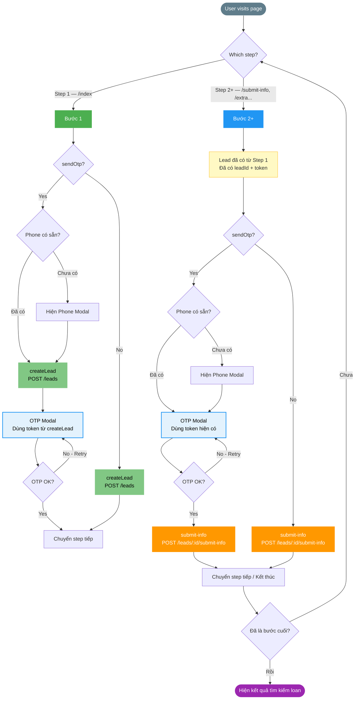

# DynamicLoanForm Logic Flow



## 🎯 Logic Tóm Tắt

### Step 1 (Index === 0)
```
IF sendOtp = true
    ├── Nếu chưa có phone → Hiện Phone Modal
    ├── Gọi createLead (POST /leads) để lấy token
    ├── Hiện OTP Modal (dùng token vừa nhận)
    ├── OTP OK → Navigate step tiếp
    └── OTP Fail → Retry (vòng lại OTP Modal)
ELSE (sendOtp = false)
    └── Gọi createLead → Navigate step tiếp
```

### Step 2+ (Index > 0)
```
Đã có leadId + token từ Step 1

IF sendOtp = true
    ├── Nếu chưa có phone → Hiện Phone Modal
    ├── Hiện OTP Modal (dùng token đã có)
    ├── OTP OK → Gọi submit-info (POST /leads/:id/submit-info)
    ├── submit-info OK → Navigate step tiếp / Kết thúc
    └── OTP Fail → Retry (vòng lại OTP Modal)
ELSE (sendOtp = false)
    └── Gọi submit-info → Navigate step tiếp / Kết thúc
```

## 📝 Ví Dụ Cụ Thể

| Scenario | Step | sendOtp | Phone | Flow |
|----------|------|---------|-------|------|
| **A** | Step 1 `/index` | true | Chưa có | Phone Modal → createLead → OTP → Navigate |
| **B** | Step 1 `/index` | true | Đã có | createLead → OTP → Navigate |
| **C** | Step 1 `/index` | false | — | createLead → Navigate |
| **D** | Step 2 `/submit-info` | true | Đã có | OTP → submit-info → Navigate |
| **E** | Step 2 `/submit-info` | false | — | submit-info → Navigate |
| **F** | Step 3 `/extra` | true | Chưa có | Phone Modal → OTP → submit-info → Navigate |

## ⚠️ Lưu Ý Quan Trọng

1. **Step 1 + OTP**: Luôn gọi `createLead` TRƯỚC OTP để có token
2. **OTP container cần**: `leadId` và `token` để gọi `POST /leads/:id/submit-otp`
3. **Step 2+**: Đã có token từ Step 1, chỉ cần verify OTP rồi gọi `submit-info`
4. **Token lifecycle**: Tạo ở Step 1, dùng cho OTP ở mọi step, hết hạn khi session kết thúc
5. **OTP không thay đổi API chính**: Chỉ là "gate" trước khi navigate (Step 1) hoặc trước `submit-info` (Step 2+)