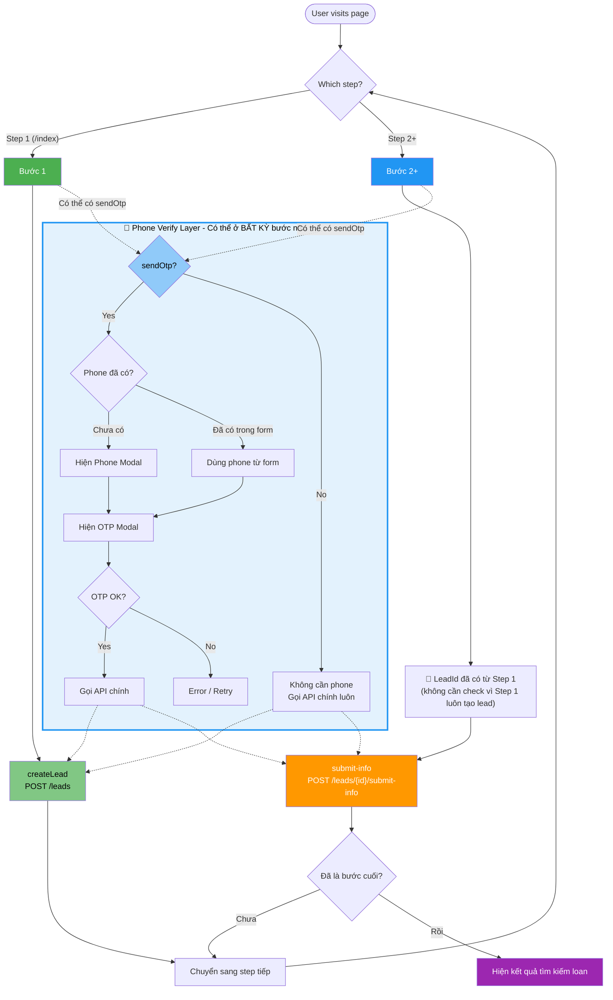

# DynamicLoanForm Logic Flow



## 🎯 Logic Tóm Tắt

### API Call Logic (Không phụ thuộc Phone Verify)
```
Step Index === 0 (Bước 1)
    └── ALWAYS: POST /leads (createLead)

Step Index > 0 (Bước 2+)
    ├── IF leadId exists: POST /leads/{id}/submit-info
    └── IF no leadId: POST /leads (createLead)
```

### Phone Verify Layer (Có thể xuất hiện ở BẤT KỲ bước)
```
Bất kỳ bước nào:
    ├── IF sendOtp = true
    │   ├── IF phone chưa có → Hiện modal nhập phone → OTP → Gọi API
    │   └── IF phone đã có → OTP luôn → Gọi API
    └── IF sendOtp = false
        └── Gọi API ngay (không cần phone)
```

## 📝 Ví Dụ Cụ Thể

| Scenario | Step | sendOtp | Phone | API Call |
|----------|------|---------|-------|----------|
| **A** | Step 1 (/index) | true | Chưa có | Phone Modal → OTP → createLead |
| **B** | Step 1 (/index) | false | - | createLead ngay |
| **C** | Step 2 (/submit-info) | true | Đã có | OTP → submit-info |
| **D** | Step 2 (/submit-info) | false | - | submit-info ngay |
| **E** | Step 3 (/extra) | true | Chưa có | Phone Modal → OTP → submit-info |

## ⚠️ Lưu Ý Quan Trọng

1. **Phone Verify là "layer" riêng**, không phải logic rẽ nhánh chính
2. **API call chỉ phụ thuộc vào Step Index** (1 tạo lead, 2+ submit-info)
3. **OTP có thể xuất hiện ở bất kỳ step nào** dựa trên `sendOtp` flag của flow config
4. **Step 1 luôn tạo lead** dù có OTP hay không
5. **Step 2+ dùng submit-info** (nếu có leadId) hoặc tạo lead (nếu chưa có)
