# Form Submission Flow

## Overview

This document describes all possible submission flows in the Digital Onboarding Platform (DOP), covering single-step and multi-step scenarios with various configurations.

## Complete Flow Diagram

```mermaid
flowchart TD
    Start([User on Page]) --> LoadFlow[Load Flow Config from API]
    LoadFlow --> CheckFlowSteps{How many steps<br/>in flow?}

    CheckFlowSteps -->|Single Step| SingleStepFlow[Single Step Flow]
    CheckFlowSteps -->|Multiple Steps| MultiStepFlow[Multi-Step Flow]

    %% ============================================================================
    %% SINGLE STEP FLOW (e.g., Homepage /index)
    %% ============================================================================

    SingleStepFlow --> FillForm1[User fills form fields]
    FillForm1 --> ClickSubmit1[User clicks Submit]
    ClickSubmit1 --> Validate1[Validate all fields]

    Validate1 -->|Validation Failed| ShowErrors1[Show Errors]
    ShowErrors1 --> ScrollToError1[Auto-scroll to first error]
    ScrollToError1 --> CheckToast1{Field has<br/>showToastOnError?}
    CheckToast1 -->|Yes + High Priority| ShowToast1[Show Toast Error]
    CheckToast1 -->|Yes + Low Priority<br/>+ No other errors| ShowToast1
    CheckToast1 -->|No or has other errors| FillForm1
    ShowToast1 --> FillForm1

    Validate1 -->|Validation Passed| CheckSendOtp1{Step has<br/>sendOtp: true?}

    %% No OTP Path
    CheckSendOtp1 -->|No| CheckNextStep1{Has next step<br/>in flow?}
    CheckNextStep1 -->|Yes| NavNextStep1[Navigate to next step page]
    CheckNextStep1 -->|No| StayOnPage1[Stay on current page]
    NavNextStep1 --> MultiStepFlow

    %% OTP Path
    CheckSendOtp1 -->|Yes| CheckPhoneInData{phone_number<br/>in form data?}

    CheckPhoneInData -->|No| CheckPhoneRequired{phone_number<br/>field required?}
    CheckPhoneRequired -->|No| ConfigError[⚠️ Configuration Error<br/>Toast: Config error]
    ConfigError --> FillForm1
    CheckPhoneRequired -->|Yes| CheckConsent1{Has valid<br/>consent?}

    CheckConsent1 -->|No| ShowConsentModal1[Show Consent Modal]
    ShowConsentModal1 --> UserGrantConsent1[User grants consent]
    UserGrantConsent1 --> CreateConsentSession1[Create consent session]
    CreateConsentSession1 --> ShowPhoneModal1[Show Phone Modal]

    CheckConsent1 -->|Yes| ShowPhoneModal1

    ShowPhoneModal1 --> UserEnterPhone1[User enters phone number]
    UserEnterPhone1 --> ValidatePhone1[Validate phone format & telco]
    ValidatePhone1 -->|Invalid| PhoneError1[Toast: Phone error]
    PhoneError1 --> UserEnterPhone1

    CheckPhoneInData -->|Yes| ValidatePhone1

    ValidatePhone1 -->|Valid| CreateLeadAPI[API: POST /leads]
    CreateLeadAPI -->|Success| SaveLeadData[Save leadId & token]
    CreateLeadAPI -->|Failed| LeadError[Toast: Submission failed]
    LeadError --> FillForm1

    SaveLeadData --> ShowOTPModal1[Show OTP Modal]
    ShowOTPModal1 --> UserEnterOTP1[User enters OTP code]
    UserEnterOTP1 --> VerifyOTP1[API: Verify OTP]

    VerifyOTP1 -->|Failed| OTPError1[Toast: OTP error]
    OTPError1 --> UserEnterOTP1

    VerifyOTP1 -->|Success| CreateVerifSession1[Create verification session]
    CreateVerifSession1 --> CheckNextStepOTP{Has next step<br/>in flow?}
    CheckNextStepOTP -->|Yes| NavToLoanInfo[Navigate to /loan-info<br/>with leadId & token]
    CheckNextStepOTP -->|No| NavToLoanInfo

    NavToLoanInfo --> LoanInfoPage

    %% ============================================================================
    %% MULTI-STEP FLOW (e.g., /loan-info, /personal-info, etc.)
    %% ============================================================================

    MultiStepFlow --> InitWizard[Initialize StepWizard<br/>with all steps]
    InitWizard --> ShowStep[Show current step]
    ShowStep --> FillFormStep[User fills step fields]
    FillFormStep --> ClickNext[User clicks Next/Submit]

    ClickNext --> CheckLastStep{Is last step?}

    %% Not Last Step - Click Next
    CheckLastStep -->|No - Click Next| ValidateStep[Validate current step]
    ValidateStep -->|Failed| ShowStepErrors[Show inline errors]
    ShowStepErrors --> ScrollToStepError[Auto-scroll to first error]
    ScrollToStepError --> FillFormStep

    ValidateStep -->|Passed| MarkStepComplete[Mark step as complete]
    MarkStepComplete --> IncrementStep[currentStep++]
    IncrementStep --> ShowStep

    %% Last Step - Click Submit
    CheckLastStep -->|Yes - Click Submit| ValidateLastStep[Validate last step]
    ValidateLastStep -->|Failed| ShowLastStepErrors[Show errors + Toast<br/>if showToastOnError]
    ShowLastStepErrors --> ScrollToLastError[Auto-scroll to first error]
    ScrollToLastError --> FillFormStep

    ValidateLastStep -->|Passed| GetAllData[Collect all steps data]
    GetAllData --> CheckLastStepOTP{Last step has<br/>sendOtp: true?}

    %% Last Step - No OTP
    CheckLastStepOTP -->|No| CheckHasLead{Has leadId<br/>from previous step?}
    CheckHasLead -->|Yes| SubmitLeadInfo[API: PUT /leads/:id/info]
    CheckHasLead -->|No| CreateLeadFinal[API: POST /leads]

    SubmitLeadInfo --> ShowFindingScreen[Show Finding Loan Screen]
    CreateLeadFinal --> ShowFindingScreen
    ShowFindingScreen --> ShowSuccess[Show Success Message]

    %% Last Step - With OTP
    CheckLastStepOTP -->|Yes| CheckPhoneInLastStep{phone_number<br/>in data?}
    CheckPhoneInLastStep -->|No| CheckPhoneReqLast{phone_number<br/>required?}
    CheckPhoneReqLast -->|No| ConfigErrorLast[⚠️ Config Error]
    ConfigErrorLast --> FillFormStep

    CheckPhoneReqLast -->|Yes| CheckConsentLast{Has valid<br/>consent?}
    CheckConsentLast -->|No| ShowConsentModalLast[Show Consent Modal]
    ShowConsentModalLast --> UserGrantConsentLast[User grants consent]
    UserGrantConsentLast --> ShowPhoneModalLast[Show Phone Modal]
    CheckConsentLast -->|Yes| ShowPhoneModalLast

    ShowPhoneModalLast --> UserEnterPhoneLast[User enters phone]
    UserEnterPhoneLast --> ValidatePhoneLast[Validate phone]
    ValidatePhoneLast -->|Invalid| PhoneErrorLast[Toast: Phone error]
    PhoneErrorLast --> UserEnterPhoneLast

    CheckPhoneInLastStep -->|Yes| ValidatePhoneLast

    ValidatePhoneLast -->|Valid| CreateLeadAPILast[API: POST /leads]
    CreateLeadAPILast -->|Failed| LeadErrorLast[Toast: Failed]
    LeadErrorLast --> FillFormStep

    CreateLeadAPILast -->|Success| SaveLeadDataLast[Save leadId & token]
    SaveLeadDataLast --> ShowOTPModalLast[Show OTP Modal]
    ShowOTPModalLast --> UserEnterOTPLast[User enters OTP]
    UserEnterOTPLast --> VerifyOTPLast[API: Verify OTP]

    VerifyOTPLast -->|Failed| OTPErrorLast[Toast: OTP error]
    OTPErrorLast --> UserEnterOTPLast

    VerifyOTPLast -->|Success| CreateVerifSessionLast[Create verification session]
    CreateVerifSessionLast --> NavToNextPage[Navigate to next page<br/>with leadId & token]
    NavToNextPage --> LoanInfoPage

    %% ============================================================================
    %% LOAN INFO PAGE (Continuation)
    %% ============================================================================

    LoanInfoPage[Loan Info Page<br/>/loan-info] --> CheckLeadParams{Has leadId<br/>& token in URL?}
    CheckLeadParams -->|Yes| LoadLoanInfoForm[Load DynamicLoanForm<br/>page=/submit-info]
    CheckLeadParams -->|No| LoadLoanInfoForm

    LoadLoanInfoForm --> CheckConsentLoanInfo{Has valid<br/>consent?}
    CheckConsentLoanInfo -->|No| ShowConsentModalLoan[Show Consent Modal]
    ShowConsentModalLoan --> UserGrantConsentLoan[User grants consent]
    UserGrantConsentLoan --> FillLoanInfoForm[User fills loan info form]
    CheckConsentLoanInfo -->|Yes| FillLoanInfoForm

    FillLoanInfoForm --> SubmitLoanInfo[User submits form]
    SubmitLoanInfo --> ValidateLoanInfo[Validate fields]
    ValidateLoanInfo -->|Failed| ShowLoanInfoErrors[Show errors]
    ShowLoanInfoErrors --> FillLoanInfoForm

    ValidateLoanInfo -->|Passed| CheckLeadIdExists{Has leadId?}
    CheckLeadIdExists -->|Yes| UpdateLeadInfo[API: PUT /leads/:id/info]
    CheckLeadIdExists -->|No| CreateNewLead[API: POST /leads]

    UpdateLeadInfo --> ShowFindingLoan[Show Finding Loan Screen]
    CreateNewLead --> ShowFindingLoan
    ShowFindingLoan --> CheckHasProducts{Has<br/>matched_products?}
    CheckHasProducts -->|Yes| ShowLoanResult[Show LoanResultScreen<br/>Product List View]
    CheckHasProducts -->|No| CheckForwardStatus{Forward<br/>status?}
    ShowLoanResult --> UserSelectProduct[User selects product]
    UserSelectProduct --> ForwardLead[API: Forward to partner]
    ForwardLead --> ShowSuccessLoan[Show Success View<br/>with partner info]
    CheckForwardStatus -->|forwarded| ShowSuccessLoan
    CheckForwardStatus -->|rejected| ShowErrorRejected[Show Error View<br/>Lead rejected]
    CheckForwardStatus -->|exhausted| ShowErrorExhausted[Show Error View<br/>No partners available]

    %% ============================================================================
    %% SPECIAL CASES
    %% ============================================================================

    style ConfigError fill:#ff6b6b,stroke:#c92a2a,color:#fff
    style ConfigErrorLast fill:#ff6b6b,stroke:#c92a2a,color:#fff
    style ShowErrors1 fill:#ffd43b,stroke:#fab005
    style ShowStepErrors fill:#ffd43b,stroke:#fab005
    style ShowLastStepErrors fill:#ffd43b,stroke:#fab005
    style ShowLoanInfoErrors fill:#ffd43b,stroke:#fab005
    style PhoneError1 fill:#ff8787,stroke:#fa5252
    style PhoneErrorLast fill:#ff8787,stroke:#fa5252
    style LeadError fill:#ff8787,stroke:#fa5252
    style LeadErrorLast fill:#ff8787,stroke:#fa5252
    style OTPError1 fill:#ff8787,stroke:#fa5252
    style OTPErrorLast fill:#ff8787,stroke:#fa5252
    style ShowFindingLoan fill:#74c0fc,stroke:#339af0
    style ShowLoanResult fill:#74c0fc,stroke:#339af0
    style ShowSuccessLoan fill:#51cf66,stroke:#37b24d,color:#fff
    style ShowErrorRejected fill:#ff8787,stroke:#fa5252
    style ShowErrorExhausted fill:#ff8787,stroke:#fa5252
    style CreateVerifSession1 fill:#74c0fc,stroke:#339af0
    style CreateVerifSessionLast fill:#74c0fc,stroke:#339af0
```



## Flow Scenarios

### Scenario 1: Single-Step Flow without OTP (Simple Form)

**Example**: Homepage with basic info collection, no phone verification

**Steps**:

1. User fills form on `/` (index page)
2. User clicks "Submit"
3. Validation passes
4. Check: `sendOtp: false`
5. Check: Has next step? → No
6. Stay on current page or show success

**Use Case**: Newsletter signup, basic contact form

---

### Scenario 2: Single-Step Flow with OTP (Homepage)

**Example**: Homepage with phone verification before proceeding

**Steps**:

1. User fills form on `/` (index page)
2. User clicks "Submit"
3. Validation passes
4. Check: `sendOtp: true`
5. Check: `phone_number` in data? → No
6. Show Phone Modal
7. User enters phone → Validate
8. Create Lead API → Success
9. Show OTP Modal
10. User enters OTP → Verify
11. Create verification session
12. Navigate to `/loan-info?leadId=X&token=Y`

**Use Case**: Quick loan application from homepage

---

### Scenario 3: Multi-Step Flow without OTP (Wizard)

**Example**: 3-step form (Personal Info → Financial Info → Submit)

**Steps**:

1. User on Step 1 (Personal Info)
2. Fill fields → Click "Next"
3. Validate Step 1 → Pass
4. Move to Step 2 (Financial Info)
5. Fill fields → Click "Next"
6. Validate Step 2 → Pass
7. Move to Step 3 (Submit)
8. Fill fields → Click "Submit"
9. Validate Step 3 → Pass
10. Check: Last step has `sendOtp: false`
11. Submit all data to API
12. Show Finding Loan Screen
13. Show Success

**Use Case**: Detailed loan application without phone verification

---

### Scenario 4: Multi-Step Flow with OTP at Middle Step

**Example**: Step 1 (Basic) → Step 2 (OTP) → Step 3 (Financial) → Step 4 (Submit)

**Steps**:

1. User on Step 1 (Basic Info)
2. Fill fields → Click "Next"
3. Validate → Pass → Move to Step 2
4. Step 2 has `sendOtp: true`
5. User fills phone → Click "Next"
6. Validate → Pass
7. Show Phone Modal (if phone not in data)
8. Create Lead API
9. Show OTP Modal
10. Verify OTP → Success
11. Create verification session
12. Move to Step 3 (Financial Info)
13. **Navigation Security Active**: Cannot go back to Step 1-2
14. Fill Step 3 → Click "Next" → Move to Step 4
15. Fill Step 4 → Click "Submit"
16. Submit all data to API
17. Show Success

**Use Case**: Secure loan application with mid-flow verification

---

### Scenario 5: Multi-Step Flow with OTP at Last Step

**Example**: Step 1 (Personal) → Step 2 (Financial) → Step 3 (OTP + Submit)

**Steps**:

1. User completes Step 1 → Move to Step 2
2. User completes Step 2 → Move to Step 3
3. Step 3 has `sendOtp: true`
4. User fills final info → Click "Submit"
5. Validate → Pass
6. Show Phone Modal (if needed)
7. Create Lead API
8. Show OTP Modal
9. Verify OTP → Success
10. Create verification session
11. Navigate to next page or show success

**Use Case**: Final verification before submission

---

### Scenario 6: Multi-OTP Flow (Multiple Verification Points)

**Example**: Step 1 (Basic) → Step 2 (Phone OTP) → Step 3 (Financial) → Step 4 (Email OTP) → Step 5 (Submit)

**Steps**:

1. Complete Step 1 → Move to Step 2
2. Step 2 has `sendOtp: true` (phone)
3. Verify phone OTP → Create session #1
4. Move to Step 3 (cannot go back to 1-2)
5. Complete Step 3 → Move to Step 4
6. Step 4 has `sendOtp: true` (email)
7. Verify email OTP → Create session #2
8. Move to Step 5 (cannot go back to 1-4)
9. Complete Step 5 → Submit
10. Show Success

**Use Case**: High-security applications requiring multiple verifications

---

## Key Components

### 1. DynamicLoanForm

- **Props**: `page`, `initialData`, `onSubmitSuccess`
- **Responsibility**: Renders form for a specific page/step
- **Handles**: Validation, OTP flow, consent checks

### 2. StepWizard

- **Props**: `config`, `initialData`, `onComplete`
- **Responsibility**: Multi-step navigation and state management
- **Handles**: Step validation, progress tracking, navigation

### 3. WizardNavigation

- **Buttons**: Back, Next, Submit
- **Logic**:
  - Next: Validate → Move to next step
  - Submit: Validate → Call `onComplete`
- **Error Handling**: Scroll to error, show toast for special fields

### 5. LoanResultScreen

**Purpose**: Display loan search results and matched products from distribution engine

**Location**: `src/components/loan-application/LoanSearching/LoanResultScreen.tsx`

**Responsibility**: 
- State-based view router (orchestrator pattern)
- Delegates rendering to appropriate view components
- No UI logic - only state determination

**State Flow**:
```
forwarded → SuccessView
has products → ProductListView  
no products → EmptyState
error → ErrorState
```

**Props**:
- `onSelectProduct`: Callback when user selects a product
- `onViewMore`: Callback for "view more" action
- `onRetry`: Retry action for error/empty states
- `onBack`: Back navigation action
- `onContinue`: Continue after successful forward

**Views** (modular, in `LoanResult/views/`):

| View | File | Purpose |
|------|------|---------|
| `ProductListView` | `ProductListView.tsx` | Display list of matched products |
| `SuccessView` | `SuccessView.tsx` | Show forwarded success state |
| `EmptyState` | `EmptyState.tsx` | No matching products found |
| `ErrorState` | `ErrorState.tsx` | Error or rejected state |

**Components** (in `LoanResult/components/`):
- `ProductCard.tsx`: Individual product display with special partner support

**Config** (in `LoanResult/config/`):
- `special-partners.ts`: Partner-specific configurations (e.g., CathayBank)

**Utils** (in `LoanResult/utils/`):
- `formatters.ts`: Pure formatting functions (currency, period, etc.)

---

### 6. LoanSearchStore (Zustand)

**Purpose**: Global state management for loan search and result display

**Location**: `src/store/use-loan-search-store.ts`

**State**:
```typescript
interface LoanSearchState {
  isVisible: boolean;
  config: LoanSearchConfig | null;
  forwardStatus: ForwardStatus;  // undefined | "forwarded" | "rejected" | "exhausted"
  result: unknown;               // Generic result from API
  matchedProducts: matched_product[];  // Products from distribution
  error: string | null;
  isLoading: boolean;
}
```

**Actions**:
- `showLoanSearching(config)`: Show searching screen, reset state
- `hideLoanSearching()`: Hide and reset all state
- `setForwardStatus(status)`: Update forward status from API
- `setResult(result)`: Set generic API result
- `setMatchedProducts(products)`: Set matched products from distribution
- `setError(error)`: Set error and update status to "rejected"

**Selectors**:
- `useLoanSearchVisible()`: Check if screen is visible
- `useForwardStatus()`: Get current forward status
- `useLoanSearchResult<T>()`: Type-safe result access
- `useMatchedProducts()`: Get matched products array
- `useLoanSearchError()`: Get error message

**Flow Integration**:
1. `DynamicLoanForm` calls `showLoanSearching()` on lead creation
2. Stores `matched_products` from API response
3. Page renders `LoanResultScreen` when products available
4. User selects product → API forward → `setForwardStatus("forwarded")`
5. `SuccessView` displayed with partner info

---

## API Endpoints

### POST /leads

**Purpose**: Create new lead
**Payload**:

```typescript
{
  flowId: string,
  tenant: string,
  deviceInfo: {},
  trackingParams: {},
  info: LeadInfo,
  consent_id?: string
}
```

**Response**:

```typescript
{
  id: string,      // leadId
  token: string    // auth token
}
```

### PUT /leads/:id/info

**Purpose**: Update existing lead with additional info
**Payload**:

```typescript
{
  ...LeadInfo
}
```

### POST /otp/verify

**Purpose**: Verify OTP code
**Payload**:

```typescript
{
  leadId: string,
  token: string,
  otp: string,
  otpType: 1 | 2
}
```

---

## Modals

### 1. Consent Modal

- **Trigger**: No valid consent + `consent_purpose_id` exists
- **Action**: User grants consent → Create consent session
- **Next**: Continue with original flow

### 2. Phone Verification Modal

- **Trigger**: `sendOtp: true` + phone not in data + phone required
- **Input**: Phone number
- **Validation**: Format + Telco check
- **Next**: Create Lead API

### 3. OTP Verification Modal

- **Trigger**: Lead created successfully
- **Input**: 6-digit OTP code
- **Validation**: API verification
- **Next**: Create verification session → Navigate

---

## Navigation Security

### Verification Session

- **Created**: After successful OTP verification
- **Purpose**: Prevent back navigation to pre-OTP steps
- **Storage**: Auth store + session storage (encrypted)
- **Check**: `canNavigateBack(targetStep)` in wizard store

### Rules

1. User can navigate forward freely
2. User can navigate back to steps BEFORE OTP step
3. User CANNOT navigate back to OTP step or earlier after verification
4. Session expires after timeout (configurable)

---

## Error Handling

### Validation Errors

- **Inline**: Show below field (default)
- **Toast**: For fields with `showToastOnError: true`
- **Priority**:
  - High (0): Always show toast
  - Low (>0): Show only if no other errors
- **Auto-scroll**: Focus first error field

### API Errors

- **Lead Creation Failed**: Toast error → Stay on form
- **OTP Verification Failed**: Toast error → Allow retry
- **Network Error**: Toast error → Allow retry

### Configuration Errors

- **sendOtp: true but phone not required**: Toast config error
- **Missing consent_purpose_id**: Skip consent check
- **Invalid flow config**: Show error message

---

## Testing Profiles

Located in `src/__tests__/msw/profiles/`:

1. **default**: OTP at step 3 (middle)
2. **otp-at-step-1**: OTP at first step
3. **otp-at-step-3**: OTP at step 3
4. **otp-at-last-step**: OTP at final step
5. **no-otp-flow**: No OTP verification
6. **multi-otp-flow**: Multiple OTP steps
7. **with-ekyc**: Includes eKYC verification

---

## Common Issues

### Issue 1: Toast not showing on Next button

**Problem**: Toast only shows on Submit, not on Next
**Solution**: Add toast logic to `handleNext()` in WizardNavigation

### Issue 2: Phone modal shows when phone already collected

**Problem**: Logic doesn't check if phone in form data
**Solution**: Check `data.phone_number` before showing modal

### Issue 3: Cannot navigate back after OTP

**Problem**: Verification session blocks navigation
**Solution**: This is intended behavior for security

### Issue 4: Consent modal shows repeatedly

**Problem**: Consent session not persisted
**Solution**: Check `hasConsent()` before showing modal

---

## Future Enhancements

1. **Resume Flow**: Save progress and resume later
2. **Multi-language OTP**: Support SMS in multiple languages
3. **Biometric Verification**: Alternative to OTP
4. **Step Skipping**: Conditional step visibility
5. **Parallel Steps**: Multiple steps at once (tabs)

---

## LoanResultScreen & Matched Products Display

### Architecture

The loan result display follows a **modular, SoC-based architecture** with clear separation between state, views, and configuration.

### 1. LoanResultScreen (Orchestrator)

**Location**: `src/components/loan-application/LoanSearching/LoanResultScreen.tsx`

**Purpose**: State-based view router that delegates rendering to appropriate view components based on store state.

**State Flow**:
```
forwardStatus === "forwarded"    → SuccessView
matchedProducts.length > 0       → ProductListView  
forwardStatus === "rejected"     → ErrorState
forwardStatus === "exhausted"    → ErrorState
No products & no error           → EmptyState
```

**Props**:
- `onSelectProduct`: Callback when user selects a product
- `onViewMore`: Callback for "view more" action  
- `onRetry`: Retry action for error/empty states
- `onBack`: Back navigation action
- `onContinue`: Continue after successful forward

### 2. Modular Views (SoC)

Located in `src/components/loan-application/LoanSearching/LoanResult/views/`:

| View | Purpose | Props |
|------|---------|-------|
| `ProductListView` | Display list of matched products | `products`, `onSelectProduct`, `onViewMore` |
| `SuccessView` | Show forwarded success state | `forwardResult`, `onContinue` |
| `EmptyState` | No matching products found | `onRetry`, `onBack` |
| `ErrorState` | Error or rejected state | `error`, `status`, `onRetry`, `onBack` |

### 3. ProductCard Component

**Location**: `LoanResult/components/ProductCard.tsx`

**Features**:
- Partner logo display with fallback
- Loan type badge
- Loan details (period, amount)
- Special partner styling support
- Theme integration

**Special Partners Support**:
- Configurable via `LoanResult/config/special-partners.ts`
- Partners like CathayBank get custom styling and messages
- Priority-based sorting in product list

### 4. LoanSearchStore (Zustand)

**Location**: `src/store/use-loan-search-store.ts`

**State**:
```typescript
interface LoanSearchState {
  isVisible: boolean;
  config: LoanSearchConfig | null;
  forwardStatus: ForwardStatus;  // undefined | "forwarded" | "rejected" | "exhausted"
  result: unknown;               // Generic result from API
  matchedProducts: matched_product[];  // Products from distribution engine
  error: string | null;
  isLoading: boolean;
}
```

**Key Actions**:
- `showLoanSearching(config)`: Show searching screen, reset state
- `setMatchedProducts(products)`: Store matched products from API
- `setForwardStatus(status)`: Update status from submit-info response
- `hideLoanSearching()`: Hide and reset all state

**Selectors**:
- `useMatchedProducts()`: Get matched products array
- `useForwardStatus()`: Get current forward status
- `useLoanSearchResult<T>()`: Type-safe result access
- `useLoanSearchError()`: Get error message

### 5. Integration Flow

```
1. User submits form
   ↓
2. DynamicLoanForm calls createLead or submitLeadInfo
   ↓
3. API returns matched_products + forward_result
   ↓
4. Store: setMatchedProducts(products)
   ↓
5. Page detects matchedProducts.length > 0
   ↓
6. Render LoanResultScreen with ProductListView
   ↓
7. User selects product → call forward API
   ↓
8. Store: setForwardStatus("forwarded")
   ↓
9. LoanResultScreen renders SuccessView
```

### 6. API Response Handling

**CreateLead Response**:
```typescript
{
  id: string;
  token: string;
  matched_products?: matched_product[];
  forward_result?: ForwardResult;
}
```

**SubmitLeadInfo Response**:
```typescript
{
  matched_products?: matched_product[];
  forward_result?: ForwardResult;
}
```

### 7. Special Partner Configuration

**Location**: `LoanResult/config/special-partners.ts`

```typescript
export const SPECIAL_PARTNER_CONFIGS: Record<string, SpecialPartnerConfig> = {
  CATHAYBANK: {
    theme: "blue",
    customMessageKey: "specialPartner.cathaybank.message",
    hideDetails: false,
    priority: 1,
  },
  // Add more partners as needed
};
```

**Features**:
- Custom theme colors
- Special badge display
- Custom CTA text
- Priority-based ordering
- Configurable detail hiding

### 8. i18n Support

**Translation Keys** (in `messages/[locale]/pages/loan-result.json`):
- `title`: Page title
- `subtitle`: Subtitle with product count
- `loanType.personal`: Personal loan label
- `loanType.creditCard`: Credit card label
- `actions.register`: Register button
- `actions.viewMore`: View more button
- `success.title`: Success state title
- `success.message`: Success message with partner name
- `specialPartner.cathaybank.message`: Custom partner message

### 9. Utilities

**Location**: `LoanResult/utils/formatters.ts`

Pure functions for data formatting:
- `formatLoanPeriod(months)`: "6 tháng" | "1 năm 6 tháng"
- `formatAmount(amount)`: "50 triệu" | "1.5 tỷ"
- `formatCurrency(amount, currency)`: "50.000.000 VND"
- `getPartnerLogoUrl(code)`: Logo path generation
- `getLoanTypeKey(type)`: i18n key for loan type
- `calculateEMI(principal, rate, months)`: Monthly payment estimation

---

## Related Documentation

- [Navigation Security](./navigation-security.md)
- [Consent System](./consent/README.md)
- [Form Generation](./form-generation/README.md)
- [Testing Guide](./testing/README.md)
