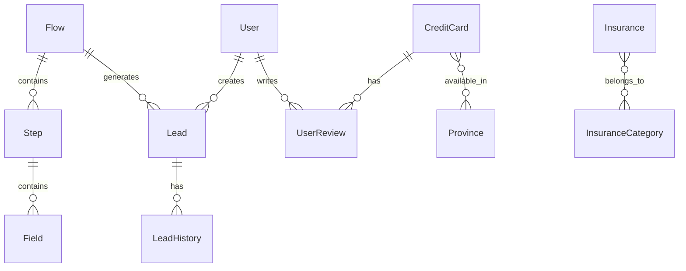

# Data Models and Structures Documentation

## Tổng quan

Tài liệu này mô tả các mô hình dữ liệu, cấu trúc và quy trình quản lý trạng thái được sử dụng trong ứng dụng DOP-FE, kết hợp các mô hình từ dự án cũ (Finzone Frontend) và cấu trúc mới với Next.js/React 19/shadcn/TS-Zod-eKYC-Query-Zustand-Tailwind.

## Mục lục

1. [Core Data Models](#core-data-models)
2. [State Management Structure](#state-management-structure)
3. [Form Data Models](#form-data-models)
4. [API Payloads](#api-payloads)
5. [Data Relationships](#data-relationships)
6. [Zod Schema Integration](#zod-schema-integration)
7. [Migration Paths and Transformations](#migration-paths-and-transformations)
8. [Type Safety and Validation](#type-safety-and-validation)

## Core Data Models

### Domain-Specific Models

#### Flow Models
Quản lý các luồng xử lý business logic trong hệ thống:

```typescript
// Từ src/types/admin.ts
interface FlowDetail {
  id: string;
  name: string;
  description?: string;
  status: FlowStatus; // 'active' | 'inactive' | 'draft' | 'archived'
  createdAt: string;
  updatedAt: string;
  steps: StepListItem[];
}

interface StepDetail {
  id: string;
  stepOrder: number;
  name: string;
  description?: string;
  hasEkyc: boolean;
  hasOtp: boolean;
  status: StepStatus; // 'active' | 'inactive' | 'draft'
  flowId: string;
  fields: FieldListItem[];
}

interface FieldListItem {
  id: string;
  name: string;
  type: FieldType; // 'text' | 'email' | 'password' | 'number' | 'date' | 'select' | 'checkbox' | 'radio' | 'textarea' | 'file' | 'ekyc' | 'otp'
  visible: boolean;
  required: boolean;
  label?: string;
  placeholder?: string;
  validation?: {
    min?: number;
    max?: number;
    pattern?: string;
  };
}
```

#### User Data Models
Kế thừa và mở rộng từ mô hình cũ với validation mạnh mẽ hơn:

```typescript
// Kế thừa từ IUserData (dự án cũ) và mở rộng
interface UserData {
  // Basic Information
  full_name?: string;
  gender?: Gender; // 'male' | 'female' | 'other'
  birthday?: string;
  
  // Contact Information
  phone_number?: string;
  email?: string;
  
  // Location Information
  district?: string;
  province?: string;
  
  // Financial Information
  income?: number;
  income_type?: string;
  expected_amount?: number;
  loan_period?: number;
  loan_purpose?: string;
  
  // Credit History
  having_loan?: HavingLoan; // 'no_loan' | 'one_loan' | 'two_loans' | 'three_loans' | 'more_than_three_loans'
  credit_status?: CreditStatus; // 'no_bad_debt' | 'bad_debt' | 'bad_debt_last3_year'
  
  // Career Information
  career_status?: CareerStatus; // 'employed' | 'self_employed' | 'unemployed' | 'housewife' | 'retired'
  career_type?: string;
  
  // Identity Verification
  national_id?: string;
  national_id_front_key?: string;
  national_id_back_key?: string;
  
  // Additional Information
  mandatory_docs?: string;
  extra_docs?: string;
  device_id?: string;
}
```

#### Product Models
Kết hợp các mô hình sản phẩm từ dự án cũ:

```typescript
// Credit Card Models (kế thừa từ ICard)
interface CreditCard {
  id: number;
  name: string;
  client_code: string;
  issuer: string;
  link: string;
  image_link: string;
  age_required_min: number;
  age_required_max: number;
  income_required: number;
  is_income_needing_validation: boolean;
  is_online_application: boolean;
  credit_limit: number;
  waive_fee_condition: string[];
  interest_rate: number;
  annual_fee: number;
  withdrawal_fee: number;
  min_withdrawal_fee: number;
  over_limit_fee: number;
  min_over_limit_fee: number;
  installment_fee: number;
  fx_fee: number;
  min_fx_fee: number;
  benefit: string[];
  drawback: string[];
  opening_gift_amount: number;
  opening_gift_desc: string[];
  benefit_rate: number;
  fee_rate: number;
  service_rate: number;
  procedure_rate: number;
  customer_rate: number;
  category_ids: number[];
  category_names: string[];
  provinces: string[];
  province_description: string;
  weight: number;
  features: string[];
  updated_at: string;
  user_reviews: UserReview[];
}

// Loan Provider Models (kế thừa từ IProvider)
interface LoanProvider {
  id: number;
  name: string;
  client_code: string;
  expected_amount: number;
  loan_period: number;
  emi: number;
  require_dop: number;
  convert_type: "forward" | "redirect";
}

// Insurance Models (kế thừa từ IInsurance)
interface Insurance {
  id: number;
  name: string;
  client_code: string;
  issuer: string;
  link: string;
  image_link: string;
  fee: number;
  body_limit: number;
  property_limit: number;
  target: string;
  coverage: string;
  benefit: string;
  exclusion: string;
  indemnity_profile: string;
  rate: string;
  metadata: any;
}
```

## State Management Structure

### Zustand Store Architecture

#### Admin Flow Store
Quản lý trạng thái của admin panel với pending changes tracking:

```typescript
// Từ src/store/use-admin-flow-store.ts
interface AdminFlowState {
  // Current flow and step being edited
  currentFlow: FlowDetail | null;
  currentStep: StepDetail | null;
  
  // Pending changes for optimistic updates
  pendingFlowChanges: Partial<FlowDetail>;
  pendingStepChanges: Record<string, Partial<StepDetail>>;
  
  // UI state
  isEditing: boolean;
  hasUnsavedChanges: boolean;
  
  // Actions
  setCurrentFlow: (flow: FlowDetail | null) => void;
  setCurrentStep: (step: StepDetail | null) => void;
  updatePendingFlowChanges: (changes: Partial<FlowDetail>) => void;
  updatePendingStepChanges: (stepId: string, changes: Partial<StepDetail>) => void;
  saveChanges: () => Promise<void>;
  discardChanges: () => void;
}
```

#### Authentication Store
Quản lý trạng thái xác thực với persistence:

```typescript
// Từ src/store/use-auth-store.ts
interface AuthState {
  user: User | null;
  isAuthenticated: boolean;
  isLoading: boolean;
  isHydrated: boolean;
  
  // Actions
  login: (credentials: LoginCredentials) => Promise<void>;
  logout: () => void;
  refreshToken: () => Promise<void>;
  hydrateAuth: () => void;
}
```

#### Multi-Step Form Store
Quản lý trạng thái của multi-step forms với validation:

```typescript
// Từ src/store/use-multi-step-form-store.ts
interface MultiStepFormState {
  currentStep: number;
  formData: Record<string, any>;
  stepValidation: Record<string, boolean>;
  completedSteps: Set<number>;
  isSubmitting: boolean;
  
  // Actions
  goToNextStep: () => Promise<boolean>;
  goToPreviousStep: () => void;
  goToStep: (stepIndex: number) => void;
  updateStepData: (data: Record<string, any>) => void;
  completeCurrentStep: () => void;
  resetForm: () => void;
}
```

### Type Safety in State Management

#### Typed State
Full TypeScript integration với generic types:

```typescript
// Generic store pattern
interface TypedStore<T> {
  state: T;
  actions: {
    [K in keyof T]: T[K] extends Function ? T[K] : never;
  };
}

// Example usage
interface LoanState {
  currentLoanStep: LOAN_STEPS;
  loanStatus: LoanStatus | null;
  isSubmitting: boolean;
  userData: UserData;
  userDataValidate: UserDataValidate;
  leadData: LeadData;
  provider: Provider;
  trackingParams: TrackingParams;
}
```

## Form Data Models

### Field Configuration Types

#### Dynamic Form Fields
Hệ thống form-driven với dynamic field configuration:

```typescript
// Từ src/types/data-driven-ui.d.ts
interface FieldConfig {
  fieldName: string;
  component: string;
  props: FieldProps;
  condition?: FieldCondition;
}

interface FieldProps {
  labelKey?: string;
  placeholderKey?: string;
  descriptionKey?: string;
  validations?: ValidationRule[];
  disabled?: boolean;
  className?: string;
  
  // Async options configuration
  optionsFetcher?: {
    fetcher: (params?: any) => Promise<any[]>;
    transform?: (data: any[]) => Array<{ value: string; label: string; disabled?: boolean }>;
    cacheKey?: string;
    cacheDuration?: number;
    dependsOn?: string[];
  };
}
```

#### Validation Rules
Hệ thống validation linh hoạt với Zod integration:

```typescript
interface ValidationRule {
  type: string; // 'required', 'minLength', 'maxLength', 'min', 'max', 'email', 'regex', etc.
  value?: any;
  messageKey: string;
}
```

### Multi-step Form Data

#### Step Configuration
Cấu hình cho từng step trong multi-step form:

```typescript
// Từ src/types/multi-step-form.d.ts
interface StepConfig {
  id: string;
  title: string;
  description?: string;
  fields: RawFieldConfig[];
  stepValidation?: {
    validate?: (data: Record<string, any>) => Promise<boolean | string>;
  };
  optional?: boolean;
  icon?: React.ReactNode;
}

interface MultiStepFormConfig {
  steps: StepConfig[];
  initialStep?: number;
  allowBackNavigation?: boolean;
  showProgress?: boolean;
  progressStyle?: "steps" | "bar" | "dots";
  persistData?: boolean;
  persistKey?: string;
  onStepComplete?: (stepId: string, stepData: Record<string, any>) => void | Promise<void>;
  onComplete?: (allData: Record<string, any>) => void | Promise<void>;
  onStepChange?: (fromStep: number, toStep: number) => void;
}
```

## API Payloads

### Request/Response Formats

#### Lead Management API
API payloads cho lead creation và submission:

```typescript
// Từ src/lib/api/schema.yaml
interface CreateLeadRequestBody {
  flow_id: string;
  domain: string;
  device_info: Record<string, any>;
  tracking_params: Record<string, any>;
  info: SubmitLeadInfoRequestBody;
}

interface SubmitLeadInfoRequestBody {
  flow_id: string;
  step_id: string;
  phone_number?: string;
  email?: string;
  purpose?: string;
  loan_amount?: number;
  loan_period?: number;
  otp_type?: OTPType; // 'sms' | 'email' | 'voice'
  full_name?: string;
  national_id?: string;
  gender?: Gender;
  location?: string;
  birthday?: string;
  income_type?: string;
  income?: number;
  having_loan?: HavingLoan;
  career_status?: CareerStatus;
  career_type?: string;
  credit_status?: CreditStatus;
}
```

#### OTP Verification API
API payloads cho OTP verification:

```typescript
interface SubmitOTPRequestBody {
  token: string;
  otp: string;
}

interface ResendOTPRequestBody {
  target: string; // phone number or email
}
```

### Data Transformation Types

#### Mapper Functions
Chuyển đổi dữ liệu giữa frontend và backend:

```typescript
// Từ src/mappers/onboardingMapper.ts
function mapFormToApi(
  formData: Record<string, any>,
  flowId: string,
  stepId: string,
): SubmitLeadInfoRequestBody;

function toCreateLeadRequest(
  formData: Record<string, any>,
  flowId: string,
  stepId: string,
  domain: string,
): CreateLeadRequestBody;

// Từ src/mappers/flowMapper.ts
function mapApiFlowToFlow(apiFlow: ApiFlowDetail): MappedFlow;
function mapApiStepToStep(apiStep: ApiStep): MappedStep;
```

## Data Relationships

### Model Relationships

#### One-to-Many Relationships
- Flow → Steps → Fields hierarchy với proper parent-child relationships
- CreditCard → UserReviews với một card có nhiều reviews
- Insurance → InsuranceCategory với một insurance có thể thuộc nhiều categories

#### Many-to-Many Relationships
- Field validation rules với multiple conditions
- CreditCard → Provinces với cards available trong multiple provinces
- User → Products với users có thể apply cho multiple products

### Foreign Keys and References

#### Reference Types
- UUID-based references cho flow_id, step_id, field_id
- Proper typing cho foreign keys với UUID format validation
- Cascade operations cho step deletion triggers field cleanup



### Data Flow Between Components

#### Unidirectional Data Flow
- Clear data flow từ API → mappers → stores → components
- Immutable updates qua immutable patterns trong Zustand stores
- Reactive updates qua proper state management patterns

#### Context Usage
- React context cho theme và authentication
- Custom hooks cho complex state logic
- Minimal prop drilling với context providers

## Zod Schema Integration

### Dynamic Schema Generation
Tự động tạo Zod schemas từ field configurations:

```typescript
// Từ src/lib/builders/zod-generator.ts
function generateZodSchema(
  fields: FieldConfig[],
  t: (key: string, values?: Record<string, any>) => string,
): z.ZodObject<any>;

function generateFieldSchema(
  fieldConfig: FieldConfig,
  t: (key: string, values?: Record<string, any>) => string,
): z.ZodTypeAny;

function validateFieldValue(
  value: any,
  fieldConfig: FieldConfig,
  t: (key: string, values?: Record<string, any>) => string,
): { success: boolean; data: any; error: string | null };
```

### Component-Specific Schema Handling
Special handling cho different component types:

```typescript
// Special handling for different component types
if (field.component === "Checkbox" || field.component === "Switch") {
  fieldSchema = z.boolean();
} else if (field.component === "Slider") {
  fieldSchema = z.number();
} else if (field.component === "DatePicker") {
  fieldSchema = z.coerce.date();
} else if (field.component === "Ekyc") {
  fieldSchema = z
    .object({
      completed: z.boolean(),
      sessionId: z.string().optional(),
      data: z.any().optional(),
      timestamp: z.string().optional(),
    })
    .or(z.boolean());
}
```

## Migration Paths and Transformations

### Old to New Model Transformations

#### User Data Migration
Chuyển đổi từ IUserData (cũ) sang UserData (mới):

```typescript
// Migration function from old IUserData to new UserData
function migrateUserData(oldUserData: IUserData): UserData {
  return {
    // Direct mapping
    full_name: oldUserData.full_name,
    gender: mapGender(oldUserData.gender),
    birthday: oldUserData.birthday,
    phone_number: oldUserData.phone_number,
    national_id: oldUserData.national_id,
    
    // Type transformations
    income: oldUserData.income ? Number(oldUserData.income) : undefined,
    expected_amount: oldUserData.expected_amount ? Number(oldUserData.expected_amount) : undefined,
    loan_period: oldUserData.loan_period ? Number(oldUserData.loan_period) : undefined,
    
    // Enum mappings
    having_loan: mapHavingLoan(oldUserData.having_loan),
    credit_status: mapCreditStatus(oldUserData.credit_status),
    career_status: mapCareerStatus(oldUserData.career_status),
    
    // Preserve additional fields
    national_id_front_key: oldUserData.national_id_front_key,
    national_id_back_key: oldUserData.national_id_back_key,
    mandatory_docs: oldUserData.mandatory_docs,
    extra_docs: oldUserData.extra_docs,
    device_id: oldUserData.device_id,
  };
}
```

#### State Management Migration
Chuyển đổi từ Zustand stores (cũ) sang stores mới với React Query integration:

```typescript
// Old store pattern (simplified)
const useLoanStore = create<ILoanState>((set, get) => ({
  currentLoanStep: LOAN_STEPS.HOMEPAGE,
  loanStatus: null,
  isSubmitting: false,
  userData: {},
  userDataValidate: {},
  // ... other properties and actions
}));

// New store pattern with React Query integration
const useLoanStore = create<LoanState>((set, get) => ({
  currentLoanStep: LOAN_STEPS.HOMEPAGE,
  loanStatus: null,
  isSubmitting: false,
  userData: {},
  
  // Actions with React Query integration
  submitLoan: async (data: UserData) => {
    set({ isSubmitting: true });
    try {
      const result = await submitLoanMutation.mutateAsync(data);
      set({ loanStatus: result.status });
      return result;
    } finally {
      set({ isSubmitting: false });
    }
  },
}));
```

### API Integration Migration

#### Request/Response Transformation
Chuyển đổi từ API format cũ sang mới:

```typescript
// Old API request format
interface OldLeadRequest {
  full_name: string;
  phone_number: string;
  // ... other fields
  tracking_params: TrackingParams;
  device_info: DeviceInfo;
  consent_id: string;
  device_id: string;
}

// New API request format (with flow-based structure)
interface NewLeadRequest {
  flow_id: string;
  domain: string;
  device_info: Record<string, any>;
  tracking_params: Record<string, any>;
  info: SubmitLeadInfoRequestBody;
}

// Migration function
function migrateLeadRequest(oldRequest: OldLeadRequest, flowId: string, domain: string): NewLeadRequest {
  return {
    flow_id: flowId,
    domain: domain,
    device_info: oldRequest.device_info,
    tracking_params: oldRequest.tracking_params,
    info: {
      // Map old fields to new structure
      full_name: oldRequest.full_name,
      phone_number: oldRequest.phone_number,
      // ... other field mappings
    },
  };
}
```

## Type Safety and Validation

### TypeScript Strict Mode
Enhanced type safety với strict mode:

```typescript
// Strict type definitions
interface StrictUserData {
  readonly full_name?: string;
  readonly gender?: Gender;
  readonly birthday?: string;
  // ... other readonly properties
}

// Type guards for runtime validation
function isUserData(data: any): data is UserData {
  return (
    typeof data === 'object' &&
    data !== null &&
    (data.full_name === undefined || typeof data.full_name === 'string') &&
    (data.gender === undefined || Object.values(Gender).includes(data.gender)) &&
    // ... other type guards
  );
}
```

### Zod Runtime Validation
Runtime type validation với Zod schemas:

```typescript
// Dynamic schema generation from field configurations
const userSchema = generateZodSchema(userFields, t);

// Type inference from Zod schema
type UserFormData = z.infer<typeof userSchema>;

// Validation function with proper error handling
function validateUserFormData(data: unknown): UserFormData {
  return userSchema.parse(data);
}
```

### Error Handling Patterns
Comprehensive error handling với typed errors:

```typescript
// Error type definitions
interface ValidationError {
  field: string;
  message: string;
  code: string;
}

interface ApiError {
  code: number;
  message: string;
  details?: Record<string, any>;
}

// Error handling utilities
function isValidationError(error: unknown): error is ValidationError {
  return (
    typeof error === 'object' &&
    error !== null &&
    'field' in error &&
    'message' in error &&
    'code' in error
  );
}

function isApiError(error: unknown): error is ApiError {
  return (
    typeof error === 'object' &&
    error !== null &&
    'code' in error &&
    'message' in error
  );
}
```

## Kết luận

Hệ thống data models của DOP-FE kết hợp các mô hình từ dự án cũ với cấu trúc mới, tập trung vào:

1. **Type Safety**: TypeScript strict mode với Zod validation
2. **Scalability**: Flexible, component-based architecture
3. **Maintainability**: Clear separation of concerns và consistent patterns
4. **Performance**: Optimized state management với React Query
5. **Developer Experience**: Comprehensive type definitions và error handling

Hệ thống này hỗ trợ đầy đủ các business flows của ứng dụng, từ loan application và credit card comparison đến insurance products, với enhanced validation và error handling capabilities.

## Tài liệu liên quan

- [Project Architecture Overview](project-architecture-overview.md) - Architecture patterns và design decisions
- [Dependencies and Integrations](dependencies-and-integrations.md) - External integrations và data flow
- [Application Pages and Components](application-pages-and-components.md) - Component hierarchy và structure
- [API Documentation](api-documentation.md) - Complete API reference
- [Business Flows and Processes](business-flows-and-processes.md) - User journeys và process flows