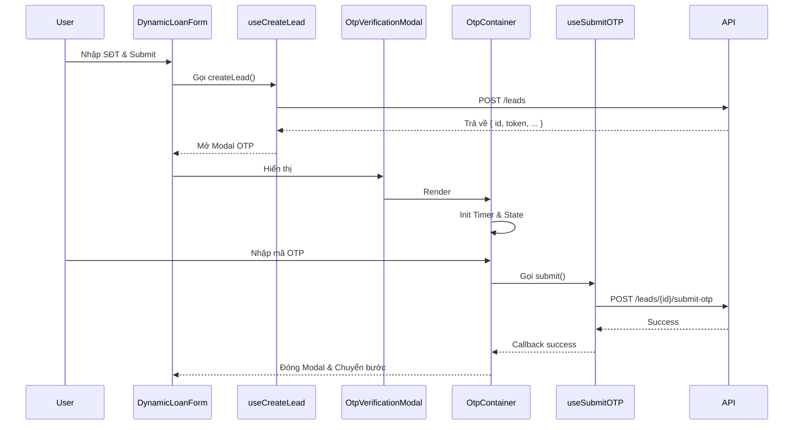
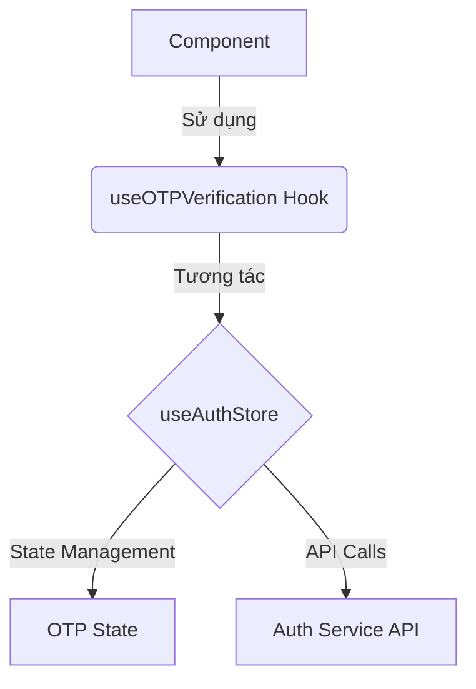

# OTP Architecture Analysis

## Tổng quan Kiến trúc

Hệ thống OTP trong DOP sử dụng kiến trúc **Two-tier**, tách biệt giữa logic nghiệp vụ (Lead Onboarding) và dịch vụ xác thực chung (Generic Authentication).

### 1. Phân tầng Kiến trúc (Architecture Tiers)

1.  **Lead-specific Layer**: Xử lý logic nghiệp vụ cụ thể cho quy trình tạo Lead vay vốn. Layer này quản lý state của form vay, tích hợp trực tiếp với các API `/leads`.
2.  **Generic OTP Service Layer**: Cung cấp các hook và store dùng chung cho việc xác thực OTP ở nhiều nơi khác nhau trong ứng dụng (ví dụ: đăng nhập, xác thực giao dịch), tích hợp với `useAuthStore`.

## Luồng xử lý (Data Flow)

### 1. Lead Onboarding OTP Flow

Đây là luồng chính được sử dụng khi khách hàng đăng ký khoản vay mới.

### 2. Generic OTP Flow

Luồng này được thiết kế để tái sử dụng cho các mục đích xác thực khác.

## Chi tiết Implementation

### Lead Flow (Hiện tại)
- **Hooks**:
    - `useCreateLead`: Khởi tạo Lead và kích hoạt luồng OTP.
    - `useSubmitOTP`: Xử lý việc gửi mã OTP lên server để xác thực.
    - `useResendOTP`: Xử lý logic gửi lại mã OTP.
- **Container**: `OtpContainer` chịu trách nhiệm quản lý logic UI của OTP (input, timer, error handling) và gọi các hooks tương ứng.

### Generic Flow
- **Hooks**: `useOTPVerification`
- **Store**: `useAuthStore`
- **Mục đích**: Tách biệt logic state management khỏi UI components, cho phép tái sử dụng ở bất kỳ đâu cần xác thực OTP mà không phụ thuộc vào context của Lead.

## Điểm lưu ý
- Hiện tại, `OtpContainer` đang được thiết kế khá chặt chẽ với Lead Flow thông qua việc nhận các props `id` (leadId) và các callback specific.
- Việc tách biệt rõ ràng giữa Generic và Lead-specific giúp hệ thống dễ bảo trì và mở rộng, nhưng cần đảm bảo `OtpContainer` đủ linh hoạt hoặc có các adapter phù hợp.
