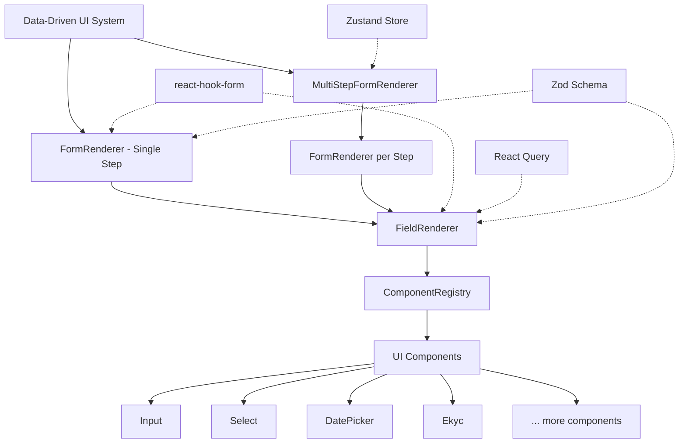
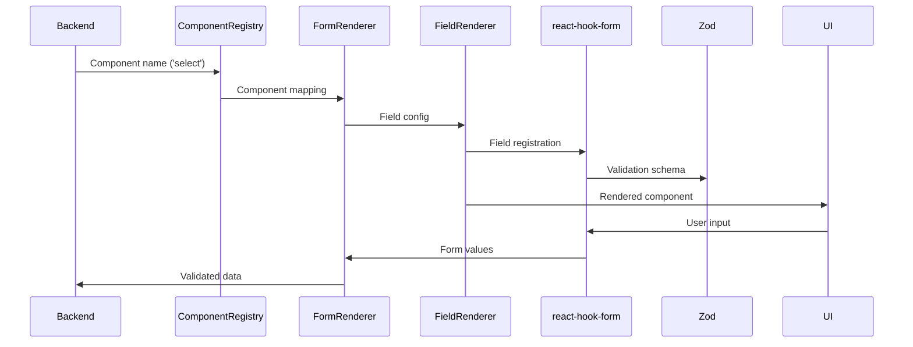

# Phase 2: Structure Analysis - Renderer System

**Date**: 2025-12-07
**Based on**: [phase-1-discovery.md](./phase-1-discovery.md)

---

## Component Hierarchy



### Key Relationships

1. **MultiStepFormRenderer** → **FormRenderer** (one per step)
2. **FormRenderer** orchestrates multiple **FieldRenderer** instances
3. **FieldRenderer** fetches components from **ComponentRegistry**
4. **ComponentRegistry** maps string names to actual UI components
5. **react-hook-form** provides form state to all renderers
6. **Zustand** manages global state for multi-step navigation
7. **React Query** handles async options with caching

---

## Dependencies

### External Libraries

| Library | Version | Purpose |
|---------|---------|---------|
| **react** | ^19.1.0 | Core UI framework |
| **react-hook-form** | ^7.63.0 | Form state management |
| **zod** | ^4.1.11 | Schema validation |
| **@hookform/resolvers** | ^5.2.2 | Zod integration |
| **zustand** | ^5.0.8 | Global state management |
| **@tanstack/react-query** | ^5.90.2 | Server state & caching |
| **next-intl** | ^4.3.9 | Internationalization |
| **@radix-ui/*** | Various | Headless UI primitives |
| **lucide-react** | ^0.555.0 | Icons |
| **date-fns** | ^4.1.0 | Date manipulation |

### Internal Dependencies

```mermaid
graph LR
    A[Renderer Components] --> B[Type Definitions]
    A --> C[Builders & Utilities]
    A --> D[Hooks]
    A --> E[UI Components]
    A --> F[Store]

    B --> B1[data-driven-ui.d.ts]
    B --> B2[component-props.d.ts]
    B --> B3[field-conditions.ts]
    B --> B4[multi-step-form.d.ts]

    C --> C1[zod-generator.ts]
    C --> C2[field-builder.ts]
    C --> C3[DefaultFieldConfig.ts]

    D --> D1[use-async-options.ts]
    D --> D2[use-multi-step-form.ts]

    E --> E1[@/components/ui]
    E --> E2[@/components/wrappers]

    F --> F1[use-multi-step-form-store.ts]
```

### Dependency Flow

```
FormRenderer
├── react-hook-form (form state)
├── zod (validation)
├── ComponentRegistry (component resolution)
├── FieldRenderer (field rendering)
│   ├── use-async-options (dynamic options)
│   ├── UI Components (@/components/ui)
│   └── Wrapper Components (@/components/wrappers)
└── Types (data-driven-ui.d.ts)
```

---

## Architecture Pattern

### 1. Registry Pattern

The **ComponentRegistry** implements a classic Registry pattern:

```typescript
// String name mapped to React component
const COMPONENT_REGISTRY: Record<string, React.ComponentType<any>> = {
  'input': Input,
  'select': Select,
  'ekyc': Ekyc,
  // ... 20 total components
};

// Type-safe lookup
type RegisteredComponent = keyof typeof COMPONENT_REGISTRY;
```

**Benefits**:
- Backend can specify components by string name
- Type safety with TypeScript
- Runtime component resolution
- Easy to extend with new components

### 2. Builder Pattern

Configuration builders enhance raw data:

```typescript
// Field configuration builder
const field = buildField()
  .type('select')
  .name('country')
  .labelKey('fields.country.label')
  .required()
  .withAsyncOptions('/api/countries')
  .build();

// Zod schema builder
const schema = generateZodSchema(fields);
```

### 3. Plugin Architecture

Components act as "plugins" to the renderer:

- **Form Components**: Collect user input
- **Display Components**: Show information (Label, Badge, Progress)
- **Action Components**: Trigger actions (Button)
- **Special Components**: Complex integrations (Ekyc, Confirmation)

### 4. Layered State Management

| Layer | Solution | Responsibility |
|-------|----------|----------------|
| **Local State** | `useState` | Component-specific UI state |
| **Form State** | `react-hook-form` | Form values, validation, errors |
| **Global State** | `Zustand` | Multi-step navigation, persistence |
| **Server State** | `React Query` | Async options, caching |

### Data Flow



---

## Folder Structure

```
src/
├── components/
│   ├── renderer/              # Core renderer system
│   │   ├── FormRenderer.tsx   # (322 lines) Single-step orchestrator
│   │   ├── FieldRenderer.tsx  # (270 lines) Individual field renderer
│   │   ├── ComponentRegistry.ts # (82 lines) Component mapping
│   │   └── MultiStepFormRenderer.tsx # (307 lines) Multi-step form
│   ├── ui/                    # Base UI components (@radix-ui based)
│   └── wrappers/              # Custom component wrappers
│       ├── CustomSelect.tsx   # Enhanced select with search
│       ├── CustomDatePicker.tsx # Localized date picker
│       └── CustomEkyc.tsx     # e-KYC integration wrapper
├── types/
│   ├── data-driven-ui.d.ts    # Core field configuration types
│   ├── component-props.d.ts   # Mapped prop types for components
│   ├── field-conditions.ts    # Conditional field logic types
│   └── multi-step-form.d.ts   # Multi-step specific types
├── lib/
│   └── builders/              # Configuration builders
│       ├── zod-generator.ts   # Dynamic schema from fields
│       ├── field-builder.ts   # Field creation helpers
│       └── multi-step-form-builder.ts # Step builders
├── hooks/
│   └── form/                  # Form-specific hooks
│       ├── use-async-options.ts    # Dynamic option loading
│       └── use-multi-step-form.ts  # Multi-step state logic
├── store/
│   └── use-multi-step-form-store.ts # Global multi-step state
└── configs/
    └── DefaultFieldConfig.ts # Sensible defaults per component
```

### Organizational Principles

1. **Feature-based grouping**: All renderer code in `/components/renderer`
2. **Type collocation**: Types in dedicated `/types` folder
3. **Utility separation**: Builders and configs in `/lib` and `/configs`
4. **Hook organization**: Form hooks in `/hooks/form`
5. **Global state**: Stores in `/store`

---

## Integration Points

### 1. Form Submission
```typescript
<FormRenderer
  fields={fields}
  onSubmit={(data) => {
    // data is validated by Zod
    // Ready for API submission
  }}
/>
```

### 2. Async Options
```typescript
{
  type: 'select',
  optionsFetcher: async () => {
    // Fetch options from API
    // Cached by React Query
    // Can depend on other field values
  }
}
```

### 3. Conditional Fields
```typescript
{
  type: 'input',
  name: 'ssn',
  condition: {
    field: 'hasSSN',
    operator: 'equals',
    value: true
  }
}
```

### 4. Internationalization
```typescript
{
  labelKey: 'fields.name.label',
  placeholderKey: 'fields.name.placeholder',
  errorKey: 'fields.name.error.required'
}
```

---

## Next Phase

→ **Phase 3** will deep-dive into the implementation details, business logic, and patterns used in the renderer system.

*[phase-3-analysis.md](./phase-3-analysis.md) (not yet created)*