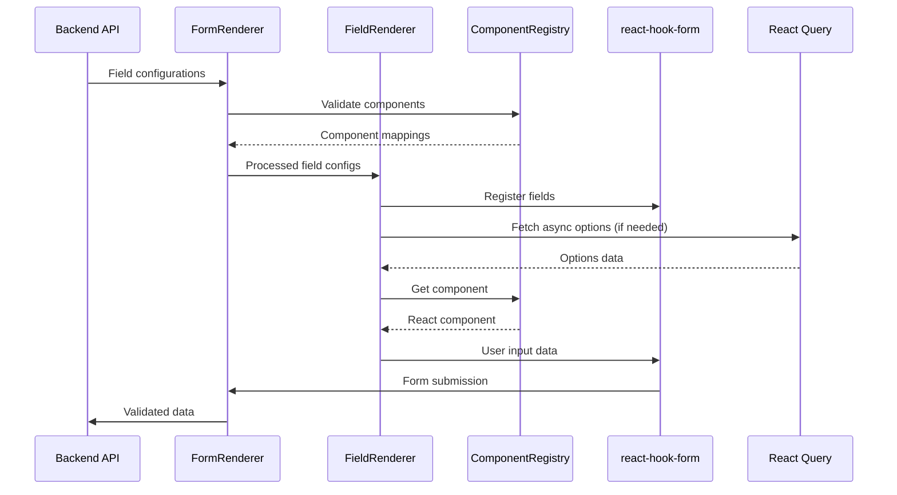

# Renderer System - Comprehensive Synthesis Report

**Date**: 2025-12-07
**Based on**:
- [Phase 1: Discovery](./renderer/phase-1-discovery.md)
- [Phase 2: Structure Analysis](./renderer/phase-2-structure.md)
- [Phase 3: Code Analysis](./renderer/phase-3-analysis.md)

---

## Executive Summary

The Renderer System is a sophisticated data-driven UI framework that enables dynamic form generation based on backend configurations. It consists of four main components: `FormRenderer` for single-step forms, `MultiStepFormRenderer` for multi-step workflows, `FieldRenderer` for individual field rendering, and `ComponentRegistry` for type-safe component mapping. The system leverages modern React patterns with `react-hook-form` for state management, `Zod` for validation, `React Query` for async operations, and `Zustand` for global state.

Key capabilities include conditional field visibility with complex logic, dynamic validation schema generation, async option loading with dependency tracking, and comprehensive internationalization support. The architecture follows a plugin-based design where 20+ UI components are registered and can be dynamically instantiated based on configuration. While the system is well-architected with strong TypeScript typing and performance optimizations, it lacks comprehensive test coverage and has opportunities for improvement in error handling, accessibility, and large form performance.

---

## System Overview & Purpose

### What is the Renderer System?

The Renderer System is a data-driven UI framework that allows backend services to define form structures dynamically. Instead of hardcoding forms in the frontend, the system renders forms based on configuration objects received from APIs. This approach enables:

1. **Rapid Form Development**: Forms can be created or modified without frontend code changes
2. **Consistent UI/UX**: All forms use the same components and validation patterns
3. **Backend-Driven Workflows**: Complex business logic can be configured server-side
4. **Internationalization**: All text uses translation keys for multi-language support
5. **Type Safety**: TypeScript ensures configuration integrity at compile time

### Core Value Proposition

```typescript
// Backend sends configuration like this:
const formConfig = {
  fields: [
    {
      fieldName: 'email',
      component: 'input',
      props: {
        type: 'email',
        labelKey: 'fields.email.label',
        validations: [{ type: 'required' }, { type: 'email' }]
      }
    },
    {
      fieldName: 'country',
      component: 'select',
      props: {
        labelKey: 'fields.country.label',
        optionsFetcher: {
          url: '/api/countries',
          dependencies: ['region']
        }
      }
    }
  ]
};

// Frontend renders automatically:
<FormRenderer fields={formConfig.fields} onSubmit={handleSubmit} />
```

---

## Architecture & Design Patterns

### 1. Layered Architecture

```
┌─────────────────────────────────────────────┐
│           Presentation Layer                │
│  FormRenderer, FieldRenderer, MultiStep... │
├─────────────────────────────────────────────┤
│            Business Logic Layer            │
│   Validation, Conditions, Async Options   │
├─────────────────────────────────────────────┤
│             Data Management               │
│    react-hook-form, Zustand, React Query   │
├─────────────────────────────────────────────┤
│             Infrastructure                │
│       Component Registry, Types, Utils    │
└─────────────────────────────────────────────┘
```

### 2. Key Design Patterns

#### Registry Pattern
- **Purpose**: Dynamic component instantiation based on string names
- **Implementation**: `ComponentRegistry` maps names to React components
- **Benefits**: Backend-driven UI, type safety, easy extensibility

```typescript
const COMPONENT_REGISTRY = {
  'input': Input,
  'select': Select,
  'ekyc': Ekyc,
  // ... 20 total components
} as const;

type RegisteredComponent = keyof typeof COMPONENT_REGISTRY;
```

#### Builder Pattern
- **Purpose**: Construct complex configurations with sensible defaults
- **Implementation**: `field-builder.ts` and `multi-step-form-builder.ts`
- **Benefits**: Fluent API, default management, validation helpers

#### Plugin Architecture
- **Purpose**: Components act as interchangeable plugins
- **Categories**: Form inputs, Display elements, Actions, Special components
- **Benefits**: Modular design, easy to add new field types

#### Observer Pattern
- **Purpose**: Reactive form state and conditional rendering
- **Implementation**: `react-hook-form` watch mechanism
- **Benefits**: Automatic re-rendering on field changes, efficient updates

---

## Core Components & Their Roles

### 1. FormRenderer (`FormRenderer.tsx` - 322 lines)
**Role**: Single-step form orchestration

**Responsibilities**:
- Process and validate field configurations
- Generate dynamic validation schemas with Zod
- Manage form state with react-hook-form
- Handle form submission and filtering
- Compute default values based on field types

**Key Features**:
- Filters unregistered components with warnings
- Merges backend config with sensible defaults
- Generates type-specific defaults (false for checkboxes, 0 for sliders)
- Submits only visible field data

### 2. FieldRenderer (`FieldRenderer.tsx` - 270 lines)
**Role**: Individual field rendering with conditional logic

**Responsibilities**:
- Fetch appropriate component from registry
- Handle conditional field visibility
- Render field with proper props and error states
- Manage async option loading for dependent fields

**Key Features**:
- Complex condition evaluation with 30+ operators
- Nested logical expressions (AND/OR/NOT)
- Dynamic option fetching with React Query
- Error boundaries for missing components

### 3. ComponentRegistry (`ComponentRegistry.ts` - 82 lines)
**Role**: Type-safe component mapping and resolution

**Responsibilities**:
- Register all renderable components
- Provide type-safe lookup mechanism
- Guard against unregistered components

**Registered Components** (20 total):
- **Basic Inputs**: Input, Textarea, Checkbox, Switch, Slider
- **Complex Inputs**: Select, RadioGroup, DatePicker, DateRangePicker, ToggleGroup, InputOTP
- **Special**: Ekyc (e-KYC integration), Confirmation (review step)
- **Display**: Label, Progress, Badge, Separator
- **Actions**: Button

### 4. MultiStepFormRenderer (`MultiStepFormRenderer.tsx` - 307 lines)
**Role**: Multi-step workflow management

**Responsibilities**:
- Orchestrate multiple form steps
- Track progress and navigation
- Persist state between steps
- Validate step transitions

**Key Features**:
- Global state management with Zustand
- Step-by-step progress indicators
- Conditional step visibility
- Data persistence across navigation

---

## Data Flow & State Management

### 1. Data Flow Diagram



### 2. State Management Layers

| Layer | Library | Scope | Purpose |
|-------|---------|-------|---------|
| **Component State** | `useState` | Local | UI-specific state (open/close, focus) |
| **Form State** | `react-hook-form` | Form instance | Field values, validation, errors |
| **Global State** | `Zustand` | Application | Multi-step navigation, persistence |
| **Server State** | `React Query` | Application | Async options, caching, sync |

### 3. State Persistence Strategy

```typescript
// Multi-step form persistence
const useMultiStepFormStore = create((set) => ({
  steps: [],
  currentStep: 0,
  formData: {}, // Accumulated data from all steps

  // Actions
  nextStep: () => set(state => ({
    currentStep: Math.min(state.currentStep + 1, state.steps.length - 1)
  })),

  updateFormData: (stepData) => set(state => ({
    formData: { ...state.formData, ...stepData }
  }))
}));
```

---

## Key Features & Capabilities

### 1. Conditional Field System

The system supports sophisticated conditional rendering with:

**Operators Supported** (30+ total):
- **Comparison**: `equals`, `notEquals`, `greaterThan`, `lessThan`, `greaterThanOrEqual`, `lessThanOrEqual`
- **String**: `contains`, `startsWith`, `endsWith`, `matches` (regex)
- **Array**: `in`, `notIn`, `contains`, `isEmpty`, `isNotEmpty`
- **Boolean**: `isTrue`, `isFalse`
- **Special**: `isEmpty`, `isNotEmpty`, `exists`

**Complex Example**:
```typescript
{
  fieldName: 'ssn',
  component: 'input',
  condition: {
    logic: 'AND',
    rules: [
      { field: 'hasSSN', operator: 'isTrue' },
      { field: 'country', operator: 'in', value: ['US', 'CA'] }
    ],
    conditions: [
      {
        logic: 'OR',
        rules: [
          { field: 'age', operator: 'greaterThan', value: 18 },
          { field: 'parentConsent', operator: 'isTrue' }
        ]
      }
    ]
  }
}
```

### 2. Dynamic Validation System

**Automatic Schema Generation**:
```typescript
// Field config
{
  fieldName: 'email',
  component: 'input',
  props: {
    validations: [
      { type: 'required', messageKey: 'errors.email.required' },
      { type: 'email', messageKey: 'errors.email.invalid' },
      { type: 'maxLength', value: 255 }
    ]
  }
}

// Generated Zod schema
z.string()
  .min(1, 'Required field')
  .email('Invalid email address')
  .max(255, 'Maximum 255 characters')
```

**Conditional Validation**:
- Hidden fields are excluded from validation
- Schema updates dynamically when fields show/hide
- Maintains type safety throughout

### 3. Async Options Management

**Features**:
- Parallel fetching with React Query
- Dependency tracking for cascading dropdowns
- Automatic caching and stale-while-revalidate
- Transform functions for API response mapping

**Configuration**:
```typescript
{
  fieldName: 'city',
  component: 'select',
  props: {
    optionsFetcher: {
      url: '/api/cities',
      method: 'GET',
      dependencies: ['country', 'state'], // Refetch when these change
      transform: (data, watch) => ({
        params: {
          country: watch('country'),
          state: watch('state')
        }
      }),
      staleTime: 5 * 60 * 1000, // 5 minutes
      cacheTime: 10 * 60 * 1000 // 10 minutes
    }
  }
}
```

### 4. Internationalization Integration

**Pattern**: All text uses translation keys
```typescript
{
  fieldName: 'firstName',
  component: 'input',
  props: {
    labelKey: 'fields.firstName.label',
    placeholderKey: 'fields.firstName.placeholder',
    descriptionKey: 'fields.firstName.description',
    validations: [
      { type: 'required', messageKey: 'errors.firstName.required' }
    ]
  }
}
```

**Safe Translation Handler**:
- Falls back to key name if translation missing
- Logs errors for debugging
- Prevents crashes from missing keys

---

## Technical Implementation Details

### 1. Type Safety Architecture

**Component Registration Types**:
```typescript
// Registry with const assertion for type inference
const COMPONENT_REGISTRY = {
  'input': Input,
  'select': Select,
  // ... other components
} as const;

// Extract valid component names
type RegisteredComponent = keyof typeof COMPONENT_REGISTRY;

// Type guard for runtime checking
function isRegisteredComponent(name: string): name is RegisteredComponent {
  return name in COMPONENT_REGISTRY;
}
```

**Component Props Mapping**:
```typescript
// Maps components to their prop types
type ComponentPropsMap = {
  'input': ComponentPropsWithoutRef<typeof Input>;
  'select': ComponentPropsWithoutRef<typeof CustomSelect>;
  'ekyc': ComponentPropsWithoutRef<typeof CustomEkyc>;
  // ... for all components
};

// Extract common props available to all fields
type CommonFieldProps = Partial<{
  name: string;
  required: boolean;
  disabled: boolean;
  placeholder: string;
  description: string;
  // ... other common props
}>;
```

### 2. Performance Optimizations

**Memoization Strategy**:
```typescript
// Process fields once, unless config changes
const processedFields = useMemo(() => {
  return fields
    .filter(field => isRegisteredComponent(field.component))
    .map(field => mergeWithDefaults(field));
}, [fields]);

// Track visible fields efficiently
const { visibleFields, visibleFieldNames } = useMemo(() => {
  const visible = processedFields.filter(field =>
    evaluateCondition(field.condition, watchValues)
  );
  return {
    visibleFields: visible,
    visibleFieldNames: new Set(visible.map(f => f.fieldName))
  };
}, [processedFields, watchValues]);
```

**Async Optimization**:
- Parallel fetching with `useQueries`
- Selective fetching based on field visibility
- Intelligent caching with React Query
- Dependency tracking for minimal refetches

### 3. Error Handling Patterns

**Safe Translation Wrapper**:
```typescript
const useSafeTranslation = () => {
  const t = useTranslations();

  return useCallback((key: string, fallback?: string) => {
    try {
      const value = t(key);
      return value !== key ? value : (fallback || key);
    } catch (error) {
      console.error(`Translation error for key: ${key}`, error);
      return fallback || key;
    }
  }, [t]);
};
```

**Component Error Boundary**:
```typescript
if (!component) {
  console.error(`Component "${field.component}" not found in registry`);
  return (
    <Alert variant="destructive">
      <AlertTitle>Component Error</AlertTitle>
      <AlertDescription>
        Component "{field.component}" is not registered
      </AlertDescription>
    </Alert>
  );
}
```

---

## How-To Guides for Common Tasks

### 1. Adding a New Component Type

**Step 1: Create the Component**
```typescript
// src/components/ui/Rating.tsx
interface RatingProps {
  value?: number;
  onChange?: (value: number) => void;
  max?: number;
}

export const Rating = ({ value = 0, onChange, max = 5 }: RatingProps) => {
  // Implementation
};
```

**Step 2: Register the Component**
```typescript
// src/components/renderer/ComponentRegistry.ts
import { Rating } from '@/components/ui/Rating';

const COMPONENT_REGISTRY = {
  // ... existing components
  'rating': Rating,
} as const;
```

**Step 3: Add Type Definitions**
```typescript
// src/types/component-props.d.ts
type ComponentPropsMap = {
  // ... existing
  'rating': ComponentPropsWithoutRef<typeof Rating>;
};
```

**Step 4: Add Default Configuration**
```typescript
// src/configs/DefaultFieldConfig.ts
const DEFAULT_FIELD_CONFIG: Record<string, any> = {
  // ... existing
  'rating': {
    max: 5,
    required: false,
  },
};
```

**Step 5: Update Zod Schema Generator**
```typescript
// src/lib/builders/zod-generator.ts
const schemaMap = {
  // ... existing
  'rating': z.number().min(0).max(5),
};
```

### 2. Creating a Conditional Field

**Simple Condition**:
```typescript
{
  fieldName: 'spouseName',
  component: 'input',
  condition: {
    field: 'maritalStatus',
    operator: 'equals',
    value: 'married'
  }
}
```

**Complex Condition**:
```typescript
{
  fieldName: 'dependentInfo',
  component: 'textarea',
  condition: {
    logic: 'OR',
    rules: [
      { field: 'hasDependents', operator: 'isTrue' },
      {
        logic: 'AND',
        rules: [
          { field: 'age', operator: 'greaterThan', value: 65 },
          { field: 'hasSpouse', operator: 'isTrue' }
        ]
      }
    ]
  }
}
```

### 3. Implementing Async Options with Dependencies

**Country → State → City Cascade**:
```typescript
const fields = [
  {
    fieldName: 'country',
    component: 'select',
    props: {
      optionsFetcher: {
        url: '/api/countries',
        staleTime: 60 * 60 * 1000 // 1 hour
      }
    }
  },
  {
    fieldName: 'state',
    component: 'select',
    props: {
      optionsFetcher: {
        url: '/api/states',
        dependencies: ['country'], // Refetch when country changes
        transform: (data, watch) => ({
          params: { country: watch('country') }
        })
      }
    }
  },
  {
    fieldName: 'city',
    component: 'select',
    props: {
      optionsFetcher: {
        url: '/api/cities',
        dependencies: ['country', 'state'],
        transform: (data, watch) => ({
          params: {
            country: watch('country'),
            state: watch('state')
          }
        })
      }
    }
  }
];
```

### 4. Creating a Multi-Step Form

**Step Configuration**:
```typescript
import { buildStep, buildField } from '@/lib/builders/multi-step-form-builder';

const steps = [
  buildStep()
    .title('Personal Information')
    .description('Tell us about yourself')
    .fields([
      buildField().type('input').name('firstName').required(),
      buildField().type('input').name('lastName').required(),
      buildField().type('datePicker').name('dateOfBirth').required()
    ])
    .build(),

  buildStep()
    .title('Contact Details')
    .fields([
      buildField().type('input').name('email').required(),
      buildField().type('select').name('country')
        .withAsyncOptions('/api/countries')
        .required(),
      buildField().type('input').name('phone')
    ])
    .build(),

  buildStep()
    .title('Review')
    .component('confirmation')
    .reviewMode(true)
    .build()
];

// Usage
<MultiStepFormRenderer
  steps={steps}
  onComplete={handleSubmit}
  persistKey="user-registration"
/>
```

---

## Actionable Recommendations

### Immediate Actions (High Priority)

#### 1. **Add Comprehensive Test Coverage**
**Impact**: Critical for system reliability
**Files to Create**:
- `src/components/renderer/__tests__/FormRenderer.test.tsx`
- `src/components/renderer/__tests__/FieldRenderer.test.tsx`
- `src/lib/builders/__tests__/zod-generator.test.ts`
- `src/types/__tests__/field-conditions.test.ts`

**Test Coverage Goals**:
- Unit tests for all business logic functions
- Component integration tests
- Edge case handling (empty forms, invalid configs)
- Async behavior mocking

#### 2. **Implement Error Boundary**
**Impact**: Better user experience, easier debugging
**Implementation**:
```typescript
// src/components/renderer/RendererErrorBoundary.tsx
class RendererErrorBoundary extends Component<Props, State> {
  // Catch and display user-friendly errors
  // Log to error tracking service
  // Provide retry mechanisms
}
```

#### 3. **Add Retry Logic for Async Options**
**Impact**: Improved reliability on poor networks
**Implementation**:
```typescript
// In use-async-options.ts
queryFn: fetchWithRetry(config, {
  retries: 3,
  backoff: 'exponential',
  onRetry: (error, attempt) => {
    console.warn(`Retry attempt ${attempt} for ${config.url}`);
  }
});
```

### Short Term Improvements (Medium Priority)

#### 4. **Performance Optimization - Dependency Tracking**
**Impact**: Forms with 50+ fields will remain responsive
**Implementation**:
- Create dependency graph for field conditions
- Only re-evaluate affected fields
- Implement memoization for condition results

#### 5. **Enhanced Accessibility**
**Impact**: Better compliance, inclusive design
**Tasks**:
- Add ARIA labels dynamically
- Implement screen reader announcements for errors
- Add keyboard navigation for custom components
- Focus management for conditional fields

#### 6. **Create Documentation Site**
**Impact**: Easier developer onboarding
**Sections**:
- Component registry reference
- Field configuration guide
- Migration guide for legacy forms
- Best practices and patterns

### Long Term Enhancements (Nice to Have)

#### 7. **Visual Form Builder**
**Impact**: Business users can create forms
**Features**:
- Drag-and-drop interface
- Real-time preview
- Condition builder UI
- Export configuration

#### 8. **Form Analytics**
**Impact**: Data-driven form optimization
**Metrics**:
- Field interaction times
- Drop-off points
- Validation error rates
- Conversion funnels

#### 9. **Advanced Validation Features**
**Impact**: More complex business rules
**Features**:
- Cross-field validation
- Async validation (username availability)
- Custom validation functions
- Conditional validation rules

### Technical Debt Resolution

#### 10. **Resolve Type Safety Issues**
**File**: `FieldRenderer.tsx:151`
**Current**: Uses `any` for component props
**Solution**: Generate typed component factory
```typescript
function createTypedFieldRenderer<T extends RegisteredComponent>(
  component: T,
  props: ComponentPropsMap[T]
) {
  return <Component {...props} />;
}
```

#### 11. **Optimize Condition Evaluation**
**File**: `field-conditions.ts`
**Issue**: No memoization, re-evaluates all conditions
**Solution**: Implement smart caching
```typescript
const conditionCache = new Map<string, boolean>();

function evaluateConditionCached(condition, formData) {
  const key = generateCacheKey(condition, formData);
  if (conditionCache.has(key)) {
    return conditionCache.get(key);
  }
  // Evaluate and cache result
}
```

---

## Critical Findings Summary

### Strengths
1. **Well-architected**: Clean separation of concerns
2. **Type-safe**: Strong TypeScript throughout
3. **Flexible**: Backend-driven configuration
4. **Performant**: Memoization and selective rendering
5. **Extensible**: Easy to add new components
6. **Internationalization-ready**: Built-in i18n support

### Concerns
1. **No tests**: Critical for business logic reliability
2. **Error handling**: Basic, needs improvement
3. **Performance**: May degrade with large forms
4. **Accessibility**: Not fully addressed
5. **Documentation**: Limited external documentation

### Opportunities
1. **Form builder**: Visual configuration tool
2. **Analytics**: User behavior insights
3. **A/B testing**: Form optimization
4. **Plugin ecosystem**: Community components
5. **Mobile optimization**: Touch-friendly components

---

## Implementation Roadmap

### Quarter 1: Foundation
- [ ] Add comprehensive test suite (80% coverage)
- [ ] Implement error boundaries
- [ ] Add retry logic for async operations
- [ ] Create basic documentation site

### Quarter 2: Enhancement
- [ ] Performance optimization with dependency tracking
- [ ] Full accessibility compliance
- [ ] Advanced validation features
- [ ] Form analytics implementation

### Quarter 3: Expansion
- [ ] Visual form builder MVP
- [ ] Plugin system for custom components
- [ ] A/B testing framework
- [ ] Mobile-first responsive design

### Quarter 4: Optimization
- [ ] Machine learning for form optimization
- [ ] Advanced analytics and insights
- [ ] Progressive web app features
- [ ] Offline form capabilities

---

## Conclusion

The Renderer System is a well-designed, flexible framework for dynamic form generation. Its architecture supports complex business requirements while maintaining type safety and performance. The immediate priorities should be adding test coverage, improving error handling, and enhancing accessibility. With these improvements in place, the system will provide a solid foundation for scaling form-based features across the application.

The modular design and clear separation of concerns make it easy to extend and maintain. The registry pattern enables backend-driven UI without sacrificing type safety. The conditional rendering system supports sophisticated business logic, and the async options management provides excellent UX for dependent fields.

By addressing the identified concerns and following the implementation roadmap, the Renderer System can become a best-in-class solution for data-driven form management.