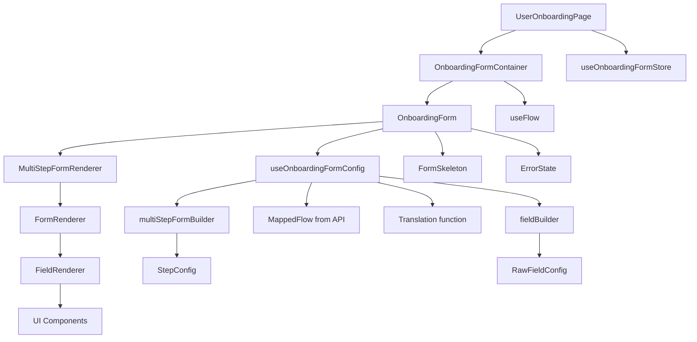
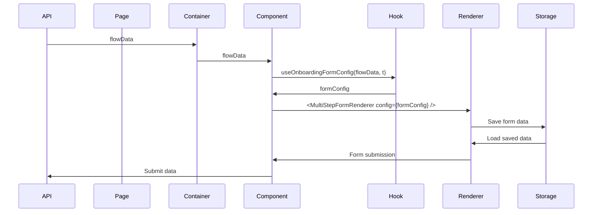

# Phase 2: Structure Analysis - useOnboardingFormConfig

**Date**: 2025-01-08
**Based on**: [phase-1-discovery.md](./phase-1-discovery.md)

---

## Component Hierarchy

```
Page Level
└── UserOnboardingPage (src/app/[locale]/user-onboarding/page.tsx)
    └── Container Level
        └── OnboardingFormContainer (src/app/[locale]/user-onboarding/components/onboarding-form.container.tsx)
            └── Component Level
                └── OnboardingForm (src/app/[locale]/user-onboarding/components/onboarding-form.tsx)
                    ├── useOnboardingFormConfig (HOOK) ← Primary focus
                    │   └── Returns formConfig for MultiStepFormRenderer
                    └── MultiStepFormRenderer (src/components/renderer/MultiStepFormRenderer.tsx)
                        └── FormRenderer
                            └── FieldRenderer
                                └── Individual field components (Input, Select, etc.)
```

### Hook Integration Points

1. **Called by**: `OnboardingForm` component at line 29
2. **Input**:
   - `flowData: MappedFlow | undefined` - API response data
   - `tPage: (key: string) => string` - Translation function
3. **Output**: `MultiStepFormConfig` object for the renderer system
4. **Uses**: Multi-step form builder pattern with fluent API

---

## Dependencies

### External Libraries

- **React** - `useMemo` hook for performance optimization
- **Lucide React** - Icons (User, Shield, CheckCircle, etc.)
- **Next-intl** - Internationalization support (via translation function prop)

### Internal Dependencies

**From hook file**:
- [`@/components/renderer/builders/multi-step-form-builder`](src/components/renderer/builders/multi-step-form-builder.ts) - MultiStepFormBuilder class
- [`@/components/renderer/builders/field-builder`](src/components/renderer/builders/field-builder.ts) - Field creation helpers
- [`@/mappers/flowMapper`](src/mappers/flowMapper.ts) - MappedFlow, MappedStep types
- [`@/components/renderer/types/ui-theme`](src/components/renderer/types/ui-theme.d.ts) - ComponentVariant, AnimationVariant types

**From components**:
- [`MultiStepFormRenderer`](src/components/renderer/MultiStepFormRenderer.tsx) - Main form renderer
- [`useFlow`](src/hooks/flow/use-flow.ts) - Data fetching hook
- [`useOnboardingFormStore`](src/store/use-onboarding-form-store.ts) - Zustand store

### Dependency Graph



---

## Architecture Pattern

### Design Pattern
**Builder Pattern + Data-Driven UI**

1. **Form Builder Pattern**:
   - Uses fluent API with `MultiStepFormBuilder` class
   - Chainable methods: `addStep()`, `persistData()`, `setFormVariant()`, etc.
   - Separates configuration from rendering logic

2. **Data-Driven UI**:
   - Form structure generated from `MappedFlow` API response
   - Dynamic field creation based on step configuration
   - Conditional rendering for EKYC steps vs regular form steps

### Hook Structure

```typescript
useOnboardingFormConfig(flowData, t) {
  // 1. Create field builder map with translations
  const fieldBuilderMap = getFieldBuilderMap(t);

  // 2. Use useMemo for performance
  const formConfig = useMemo(() => {
    // 3. Build multi-step form dynamically
    const builder = multiStepForm();

    // 4. Add steps based on flowData.steps
    flowData?.steps?.forEach(step => {
      // Add fields based on step.stepType
    });

    // 5. Add confirmation step
    builder.addStep(/* confirmation config */);

    // 6. Configure form behavior
    return builder
      .persistData("user-onboarding-data")
      .setFormVariant("onboarding")
      .setAnimation("slide")
      .build();
  }, [flowData, t, fieldBuilderMap]);

  return formConfig;
}
```

### State Management Strategy

| State Type | Solution | Used For |
|------------|----------|----------|
| Form Configuration | useMemo in hook | Generated form structure |
| Form Data | useMultiStepForm (renderer) | User inputs, current step |
| Persistent Data | localStorage | Saving progress across sessions |
| Global State | Zustand store | Form reset, overall state |

### Data Flow



---

## Folder Structure

```
src/
├── app/[locale]/user-onboarding/
│   ├── hooks/
│   │   └── use-onboarding-form-config.tsx    ← Main hook (534 lines)
│   ├── components/
│   │   ├── onboarding-form.tsx              ← Primary usage (73 lines)
│   │   ├── onboarding-form.container.tsx    ← Container (27 lines)
│   │   └── onboarding-form.stories.tsx      ← Stories (252 lines)
│   └── page.tsx                             ← Entry point (43 lines)
│
├── components/renderer/
│   ├── builders/
│   │   ├── multi-step-form-builder.ts       ← Builder pattern
│   │   └── field-builder.ts                 ← Field creation
│   ├── types/
│   │   ├── multi-step-form.d.ts             ← Type definitions
│   │   ├── ui-theme.d.ts                    ← UI variants
│   │   └── component-props.d.ts             ← Component props
│   ├── MultiStepFormRenderer.tsx            ← Main renderer
│   └── FormRenderer.tsx                     ← Step renderer
│
├── mappers/
│   └── flowMapper.ts                        ← API to frontend mapping
│
├── hooks/flow/
│   └── use-flow.ts                          ← Data fetching
│
└── store/
    └── use-onboarding-form-store.ts         ← Global state
```

### Organizational Conventions

1. **Feature-based organization**: All onboarding-related code co-located
2. **Separation of concerns**:
   - Hooks contain business logic
   - Components handle UI rendering
   - Containers manage data fetching
3. **Type-safe development**: Comprehensive TypeScript definitions
4. **Component composition**: Reusable renderer system
5. **Builder pattern**: For complex object construction

---

## Key Architectural Decisions

### 1. Builder Pattern for Form Configuration
**Why**: Complex form configurations with many options
- Fluent API improves readability
- Easy to add new configuration options
- Separates configuration from rendering

### 2. Data-Driven Forms
**Why**: Form structure comes from API
- Flexible - can change forms without code deployment
- Supports A/B testing different form flows
- Centralized form definitions

### 3. Renderer System
**Why**: Reusable form rendering components
- Consistent form behavior across app
- Customizable field renderers
- Theme support out of the box

### 4. Hook-Based Architecture
**Why**: Isolate form configuration logic
- Reusable across different components
- Easy to test configuration in isolation
- Clean separation from UI

---

## Integration Points

### API Integration
- **Input**: Expects `MappedFlow` from flow mapper
- **Output**: Form submission ready for API
- **Format**: JSON-based configuration

### Renderer System
- **Uses**: Multi-step form renderer
- **Provides**: Field configurations
- **Customizes**: Validation, styling, behavior

### Translation System
- **Integration**: next-intl
- **Method**: Translation function passed as prop
- **Coverage**: All user-facing text

### Storage System
- **Method**: localStorage
- **Key**: "user-onboarding-data"
- **Purpose**: Persist form progress

---

## Next Phase

→ **Phase 3** will deep-dive into the code implementation, business logic, and patterns used.

*[phase-3-analysis.md](./phase-3-analysis.md) (not yet created)*