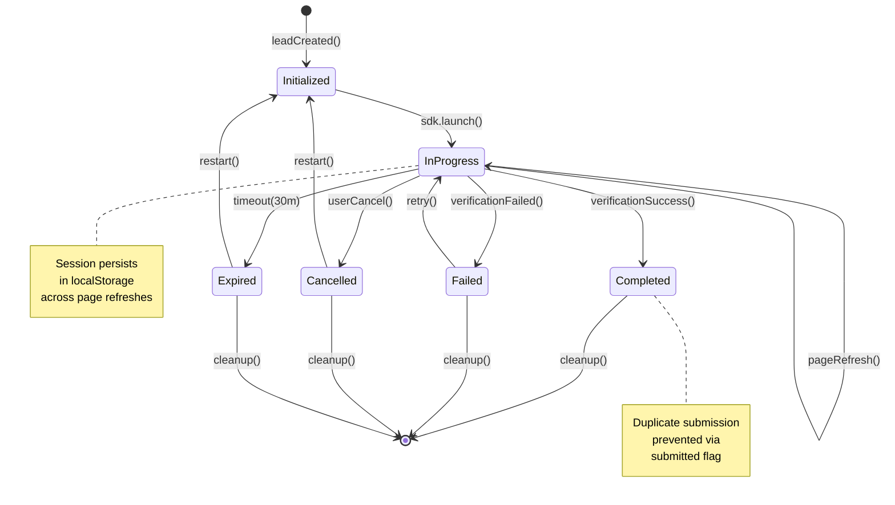
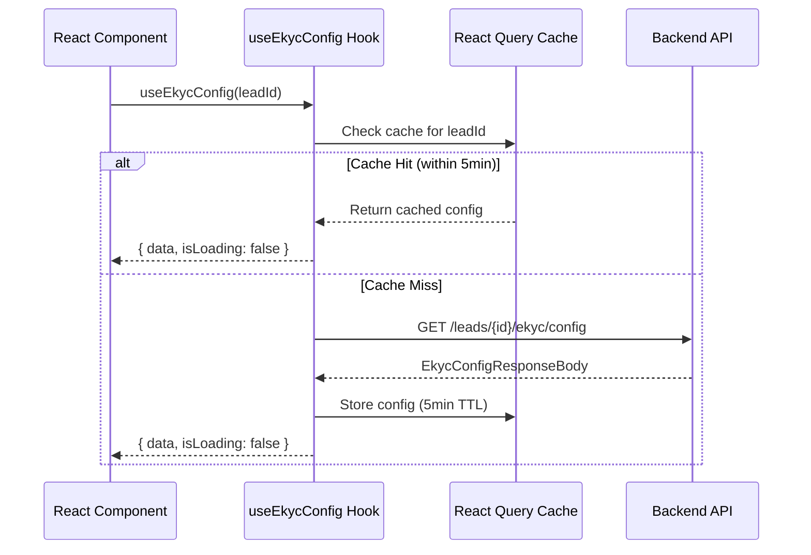
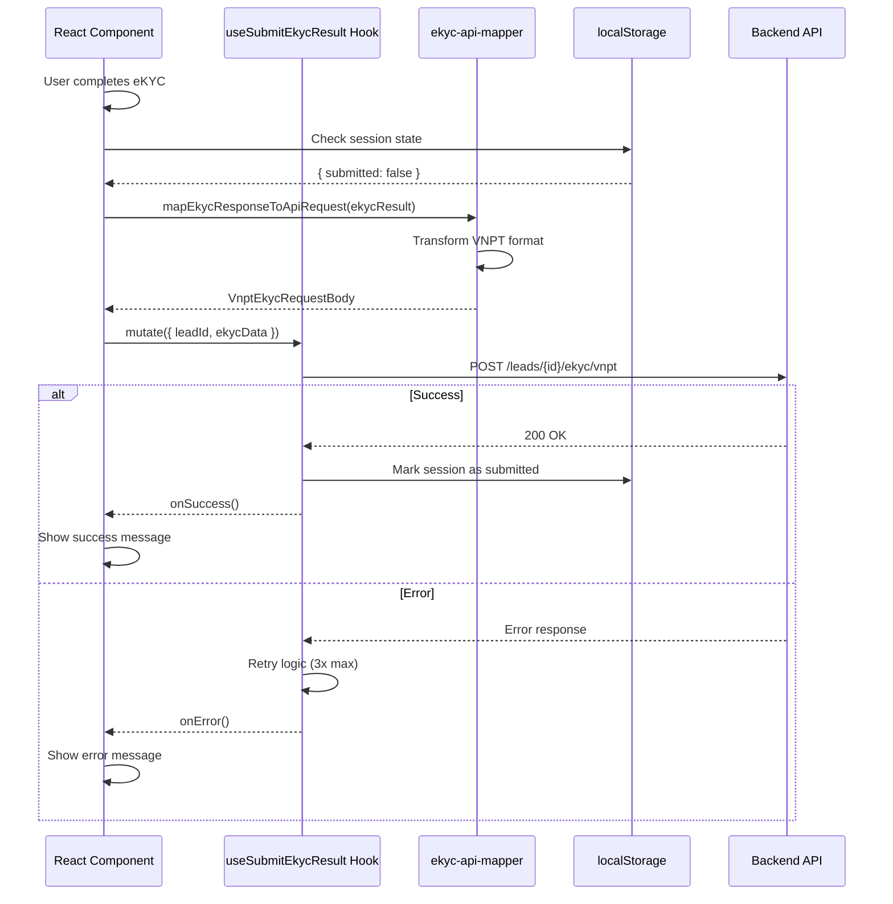

# eKYC API Integration - Data Model

**Feature Branch**: `001-ekyc-api-integration`  
**Status**: Implementation Validation  
**Last Updated**: 2026-01-12

## Overview

This document defines the data model for the eKYC API Integration feature, including entities, state transitions, and validation rules. The implementation already exists in the codebase; this document serves to validate and document the data structures used.

---

## Core Entities

### 1. eKYC Configuration Entity

Represents the configuration fetched from the backend to initialize the VNPT eKYC SDK.

**Source**: [`EkycConfigResponseBody`](src/lib/api/v1.d.ts:266)

```typescript
interface EkycConfigResponseBody {
  // Authentication
  access_token: string;
  challenge_code: string;
  
  // Feature Flags
  has_result_screen: boolean;
  enable_api_liveness_document: boolean;
  enable_api_liveness_face: boolean;
  enable_api_masked_face: boolean;
  enable_api_compare_face: boolean;
  
  // Flow Configuration
  sdk_flow: SdkFlow; // DOCUMENT_TO_FACE | FACE_TO_DOCUMENT | FACE | DOCUMENT
  list_type_document: number[]; // Supported document type IDs
  show_step: boolean;
  has_qr_scan: boolean;
  document_type_start: number;
  double_liveness: boolean;
  
  // UI Configuration
  use_method: PictureMethod; // BOTH | PHOTO | UPLOAD
  show_tab_result_information: boolean;
  show_tab_result_validation: boolean;
  show_tab_result_qrcode: boolean;
}
```

**Cache Configuration**:
- TTL: 5 minutes (300 seconds)
- Storage: React Query cache
- Key: `['ekyc-config', leadId]`

---

### 2. eKYC Result Entity

Represents the complete verification result from the VNPT SDK, transformed for backend submission.

**Source**: [`VnptEkycRequestBody`](src/lib/api/v1.d.ts:533)

```typescript
interface VnptEkycRequestBody {
  // Document Selection
  type_document?: number;
  
  // Liveness Detection (Document)
  liveness_card_front?: VNPTLivenessCard;
  liveness_card_back?: VNPTLivenessCard;
  
  // OCR Data
  ocr?: VNPTOCR;
  
  // Liveness Detection (Face)
  liveness_face?: VNPTLivenessFace;
  
  // Masked Face Detection
  masked?: VNPTMasked;
  
  // Face Comparison
  compare?: VNPTCompare;
  
  // Base64 Encoded Images
  base64_doc_img?: VNPTBase64DocImg;
  base64_face_img?: VNPTBase64FaceImg;
  
  // Document Hashes
  data_hash_document?: VNPTHashDocument;
  hash_img?: string; // JSON stringified hash object
  
  // QR Code
  qr_code?: string;
}
```

**Nested Entities**:

```typescript
// Liveness Card Response
interface VNPTLivenessCard {
  challengeCode: string;
  dataBase64: string;
  dataSign: string;
  imgs: { img: string };
  logID: string;
  message: string;
  object: {
    face_swapping: string;
    face_swapping_prob: number;
    fake_liveness: string;
    fake_liveness_prob: number;
    fake_print_photo: string;
    fake_print_photo_prob: number;
    liveness: string;
    liveness_msg: string;
  };
  server_version: string;
  statusCode: number;
}

// OCR Response
interface VNPTOCR {
  message: string;
  challengeCode: string;
  dataBase64: string;
  dataSign: string;
  imgs: {
    img_front?: string;
    img_back?: string;
  };
  logID: string;
  object: {
    // Personal Information
    id?: string;
    name?: string;
    birth_day?: string;
    gender?: string;
    nationality?: string;
    
    // Document Information
    card_type?: string;
    type_id?: number;
    issue_date?: string;
    valid_date?: string;
    issue_place?: string;
    
    // Address Information
    recent_location?: string;
    origin_location?: string;
    post_code?: VnptEkycOcrPostCode[];
    new_post_code?: VnptEkycOcrPostCode[];
    
    // Quality & Authenticity
    quality_front?: VnptEkycOrcQuality;
    quality_back?: VnptEkycOrcQuality;
    checking_result_front?: VnptEkycCheckingOcrResult;
    checking_result_back?: VnptEkycCheckingOcrResult;
    
    // Confidence Scores
    id_fake_prob?: number;
    name_prob?: number;
    birth_day_prob?: number;
    recent_location_prob?: number;
    
    // Tampering Detection
    tampering?: {
      is_legal: string;
      warning: string[];
    };
  };
  server_version: string;
  statusCode: number;
}

// Liveness Face Response
interface VNPTLivenessFace {
  challengeCode: string;
  dataBase64: string;
  dataSign: string;
  imgs: {
    img_face: string;
    img_front: string;
  };
  object: {
    age: number;
    background_warning: string;
    blur_face: string;
    blur_face_prob: number;
    gender: string;
    is_eye_open: string;
    liveness: string;
    liveness_msg: string;
    liveness_prob: number;
    multiple_faces_detail: {
      multiple_face_1: boolean;
      multiple_face_2: boolean;
    };
  };
  server_version: string;
  message: string;
  logID: string;
  statusCode: number;
}

// Face Comparison Response
interface VNPTCompare {
  challengeCode: string;
  dataBase64: string;
  dataSign: string;
  imgs: {
    img_face: string;
    img_front: string;
  };
  object: {
    match_warning: string;
    msg: string;
    multiple_faces: boolean;
    multiple_faces_detail: {
      multiple_face_1: boolean;
      multiple_face_2: boolean;
    };
    prob: number;
    result: string;
  };
  server_version: string;
  message: string;
  logID: string;
  statusCode: number;
}

// Base64 Document Images
interface VNPTBase64DocImg {
  img_front: string;
  img_back: string;
}

// Base64 Face Images
interface VNPTBase64FaceImg {
  img_face_far: string;
  img_face_near: string;
}

// Document Hashes
interface VNPTHashDocument {
  img_front: string;
  img_back: string;
}
```

**Extracted Personal Data**:

```typescript
interface ExtractedPersonalData {
  fullName: string;
  idNumber: string;
  dateOfBirth: string; // ISO 8601 format
  gender: 'male' | 'female' | 'other';
  nationality: string;
  address: {
    fullAddress: string;
    city?: string;
    district?: string;
    ward?: string;
  };
  documentType: string;
  issuedDate?: string; // ISO 8601 format
  expiryDate?: string; // ISO 8601 format
  issuedBy?: string;
  ethnicity?: string;
  hometown?: string;
}
```

---

### 3. eKYC Session Entity

Tracks the current verification state across page refreshes and navigation.

**Storage**: localStorage with key pattern `ekyc_session_${leadId}`

```typescript
interface EkycSessionState {
  // Session Identification
  sessionId: string; // Generated as `vnpt_${timestamp}_${random}`
  leadId: string;
  
  // Status Tracking
  status: EkycSessionStatus;
  
  // Timestamps
  startTime: number; // Unix timestamp (ms)
  lastActivity: number; // Unix timestamp (ms)
  submittedAt?: number; // Unix timestamp (ms)
  
  // Metadata
  documentType?: number;
  flowType?: SdkFlow;
  
  // Submission Tracking
  submitted: boolean;
  submissionAttempts: number;
}
```

**Status Values**:

```typescript
type EkycSessionStatus =
  | 'initialized'   // SDK loaded and ready
  | 'in_progress'   // User actively verifying
  | 'completed'     // Verification successful, submitted
  | 'failed'        // Verification failed
  | 'cancelled'     // User cancelled
  | 'expired';      // Session timed out (30 minutes)
```

**Session Expiration**:
- Default TTL: 30 minutes
- Cleanup on successful submission
- Manual cleanup on user logout

---

## State Transitions

### Session Lifecycle



### Status Transition Rules

| From | To | Trigger | Conditions |
|------|-----|---------|------------|
| `initialized` | `in_progress` | SDK launches | `leadId` exists |
| `in_progress` | `completed` | Verification success | All checks pass, backend accepts submission |
| `in_progress` | `failed` | Verification failure | SDK returns error or backend rejects |
| `in_progress` | `cancelled` | User action | User explicitly cancels |
| `in_progress` | `expired` | Time elapsed | No activity for 30 minutes |
| `failed` | `in_progress` | User retry | User clicks retry button |
| `cancelled` | `initialized` | Restart | User starts new verification |
| `expired` | `initialized` | Restart | User starts new verification |

### Duplicate Submission Prevention

**Implementation** (FR-009):

```typescript
const canSubmit = (session: EkycSessionState): boolean => {
  // Check if already submitted
  if (session.submitted) {
    return false;
  }
  
  // Check if recently submitted (within 1 minute)
  if (session.submittedAt && Date.now() - session.submittedAt < 60000) {
    return false;
  }
  
  // Check maximum attempts
  if (session.submissionAttempts >= 3) {
    return false;
  }
  
  return true;
};
```

---

## Validation Rules

### Pre-Submission Validation (FR-007)

#### Required Fields

```typescript
const validateEkycResult = (data: VnptEkycRequestBody): ValidationResult => {
  const errors: string[] = [];
  
  // OCR data is required
  if (!data.ocr) {
    errors.push('OCR data is required');
  } else {
    // Personal ID is required
    if (!data.ocr.object?.id) {
      errors.push('Personal ID is required');
    }
    
    // Full name is required
    if (!data.ocr.object?.name) {
      errors.push('Full name is required');
    }
  }
  
  // Document type is required
  if (!data.type_document) {
    errors.push('Document type is required');
  }
  
  // At least one liveness check is required
  if (!data.liveness_card_front && !data.liveness_face) {
    errors.push('At least one liveness check is required');
  }
  
  return {
    valid: errors.length === 0,
    errors,
  };
};
```

#### Data Quality Checks

```typescript
const validateDataQuality = (data: VnptEkycRequestBody): ValidationResult => {
  const errors: string[] = [];
  
  // Check OCR confidence scores
  if (data.ocr?.object) {
    const ocr = data.ocr.object;
    
    if (ocr.id_fake_prob && ocr.id_fake_prob > 0.3) {
      errors.push('ID confidence too low');
    }
    
    if (ocr.name_prob && ocr.name_prob < 0.7) {
      errors.push('Name confidence too low');
    }
  }
  
  // Check liveness results
  if (data.liveness_face?.object) {
    const liveness = data.liveness_face.object;
    
    if (liveness.liveness !== 'success') {
      errors.push('Liveness check failed');
    }
    
    if (liveness.fake_liveness === 'yes') {
      errors.push('Possible spoofing detected');
    }
  }
  
  // Check face comparison
  if (data.compare?.object) {
    const compare = data.compare.object;
    
    if (compare.msg !== 'MATCH') {
      errors.push('Face comparison failed');
    }
  }
  
  return {
    valid: errors.length === 0,
    errors,
  };
};
```

### API Schema Validation

The backend validates the submitted data against the OpenAPI schema. Key validation points:

1. **Type Safety**: All types are auto-generated from [`v1.d.ts`](src/lib/api/v1.d.ts:1)
2. **Required Fields**: Enforced by TypeScript compiler in strict mode
3. **Format Validation**: Base64 strings, date formats, numeric ranges
4. **Enum Values**: Document types, flow types, picture methods

### Image Validation

```typescript
const validateBase64Images = (data: VnptEkycRequestBody): ValidationResult => {
  const errors: string[] = [];
  
  // Validate document images
  if (data.base64_doc_img) {
    if (!isValidBase64(data.base64_doc_img.img_front)) {
      errors.push('Invalid base64 format for front document image');
    }
    if (!isValidBase64(data.base64_doc_img.img_back)) {
      errors.push('Invalid base64 format for back document image');
    }
  }
  
  // Validate face images
  if (data.base64_face_img) {
    if (!isValidBase64(data.base64_face_img.img_face_far)) {
      errors.push('Invalid base64 format for far face image');
    }
    if (!isValidBase64(data.base64_face_img.img_face_near)) {
      errors.push('Invalid base64 format for near face image');
    }
  }
  
  return {
    valid: errors.length === 0,
    errors,
  };
};

function isValidBase64(str: string): boolean {
  if (!str) return false;
  try {
    return btoa(atob(str)) === str;
  } catch {
    return false;
  }
}
```

---

## Data Flow

### Configuration Fetch Flow



### Result Submission Flow



---

## Error Handling

### Error Categories

1. **Network Errors**: Connection failures, timeouts
2. **Validation Errors**: Missing/invalid data
3. **Business Logic Errors**: Duplicate submission, expired session
4. **SDK Errors**: VNPT SDK initialization failures

### Error Response Format

```typescript
interface ErrorResponse {
  success: false;
  error: {
    code: string;
    message: string;
    details?: Record<string, unknown>;
  };
}
```

### Error Recovery Strategies

| Error Type | Recovery Strategy | User Action Required |
|------------|-------------------|----------------------|
| Network timeout | Retry with exponential backoff | None (automatic) |
| Invalid data | Show validation errors | Fix and resubmit |
| Duplicate submission | Prevent action | None (blocked) |
| Session expired | Prompt to restart | User confirms restart |
| SDK initialization failed | Reload SDK | Retry or contact support |

---

## Performance Considerations

### Payload Size

- Base64 images increase payload size by ~33%
- Typical eKYC submission: 500KB - 2MB
- Network timeout: 30 seconds

### Optimization Strategies

1. **Cache Configuration**: 5-minute TTL reduces API calls
2. **Lazy Loading**: SDK loads only when needed
3. **Background Validation**: Validate during input, not on submit
4. **Compression**: Backend handles compression

---

## Security Considerations

### Data Sensitivity

All eKYC data is **Personal Data** under Vietnamese Decree 13/2023:
- Full name, ID number, DOB: **Highly Sensitive**
- Document images: **Highly Sensitive**
- Address, phone: **Sensitive**
- Verification metadata: **Low Sensitivity**

### Protection Measures

1. **In Transit**: HTTPS/TLS 1.3
2. **At Rest**: Encrypted backend storage
3. **In Memory**: Cleared after submission
4. **Logging**: No PII in logs (SC-010)

### Retention Policy

- Active sessions: 30 minutes
- Submitted data: Per business requirements
- Failed attempts: 24 hours (for fraud analysis)

---

## TypeScript Types Reference

All types are auto-generated from the OpenAPI schema in [`src/lib/api/v1.d.ts`](src/lib/api/v1.d.ts:1).

**Key Type Imports**:

```typescript
import type { components } from "@/lib/api/v1.d.ts";

type EkycConfigResponseBody = components["schemas"]["EkycConfigResponseBody"];
type VnptEkycRequestBody = components["schemas"]["VnptEkycRequestBody"];
type VNPTOCR = components["schemas"]["VNPTOCR"];
type VNPTLivenessFace = components["schemas"]["VNPTLivenessFace"];
// ... etc
```

---

## Migration Notes

### Existing Implementation Validation

The data model in the existing implementation is consistent with this document:

1. **Hooks properly typed**: [`useEkycConfig`](src/hooks/use-ekyc-config.ts:18), [`useSubmitEkycResult`](src/hooks/use-submit-ekyc-result.ts:29)
2. **Mapper comprehensive**: [`ekyc-api-mapper.ts`](src/lib/ekyc/ekyc-api-mapper.ts:1) handles all transformations
3. **Provider abstraction**: [`vnpt-provider.ts`](src/lib/verification/providers/vnpt-provider.ts:1) wraps SDK cleanly

### Gaps Identified

1. **Session state not tracked**: Need to add localStorage-based session management
2. **Validation not implemented**: Need to add pre-submission validation functions
3. **Cache TTL not configured**: Need to add `staleTime` to [`useEkycConfig`](src/hooks/use-ekyc-config.ts:18)

---

## References

### Internal Documentation
- [Feature Specification](./spec.md)
- [Research Document](./research.md)
- [API Types](src/lib/api/v1.d.ts:1)

### Code References
- [Config Hook](src/hooks/use-ekyc-config.ts:18)
- [Submit Hook](src/hooks/use-submit-ekyc-result.ts:29)
- [Data Mapper](src/lib/ekyc/ekyc-api-mapper.ts:1)
- [VNPT Provider](src/lib/verification/providers/vnpt-provider.ts:1)

---

**Version**: 1.0.0  
**Author**: Architecture Team  
**Review Status**: Pending
