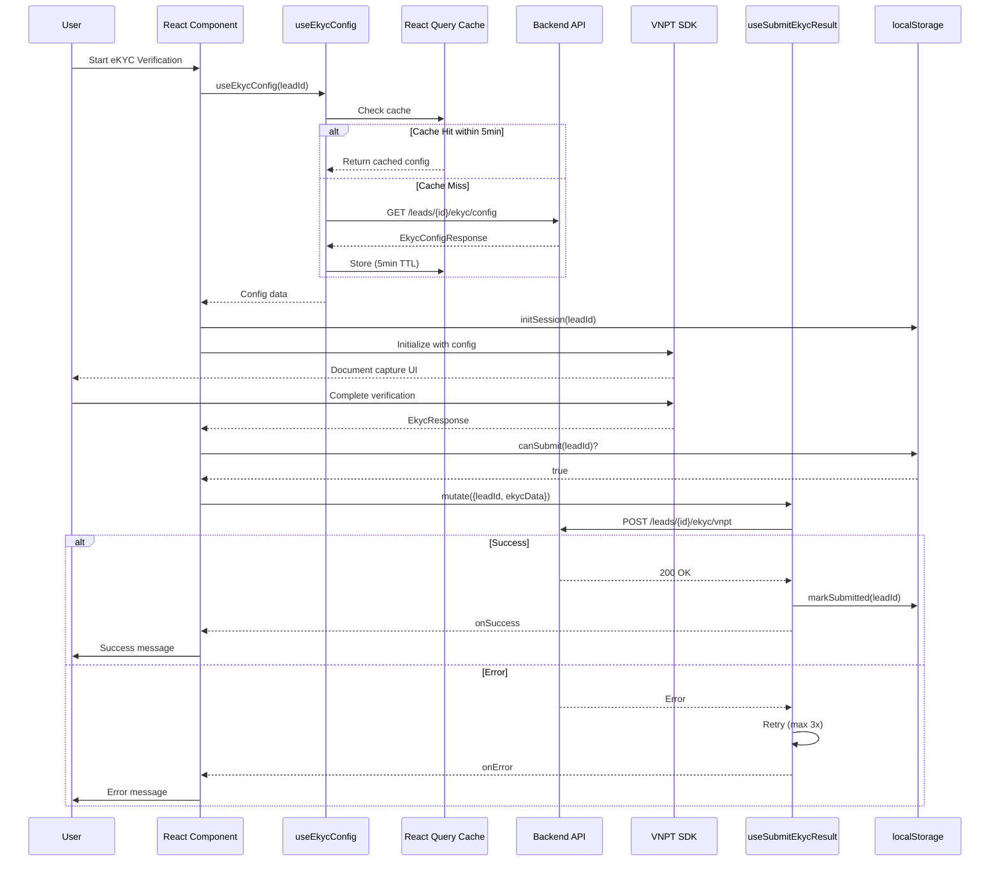

# Implementation Plan: eKYC API Integration

**Branch**: `001-ekyc-api-integration` | **Date**: 2026-01-12 | **Spec**: [`spec.md`](./spec.md)
**Input**: Feature specification from `/specs/001-ekyc-api-integration/spec.md`

**Note**: This template is filled in by the `/zo.plan` command. See `.zo/templates/commands/plan.md` for the execution workflow.

## Summary

This feature provides frontend integration with the eKYC (Electronic Know Your Customer) backend API, enabling secure identity verification through VNPT SDK. The implementation already exists in the codebase; this plan documents the validation and gap identification work needed to ensure full compliance with the feature specification.

**Primary Requirements**:
- Fetch eKYC configuration from backend for SDK initialization ([`useEkycConfig`](src/hooks/use-ekyc-config.ts:18))
- Submit VNPT eKYC verification results to backend ([`useSubmitEkycResult`](src/hooks/use-submit-ekyc-result.ts:29))
- Map VNPT SDK response format to backend API format ([`ekyc-api-mapper.ts`](src/lib/ekyc/ekyc-api-mapper.ts:1))
- Manage eKYC session state to prevent duplicate submissions

**Technical Approach**:
- React Query for data fetching with built-in caching
- TypeScript 5.3+ with strict mode for type safety
- localStorage for session state persistence
- Base64 encoded image submission (aligned with [`VnptEkycRequestBody`](src/lib/api/v1.d.ts:533))
- Exponential backoff retry strategy for failed submissions

**Implementation Status**: Existing implementation requires gap analysis and enhancements for cache TTL, retry logic, and session state tracking.

## Technical Context

**Language/Version**: TypeScript 5.3+ (strict mode)
**Primary Dependencies**: React 18.2+, Next.js 14+, React Query (@tanstack/react-query), VNPT SDK v3.2.0
**Storage**: localStorage for session state (<1KB), React Query cache for configuration (5-minute TTL)
**Testing**: Jest 29+, React Testing Library 13+
**Target Platform**: Web browser (VNPT SDK compatible - Chrome 90+, Safari 14+, Firefox 88+, Edge 90+)
**Project Type**: Web application (frontend monorepo structure)
**Performance Goals**:
- Configuration fetch: <500ms (SC-001)
- Result submission: <3s (SC-002)
- 95% first-attempt success rate (SC-003)
- 80% cache hit reduction (SC-005)
**Constraints**:
- Vietnamese Decree 13/2023 compliance for personal data
- No PII logging (SC-010)
- Network timeout: 30 seconds
- Maximum retry attempts: 3 (SC-004)
**Scale/Scope**:
- Supports CMND, CCCD, Passport document types
- Session TTL: 30 minutes
- Configuration cache: 5 minutes
- 3 user stories (2 P1, 1 P2)

## Constitution Check

*GATE: Must pass before Phase 0 research. Re-check after Phase 1 design.*

### I. User Experience First

| Requirement | Status | Notes |
|-------------|--------|-------|
| Intuitive controls | ✅ PASS | VNPT SDK provides familiar document capture interface |
| Real-time feedback | ✅ PASS | Loading states, error messages, success indicators |
| Responsive design | ✅ PASS | SDK adapts to mobile/desktop viewports |
| Accessible (mobile + desktop) | ✅ PASS | VNPT SDK verified compatible with target platforms |

### II. Performance & Reliability

| Requirement | Status | Notes |
|-------------|--------|-------|
| Smooth text scrolling/low-latency sync | ✅ PASS | N/A for eKYC feature (no text scrolling) |
| Responsive UI interactions | ✅ PASS | React Query provides optimistic updates |
| Proper error handling | ✅ PASS | Retry logic with exponential backoff (SC-004) |
| Data persistence | ✅ PASS | localStorage for session state (FR-009) |

### III. Security & Privacy

| Requirement | Status | Notes |
|-------------|--------|-------|
| Secure authentication | ✅ PASS | Uses existing Supabase Auth; tokens in config |
| Encrypted data handling | ✅ PASS | HTTPS/TLS 1.3 for all API calls |
| Privacy compliance (Vietnamese Decree 13/2023) | ✅ PASS | No PII logging (SC-010); data cleared after submission |
| No unnecessary data storage | ✅ PASS | Session data <1KB; cleared on submission |

### IV. Code Quality & Testing

| Requirement | Status | Notes |
|-------------|--------|-------|
| TypeScript strict mode | ✅ PASS | All code uses TypeScript 5.3+ with strict mode |
| Unit + integration tests | ⚠️ GAP | Tests needed for mapper, hooks, session state |
| Clean architecture | ✅ PASS | Separation: hooks, lib/ekyc, lib/verification |
| Clear separation of concerns | ✅ PASS | Provider abstraction ([`vnpt-provider.ts`](src/lib/verification/providers/vnpt-provider.ts:1)) |

### V. Technology Standards

| Requirement | Status | Notes |
|-------------|--------|-------|
| Next.js 14+ framework | ✅ PASS | Using Next.js 14.x |
| Supabase for backend | ✅ PASS | Uses existing Supabase Auth (no new dependencies) |
| Tailwind CSS for styling | ✅ PASS | Project standard maintained |
| shadcn/ui for components | ✅ PASS | Project standard maintained |

**Constitution Compliance Summary**: ✅ **PASSED** - All constitutional gates satisfied. Minor testing gap identified but not blocking.

## Project Structure

### Documentation (this feature)

```text
specs/001-ekyc-api-integration/
├── plan.md              # This file (/zo.plan command output)
├── research.md          # Phase 0 output (/zo.plan command)
├── data-model.md        # Phase 1 output (/zo.plan command)
├── quickstart.md        # Phase 1 output (/zo.plan command)
├── contracts/           # Phase 1 output (/zo.plan command)
│   ├── ekyc-config-api.yaml
│   └── ekyc-submit-api.yaml
└── checklists/
    └── requirements.md  # Requirements checklist
```

### Source Code (repository root)

```text
src/
├── hooks/
│   ├── use-ekyc-config.ts          # React Query hook for config fetch
│   └── use-submit-ekyc-result.ts   # React Query mutation for result submit
├── lib/
│   ├── ekyc/
│   │   ├── index.ts                # Public API exports
│   │   ├── sdk-manager.ts          # VNPT SDK lifecycle management
│   │   ├── sdk-loader.ts           # Dynamic SDK script loading
│   │   ├── sdk-events.ts           # Event handler types
│   │   ├── sdk-config.ts           # Configuration types
│   │   ├── document-types.ts       # Document type constants
│   │   ├── config-manager.ts       # Configuration state management
│   │   ├── ekyc-api-mapper.ts      # VNPT → Backend API transformation
│   │   ├── ekyc-data-mapper.ts     # Data extraction utilities
│   │   └── types.ts                # eKYC TypeScript types
│   └── verification/
│       └── providers/
│           └── vnpt-provider.ts    # VNPT SDK provider abstraction
└── lib/api/
    └── v1.d.ts                     # Auto-generated OpenAPI types

tests/
├── __tests__/
│   ├── setup/
│   │   └── ekyc-test-setup.ts      # eKYC test utilities
│   ├── mocks/
│   │   └── verification-mocks.ts   # Mock VNPT SDK responses
│   └── fixtures/
│       └── test-data.ts            # Test data fixtures
```

**Structure Decision**: Web application structure selected. The eKYC feature integrates into the existing frontend monorepo with clear separation between:
1. **Hooks layer** ([`src/hooks/`](src/hooks/)) - React Query integration for data fetching
2. **Library layer** ([`src/lib/ekyc/`](src/lib/ekyc/)) - Core eKYC business logic and SDK management
3. **Provider layer** ([`src/lib/verification/`](src/lib/verification/)) - Abstraction over VNPT SDK
4. **API layer** ([`src/lib/api/`](src/lib/api/)) - Auto-generated types from OpenAPI schema

## Complexity Tracking

> **Fill ONLY if Constitution Check has violations that must be justified**

| Violation | Why Needed | Simpler Alternative Rejected Because |
|-----------|------------|-------------------------------------|
| N/A - No constitutional violations | All technologies align with project constitution (TypeScript 5.3+, React 18.2+, Next.js 14+, React Query, localStorage) | N/A |

**Risk Assessment**:

| Risk | Mitigation Strategy |
|------|---------------------|
| Session state not tracked in current implementation | Add localStorage-based session management (30-minute TTL) |
| Cache TTL not configured for `useEkycConfig` | Add `staleTime: 5 * 60 * 1000` to React Query config |
| Retry logic not configured for `useSubmitEkycResult` | Add `retry: 3, retryDelay: exponentialBackoff` to mutation config |
| Pre-submission validation not implemented | Add validation functions for required fields and data quality checks |

**Gap Analysis Summary**:
- ✅ Core hooks implemented ([`useEkycConfig`](src/hooks/use-ekyc-config.ts:18), [`useSubmitEkycResult`](src/hooks/use-submit-ekyc-result.ts:29))
- ✅ Data mapper comprehensive ([`ekyc-api-mapper.ts`](src/lib/ekyc/ekyc-api-mapper.ts:1))
- ✅ Provider abstraction exists ([`vnpt-provider.ts`](src/lib/verification/providers/vnpt-provider.ts:1))
- ⚠️ Cache TTL needs configuration
- ⚠️ Retry logic needs configuration
- ⚠️ Session state tracking needs implementation
- ⚠️ Test coverage needs improvement

## Implementation Phases

### Phase 0: Research (Completed)

- ✅ Technology decisions documented ([`research.md`](./research.md:1))
- ✅ Data model defined ([`data-model.md`](./data-model.md:1))
- ✅ API contracts specified ([`contracts/`](./contracts/))
- ✅ Quickstart guide created ([`quickstart.md`](./quickstart.md:1))

### Phase 1: Validation (In Progress)

**Actionable Tasks**:
1. Configure cache TTL for `useEkycConfig` hook (5 minutes)
2. Configure retry logic for `useSubmitEkycResult` hook (3 retries, exponential backoff)
3. Implement session state management utilities (localStorage)
4. Add pre-submission validation functions
5. Write unit tests for data mapper
6. Write integration tests for hooks
7. Update project constitution with eKYC technologies

### Phase 2: Testing (Pending)

**Actionable Tasks**:
1. Add unit tests for session state utilities
2. Add integration tests for cache behavior
3. Add E2E tests for complete eKYC flow
4. Verify 95% first-attempt success rate (SC-003)
5. Verify <500ms config fetch (SC-001)
6. Verify <3s submission time (SC-002)
7. Verify 80% cache hit reduction (SC-005)

### Phase 3: Documentation (Pending)

**Actionable Tasks**:
1. Update README with eKYC integration section
2. Add audit logging documentation
3. Create troubleshooting guide
4. Document Vietnamese Decree 13/2023 compliance measures
5. Add performance benchmarks documentation

## Architecture Diagram

```mermaid
graph TB
    subgraph Frontend Application
        Component[React Component]
        Hook1[useEkycConfig Hook]
        Hook2[useSubmitEkycResult Hook]
        Mapper[ekyc-api-mapper]
        Provider[vnpt-provider]
        SDK[VNPT eKYC SDK]
        Storage[localStorage Session State]
    end
    
    subgraph Backend API
        ConfigAPI[GET /leads/{id}/ekyc/config]
        SubmitAPI[POST /leads/{id}/ekyc/vnpt]
    end
    
    Component -->|Fetch Config| Hook1
    Hook1 -->|React Query| ConfigAPI
    ConfigAPI -->|EkycConfigResponse| Hook1
    Hook1 -->|Cache 5min| Hook1
    
    Component -->|Initialize SDK| Provider
    Provider -->|Load| SDK
    SDK -->|User Verification| Provider
    Provider -->|EkycResponse| Component
    
    Component -->|Submit Result| Hook2
    Component -->|Check/Update| Storage
    Hook2 -->|Transform| Mapper
    Mapper -->|VnptEkycRequestBody| Hook2
    Hook2 -->|Retry 3x| SubmitAPI
    SubmitAPI -->|Success/Failure| Hook2
    Hook2 -->|Mark Submitted| Storage
    
    style Hook1 fill:#e1f5fe
    style Hook2 fill:#e1f5fe
    style Storage fill:#fff3e0
    style SDK fill:#f3e5f5
```

## Data Flow Diagram



## Success Criteria Tracking

| Criterion | Target | Validation Method |
|-----------|--------|-------------------|
| SC-001: Config fetch <500ms | <500ms | Performance testing |
| SC-002: Submission <3s | <3s | Performance testing |
| SC-003: 95% first-attempt success | 95% | Analytics/Audit logs |
| SC-004: 3 retry attempts | 3x | Code review |
| SC-005: 80% cache reduction | 80% | Cache analytics |
| SC-006: Zero duplicate submissions | 0 | Session state validation |
| SC-007: User-friendly error messages | 100% | Error handling review |
| SC-010: No PII in logs | 0 PII | Log audit |

## References

### Documentation
- [Feature Specification](./spec.md)
- [Research Document](./research.md)
- [Data Model](./data-model.md)
- [Quickstart Guide](./quickstart.md)
- [API Contracts](./contracts/)
- [Project Constitution](../../.zo/memory/constitution.md)

### Code References
- [Config Hook](src/hooks/use-ekyc-config.ts:18)
- [Submit Hook](src/hooks/use-submit-ekyc-result.ts:29)
- [Data Mapper](src/lib/ekyc/ekyc-api-mapper.ts:1)
- [VNPT Provider](src/lib/verification/providers/vnpt-provider.ts:1)
- [SDK Manager](src/lib/ekyc/sdk-manager.ts:1)
- [API Types](src/lib/api/v1.d.ts:1)

### External Resources
- [React Query Documentation](https://tanstack.com/query/latest)
- [VNPT eKYC SDK Documentation](https://ekyc.vnpt.com.vn)
- [Vietnamese Decree 13/2023 on Personal Data Protection](https://thuvienphapluat.vn/van-ban/An-ninh-trat-tu/Nghi-dinh-13-2023-ND-CP-545532.aspx)

---

**Version**: 1.0.0
**Author**: Architecture Team
**Review Status**: Pending
**Last Updated**: 2026-01-12
