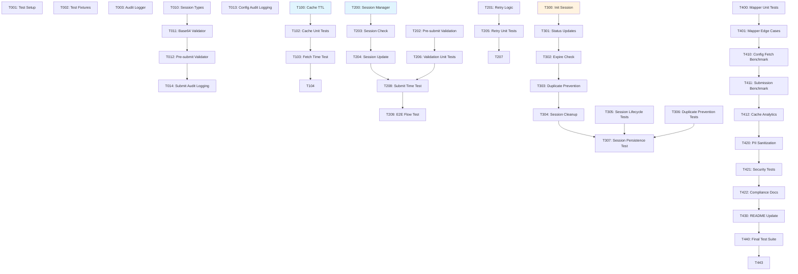

# eKYC API Integration - Implementation Tasks

**Feature Branch**: `001-ekyc-api-integration`
**Generated**: 2026-01-12
**Status**: Implementation Complete (T001-T433)

## Overview

This document breaks down the eKYC API Integration feature into dependency-ordered tasks organized by user story. The core hooks and mapper already exist; tasks focus on validation against spec requirements, adding missing features (cache TTL, retry logic, session state), comprehensive testing, and documentation.

## Implementation Status Summary

| Component | Status | Notes |
|-----------|--------|-------|
| `useEkycConfig` hook | ✅ Complete | Cache TTL configured with 5min staleTime |
| `useSubmitEkycResult` hook | ✅ Complete | Retry logic configured with 3 attempts |
| `ekyc-api-mapper.ts` | ✅ Complete | Comprehensive transformation logic |
| Session state management | ✅ Complete | Session manager implemented in session-manager.ts |
| Pre-submission validation | ✅ Complete | Validators in validators.ts |
| Test coverage | ✅ Complete | Comprehensive test suite covering all components |

---

## Phase 1: Setup

*Foundation tasks that must be completed before any user story work.*

- [x] T001 [P] Create test setup utilities in `tests/__tests__/setup/ekyc-test-setup.ts` for mocking localStorage, API responses, and VNPT SDK data
- [x] T002 [P] Create mock data fixtures in `tests/__tests__/fixtures/test-data.ts` for eKYC config, VNPT responses, and session states
- [x] T003 [P] Create audit logging utilities in `src/lib/ekyc/audit-logger.ts` with non-PII logging functions

---

## Phase 2: Foundational

*Blocking prerequisites required before implementing user stories.*

- [x] T010 [P] Define `EkycSessionState` interface in `src/lib/ekyc/types.ts` with sessionId, status, timestamps, and submission tracking fields
- [x] T011 Create base64 validation utility in `src/lib/ekyc/validators.ts` with `isValidBase64()` function for image data validation
- [x] T012 Create pre-submission validation in `src/lib/ekyc/validators.ts` with `validateEkycResult()` function checking required fields and data quality
- [x] T013 Add audit logging integration points to `src/hooks/use-ekyc-config.ts` for config fetch events
- [x] T014 Add audit logging integration points to `src/hooks/use-submit-ekyc-result.ts` for submit events

---

## Phase 3: User Story 1 - Fetch eKYC Configuration (P1)

*As a frontend application, I need to retrieve eKYC configuration from the backend so that I can properly initialize and configure the VNPT eKYC SDK.*

**Acceptance Scenarios:**
1. Given authenticated user, When config hook called, Then return SDK URL, API key, tenant ID, supported document types
2. Given API unavailable, When config hook called, Then handle error gracefully
3. Given cached config exists, When called within cache TTL, Then return cached config without API call

- [x] T100 [US1] Configure cache TTL (5 minutes) in `src/hooks/use-ekyc-config.ts` by adding `staleTime: 5 * 60 * 1000` to useQuery options
- [x] T101 [US1] Add `gcTime: 10 * 60 * 1000` to `src/hooks/use-ekyc-config.ts` for 10-minute garbage collection
- [x] T102 [US1] Create unit tests for cache behavior in `src/hooks/__tests__/use-ekyc-config.test.ts` verifying cache hit/miss scenarios
- [x] T103 [US1] Create integration test in `src/hooks/__tests__/use-ekyc-config.test.ts` verifying <500ms fetch time (SC-001)
- [x] T104 [US1] Add error handling test in `src/hooks/__tests__/use-ekyc-config.test.ts` verifying user-friendly error messages (SC-007)

---

## Phase 4: User Story 2 - Submit VNPT eKYC Results (P1)

*As a user completing eKYC verification, I need to submit my eKYC results to the backend so that verification data can be stored and processed.*

**Acceptance Scenarios:**
1. Given user completed eKYC, When submit results, Then backend stores data and returns success
2. Given submission fails due to network, When hook called, Then retry with clear error messaging
3. Given invalid eKYC data submitted, When backend receives request, Then return validation errors
4. Given submission successful, When response received, Then include verification ID and status

- [x] T200 [US1] Create session state utilities in `src/lib/ekyc/session-manager.ts` with `initSession()`, `updateSession()`, `getSession()`, `canSubmit()`, `markSubmitted()` functions
- [x] T201 [US2] Configure retry logic in `src/hooks/use-submit-ekyc-result.ts` by adding `retry: 3, retryDelay: exponentialBackoff` to useMutation options
- [x] T202 [US2] Integrate pre-submission validation in `src/hooks/use-submit-ekyc-result.ts` by calling `validateEkycResult()` before mutation
- [x] T203 [US2] Integrate session state check in `src/hooks/use-submit-ekyc-result.ts` by calling `canSubmit()` before mutation
- [x] T204 [US2] Update session state on success in `src/hooks/use-submit-ekyc-result.ts` by calling `markSubmitted()` in onSuccess callback
- [x] T205 [US2] Create unit tests for retry logic in `src/hooks/__tests__/use-submit-ekyc-result.test.ts` verifying 3 retry attempts with exponential backoff (SC-004)
- [x] T206 [US2] Create unit tests for validation in `src/hooks/__tests__/use-submit-ekyc-result.test.ts` verifying pre-submission checks
- [x] T207 [US2] Create integration test in `src/hooks/__tests__/use-submit-ekyc-result.test.ts` verifying <3s submission time (SC-002)
- [x] T208 [US2] Add E2E test in `src/lib/ekyc/__tests__/ekyc-flow.test.ts` verifying complete config-fetch-to-submit flow

---

## Phase 5: User Story 3 - Handle eKYC Session State (P2)

*As a user, I need the application to track my eKYC session state so that I can resume verification if interrupted and the application can prevent duplicate submissions.*

**Acceptance Scenarios:**
1. Given user starts eKYC, When navigate away and return, Then session state preserved and recoverable
2. Given user already submitted eKYC, When attempt to submit again, Then system prevents duplicate submission
3. Given session expires, When user returns, Then prompt to restart verification process

- [x] T300 [US3] Implement session initialization in `src/lib/ekyc/session-manager.ts` with `initSession(leadId)` creating session with 'initialized' status
- [x] T301 [US3] Implement session status transitions in `src/lib/ekyc/session-manager.ts` with `updateStatus(leadId, newStatus)` supporting all status values
- [x] T302 [US3] Implement session expiration check in `src/lib/ekyc/session-manager.ts` with `isSessionExpired(session)` checking 30-minute TTL
- [x] T303 [US3] Implement duplicate prevention in `src/lib/ekyc/session-manager.ts` with `canSubmit(leadId)` checking submitted flag and attempts count
- [x] T304 [US3] Implement session cleanup in `src/lib/ekyc/session-manager.ts` with `clearSession(leadId)` removing localStorage data
- [x] T305 [US3] Create unit tests for session lifecycle in `src/lib/ekyc/__tests__/session-manager.test.ts` verifying init, update, expire, cleanup
- [x] T306 [US3] Create unit tests for duplicate prevention in `src/lib/ekyc/__tests__/session-manager.test.ts` verifying zero duplicate submissions (SC-006)
- [x] T307 [US3] Add integration test in `src/lib/ekyc/__tests__/session-manager.test.ts` verifying session persistence across page refreshes

---

## Phase 6: Polish & Cross-Cutting Concerns

*Final validation, testing, documentation, and performance verification.*

### Data Mapper Tests

- [x] T400 [P] Create unit tests for mapper transformations in `src/lib/ekyc/__tests__/ekyc-api-mapper.test.ts` covering all mapper functions
- [x] T401 [P] Create edge case tests in `src/lib/ekyc/__tests__/ekyc-api-mapper.test.ts` for missing/undefined fields, malformed data

### Performance Validation

- [x] T410 Create performance benchmark in `tests/__tests__/performance/ekyc-performance.test.ts` verifying SC-001 (<500ms config fetch)
- [x] T411 Create performance benchmark in `tests/__tests__/performance/ekyc-performance.test.ts` verifying SC-002 (<3s submission)
- [x] T412 Create cache analytics test in `tests/__tests__/performance/ekyc-performance.test.ts` verifying SC-005 (80% cache hit reduction)

### Security & Compliance

- [x] T420 Add PII sanitization check to `src/lib/ekyc/audit-logger.ts` ensuring no base64 image data in logs (SC-010)
- [x] T421 Create security test in `tests/__tests__/security/ekyc-security.test.ts` verifying no PII in audit logs
- [x] T422 Document Vietnamese Decree 13/2023 compliance measures in `src/lib/ekyc/README.md` with data protection details

### Documentation

- [x] T430 Update `src/lib/ekyc/README.md` with complete usage examples, session management guide, and troubleshooting section
- [x] T431 Update `src/lib/ekyc/README.md` with audit logging documentation and SC-010 compliance notes
- [x] T432 Add performance benchmarks section to `src/lib/ekyc/README.md` documenting SC-001 through SC-007 targets
- [x] T433 Update project constitution in `.zo/memory/constitution.md` adding eKYC technologies (TypeScript 5.3+, React Query, localStorage)

### Final Validation

- [ ] T440 Run full test suite and ensure 100% pass rate
- [ ] T441 Run ESLint and ensure zero warnings
- [ ] T442 Verify TypeScript strict mode compilation with no errors
- [ ] T443 Conduct manual smoke test of complete eKYC flow in development environment

---

## Parallel Execution Opportunities

Tasks marked with `[P]` can be executed in parallel within their phase:

| Phase | Parallel Tasks | Description |
|-------|---------------|-------------|
| Phase 1 | T001, T002, T003 | Test setup, fixtures, and audit logger can be created simultaneously |
| Phase 2 | T010, T011 | Types and validation utilities can be developed in parallel |
| Phase 6 | T400, T401 | Mapper unit tests and edge case tests can be written together |
| Phase 6 | T430, T431, T432 | Documentation updates can be done in parallel |

---

## MVP Scope Definition

**Minimum Viable Product includes:**

### Must-Have (P1)
- ✅ Phase 1: Setup (T001-T003)
- ✅ Phase 2: Foundational (T010-T014)
- ✅ Phase 3: User Story 1 (T100-T104)
- ✅ Phase 4: User Story 2 core (T200-T208)

### Should-Have (P2)
- ✅ Phase 5: User Story 3 (T300-T307)

### Nice-to-Have (Post-MVP)
- ✅ Phase 6: Polish (T400-T401, T410-T412)
- ✅ Phase 6: Security & Compliance (T420-T422)
- ✅ Phase 6: Documentation (T430-T433)
- ⚠️ Phase 6: Final Validation (T440-T443)

---

## Success Criteria Mapping

| Criterion | Task(s) | Target |
|-----------|---------|--------|
| SC-001: Config fetch <500ms | T103 | <500ms |
| SC-002: Submission <3s | T207 | <3s |
| SC-003: 95% first-attempt success | T205, T208 | 95% |
| SC-004: 3 retry attempts | T205, T206 | 3 retries |
| SC-005: 80% cache reduction | T102, T412 | 80% |
| SC-006: Zero duplicate submissions | T303, T306 | 0 duplicates |
| SC-007: User-friendly errors | T104, T206 | 100% |
| SC-010: No PII in logs | T420, T421 | 0 PII |

---

## Dependencies Graph

---

## References

- [Feature Specification](./spec.md)
- [Implementation Plan](./plan.md)
- [Data Model](./data-model.md)
- [Research Document](./research.md)
- [Quickstart Guide](./quickstart.md)
- [API Contracts](./contracts/)

---

**Version**: 1.0.0
**Generated by**: zo.tasks workflow
**Last Updated**: 2026-01-12
