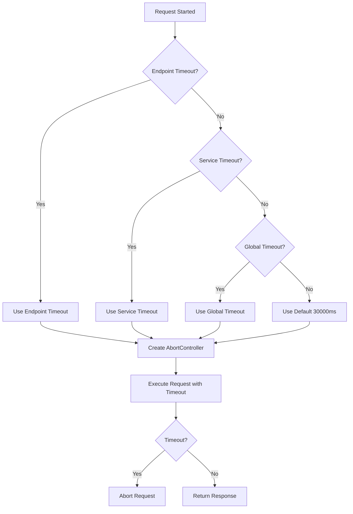
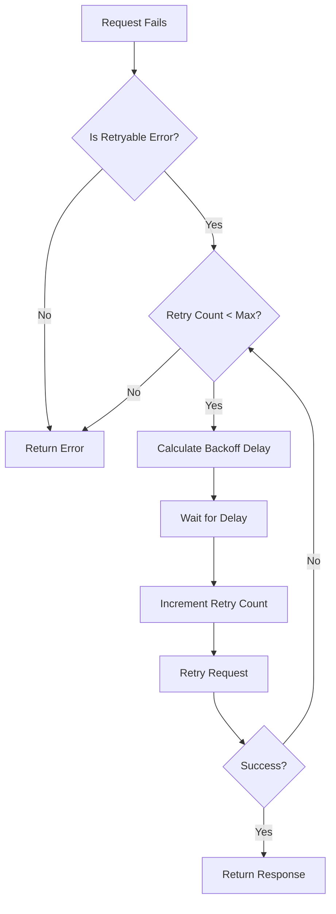

# API Contracts: Configurable API Timeout

**Feature**: 002-configurable-api-timeout  
**Created**: 2026-01-13  
**Status**: Phase 1 - Design Complete

## Overview

This document defines the internal API contracts for the timeout configuration system, including type definitions, validation schemas, and error handling contracts.

---

## Core Configuration Contracts

### TimeoutConfig

```typescript
interface TimeoutConfig {
  /**
   * Global timeout in milliseconds (default: 30000)
   * Range: 1000 - 600000
   */
  global: number;

  /**
   * Service-specific timeouts keyed by service name
   * Overrides global timeout for the specified service
   */
  services?: Record<string, number>;

  /**
   * Endpoint-specific timeouts keyed by normalized path
   * Overrides both service and global timeouts
   */
  endpoints?: Record<string, number>;

  /**
   * Maximum number of retry attempts (default: 3)
   * Range: 0 - 10
   */
  maxRetries: number;

  /**
   * Initial retry delay in milliseconds (default: 1000)
   * Range: 100 - 30000
   */
  retryDelay: number;
}
```

**Validation Rules**:
- All timeout values must be positive integers
- Minimum value: 1000ms (1 second)
- Maximum value: 600000ms (10 minutes)
- `maxRetries` must be between 0 and 10
- `retryDelay` must be between 100ms and 30000ms

---

### TimeoutResolution

```typescript
interface TimeoutResolution {
  /**
   * Final timeout value to apply (milliseconds)
   */
  timeout: number;

  /**
   * Source of the timeout value
   */
  source: 'endpoint' | 'service' | 'global' | 'default';

  /**
   * The endpoint key that was matched (if endpoint source)
   */
  endpointKey?: string;

  /**
   * The service key that was matched (if service source)
   */
  serviceKey?: string;

  /**
   * Whether timeout was explicitly configured
   */
  explicit: boolean;
}
```

**Resolution Priority**:
```
1. endpoint → NEXT_PUBLIC_API_TIMEOUT_ENDPOINT_<normalized_path>
2. service → NEXT_PUBLIC_API_TIMEOUT_SERVICE_<service_name>
3. global → NEXT_PUBLIC_API_TIMEOUT_GLOBAL
4. default → 30000 (hardcoded)
```

---

### RetryStrategy

```typescript
interface RetryStrategy {
  /**
   * Maximum number of retry attempts
   * Range: 0 - 10
   */
  maxAttempts: number;

  /**
   * Initial delay before first retry (milliseconds)
   * Range: 100 - 30000
   */
  initialDelay: number;

  /**
   * Backoff multiplier for exponential delay
   * Range: 1.0 - 5.0
   */
  backoffMultiplier: number;

  /**
   * Maximum delay cap (milliseconds, optional)
   * Range: 100 - 60000
   */
  maxDelay?: number;

  /**
   * Error types that trigger retry
   */
  retryableErrors: string[];

  /**
   * Whether jitter is added to delays
   */
  useJitter: boolean;
}
```

**Backoff Calculation**:
```
delay[i] = min(initialDelay * (backoffMultiplier ^ i), maxDelay)
```

---

## Error Handling Contracts

### TimeoutError

```typescript
interface TimeoutError extends Error {
  /**
   * Error type for distinguishing timeout from cancellation
   */
  type: 'API_TIMEOUT' | 'USER_CANCEL';

  /**
   * The endpoint path that timed out
   */
  endpoint: string;

  /**
   * The configured timeout duration (milliseconds)
   */
  timeoutDuration: number;

  /**
   * Actual elapsed time (milliseconds)
   */
  elapsedTime: number;

  /**
   * Number of retry attempts before giving up
   */
  retryCount: number;

  /**
   * HTTP method of the request
   */
  method: string;

  /**
   * Request ID for tracking
   */
  requestId?: string;

  /**
   * Session ID for user-level analysis
   */
  sessionId?: string;

  /**
   * Timestamp when timeout occurred
   */
  timestamp: string;
}
```

**Error Type Semantics**:

| Type | Description | User Message | Logging |
|------|-------------|--------------|---------|
| `API_TIMEOUT` | Automatic timeout after configured duration | "The request took too long to complete. Please try again." | Logged as error with full context |
| `USER_CANCEL` | User-initiated cancellation | "Request was cancelled." | Logged as info, separate from timeouts |

---

### TimeoutErrorHandler

```typescript
type TimeoutErrorHandler = (error: TimeoutError) => void;

interface TimeoutErrorHandlers {
  /**
   * Handler for automatic timeout errors
   */
  onTimeout: TimeoutErrorHandler;

  /**
   * Handler for user cancellation errors
   */
  onCancel: TimeoutErrorHandler;

  /**
   * Handler for retry attempt
   */
  onRetry: (attempt: number, maxAttempts: number) => void;

  /**
   * Handler for final failure after all retries
   */
  onFinalFailure: TimeoutErrorHandler;
}
```

---

## Validation Contracts

### ValidationResult

```typescript
interface ValidationResult {
  /**
   * Whether validation passed
   */
  valid: boolean;

  /**
   * Array of validation errors
   */
  errors: ValidationError[];

  /**
   * Parsed and validated configuration (if valid)
   */
  config?: TimeoutConfig;
}
```

### ValidationError

```typescript
interface ValidationError {
  /**
   * Environment variable name
   */
  variable: string;

  /**
   * Error message
   */
  message: string;

  /**
   * Invalid value that caused the error
   */
  value: string;

  /**
   * Expected format
   */
  expected: string;
}
```

**Validation Rules**:

| Variable | Validation | Error Message |
|----------|------------|---------------|
| `NEXT_PUBLIC_API_TIMEOUT_GLOBAL` | Must be positive integer between 1000-600000 | "Global timeout must be between 1000 and 600000 milliseconds" |
| `NEXT_PUBLIC_API_TIMEOUT_SERVICE_*` | Must be positive integer between 1000-600000 | "Service timeout for {SERVICE} must be between 1000 and 600000 milliseconds" |
| `NEXT_PUBLIC_API_TIMEOUT_ENDPOINT_*` | Must be positive integer between 1000-600000 | "Endpoint timeout for {ENDPOINT} must be between 1000 and 600000 milliseconds" |
| `NEXT_PUBLIC_API_MAX_RETRIES` | Must be integer between 0-10 | "Max retries must be between 0 and 10" |
| `NEXT_PUBLIC_API_RETRY_DELAY_MS` | Must be positive integer between 100-30000 | "Retry delay must be between 100 and 30000 milliseconds" |

**Startup Behavior**:
- If any validation fails, application startup is aborted
- All validation errors are displayed in a single error message
- Error message format: `"Invalid timeout configuration:\n- {error1}\n- {error2}\n..."`

---

## Logging Contracts

### TimeoutLogEntry

```typescript
interface TimeoutLogEntry {
  /**
   * Log entry type
   */
  type: 'API_TIMEOUT' | 'USER_CANCEL';

  /**
   * Log severity
   */
  level: 'error' | 'warn' | 'info';

  /**
   * Endpoint path
   */
  endpoint: string;

  /**
   * Configured timeout duration (milliseconds)
   */
  timeoutDuration: number;

  /**
   * Actual elapsed time (milliseconds)
   */
  elapsedTime: number;

  /**
   * Number of retries attempted
   */
  retryCount: number;

  /**
   * HTTP method
   */
  method: string;

  /**
   * Request ID
   */
  requestId: string;

  /**
   * Session ID (if available)
   */
  sessionId?: string;

  /**
   * User agent
   */
  userAgent?: string;

  /**
   * Timestamp
   */
  timestamp: string;

  /**
   * Additional context
   */
  context?: Record<string, unknown>;
}
```

**Logging Levels**:

| Event Type | Level | Context |
|------------|-------|---------|
| API Timeout (final) | error | Full context + retry count |
| User Cancel | info | Request ID + timestamp |
| Retry attempt | warn | Attempt number + max attempts |
| Successful retry | info | Attempt number + total time |

---

## React Query Integration Contracts

### TimeoutQueryOptions

```typescript
interface TimeoutQueryOptions<TData, TError>
  extends Omit<UseQueryOptions<TData, TError>, 'signal'> {
  /**
   * Override timeout for this specific query (milliseconds)
   * Range: 1000 - 600000
   */
  timeout?: number;

  /**
   * Disable retry for this query
   */
  disableRetry?: boolean;

  /**
   * Custom retry strategy overrides
   */
  retryStrategy?: Partial<RetryStrategy>;
}
```

### TimeoutMutationOptions

```typescript
interface TimeoutMutationOptions<TData, TError, TVariables>
  extends Omit<UseMutationOptions<TData, TError, TVariables>, 'signal'> {
  /**
   * Override timeout for this specific mutation (milliseconds)
   * Range: 1000 - 600000
   */
  timeout?: number;

  /**
   * Disable retry for this mutation
   */
  disableRetry?: boolean;

  /**
   * Custom retry strategy overrides
   */
  retryStrategy?: Partial<RetryStrategy>;
}
```

---

## Environment Variable Contracts

### Variable Naming Convention

```
NEXT_PUBLIC_API_TIMEOUT_<SCOPE>_<TARGET>
```

**Scopes**:
- `GLOBAL` - Default timeout for all requests
- `SERVICE_<SERVICE_NAME>` - Timeout for specific service
- `ENDPOINT_<NORMALIZED_PATH>` - Timeout for specific endpoint

**Path Normalization**:
1. Remove leading slash
2. Replace slashes with underscores
3. Remove dynamic segments (`{id}`, `:id`, etc.)
4. Convert to uppercase

**Examples**:

| Path | Normalized | Environment Variable |
|------|------------|---------------------|
| `/leads` | `LEADS` | `NEXT_PUBLIC_API_TIMEOUT_ENDPOINT_LEADS` |
| `/leads/{id}/submit-otp` | `LEADS_SUBMIT_OTP` | `NEXT_PUBLIC_API_TIMEOUT_ENDPOINT_LEADS_SUBMIT_OTP` |
| `/ekyc/config` | `EKYC_CONFIG` | `NEXT_PUBLIC_API_TIMEOUT_ENDPOINT_EKYC_CONFIG` |
| `/api/v1/users/:id/profile` | `API_V1_USERS_PROFILE` | `NEXT_PUBLIC_API_TIMEOUT_ENDPOINT_API_V1_USERS_PROFILE` |

---

## Constants Contract

```typescript
export const DEFAULT_TIMEOUTS = {
  GLOBAL: 30000,        // 30 seconds
  MINIMUM: 1000,        // 1 second
  MAXIMUM: 600000,      // 10 minutes
  STREAMING: 600000,    // 10 minutes
} as const;

export const DEFAULT_RETRY = {
  MAX_RETRIES: 3,
  INITIAL_DELAY: 1000,  // 1 second
  BACKOFF_MULTIPLIER: 2,
  MAX_DELAY: 10000,     // 10 seconds
} as const;

export const ERROR_TYPES = {
  API_TIMEOUT: 'API_TIMEOUT',
  USER_CANCEL: 'USER_CANCEL',
} as const;

export const TIMEOUT_SOURCE = {
  ENDPOINT: 'endpoint',
  SERVICE: 'service',
  GLOBAL: 'global',
  DEFAULT: 'default',
} as const;
```

---

## Type Guards Contract

```typescript
/**
 * Type guard for TimeoutError
 */
function isTimeoutError(error: unknown): error is TimeoutError;

/**
 * Type guard for retryable errors
 */
function isRetryableError(error: unknown): boolean;
```

---

## Path Normalization Contract

```typescript
/**
 * Normalizes endpoint paths for environment variable lookup
 * 
 * @param path - The endpoint path to normalize
 * @returns Normalized path string
 * 
 * @example
 * normalizeEndpointPath('/leads/{id}/submit-otp') // 'LEADS_SUBMIT_OTP'
 * normalizeEndpointPath('/ekyc/config') // 'EKYC_CONFIG'
 */
function normalizeEndpointPath(path: string): string;
```

**Algorithm**:
```typescript
function normalizeEndpointPath(path: string): string {
  return path
    .replace(/^\//, '')                    // Remove leading slash
    .replace(/\/:?\w+/g, '')               // Remove dynamic segments
    .replace(/\//g, '_')                   // Replace slashes with underscores
    .toUpperCase();                        // Convert to uppercase
}
```

---

## State Management Contracts

### TimeoutStore (Zustand)

```typescript
interface TimeoutStore {
  /**
   * Current timeout configuration
   */
  config: TimeoutConfig;

  /**
   * Active timeout contexts keyed by request ID
   */
  activeRequests: Map<string, TimeoutContext>;

  /**
   * Update timeout configuration
   */
  setConfig: (config: TimeoutConfig) => void;

  /**
   * Add an active request context
   */
  addRequest: (context: TimeoutContext) => void;

  /**
   * Remove an active request context
   */
  removeRequest: (requestId: string) => void;

  /**
   * Cancel a specific request
   */
  cancelRequest: (
    requestId: string,
    reason: 'USER_CANCEL' | 'API_TIMEOUT'
  ) => void;

  /**
   * Cancel all active requests
   */
  cancelAllRequests: () => void;
}
```

---

## Flow Contracts

### Timeout Resolution Flow



### Retry Flow



---

**Document Version**: 1.0  
**Last Updated**: 2026-01-13  
**Status**: Ready for Implementation
