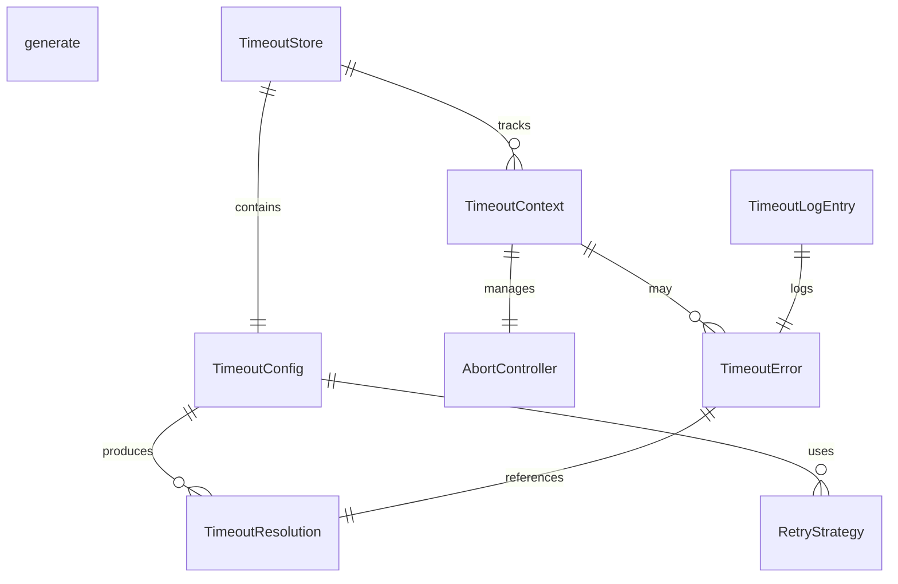
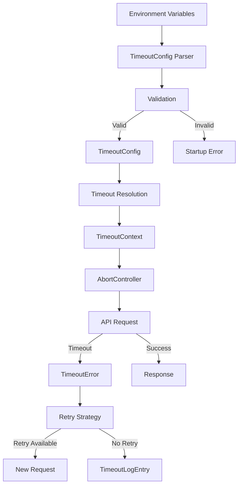

# Data Model: Configurable API Timeout

**Feature**: 002-configurable-api-timeout  
**Created**: 2026-01-13  
**Status**: Phase 1 - Design Complete

## Overview

This document defines all data structures, types, and entities required for implementing configurable API timeouts across global, service, and endpoint levels.

---

## Core Type Definitions

### TimeoutConfig

The main configuration structure that holds all timeout settings.

```typescript
interface TimeoutConfig {
  /**
   * Global timeout in milliseconds (default: 30000)
   * Applied to all API calls when no more specific timeout is configured
   */
  global: number;

  /**
   * Service-specific timeouts keyed by service name
   * Overrides global timeout for the specified service
   */
  services?: Record<string, number>;

  /**
   * Endpoint-specific timeouts keyed by normalized path
   * Overrides both service and global timeouts
   */
  endpoints?: Record<string, number>;

  /**
   * Maximum number of retry attempts after timeout (default: 3)
   */
  maxRetries: number;

  /**
   * Initial retry delay in milliseconds (default: 1000)
   * Subsequent delays use exponential backoff: delay * 2^attempt
   */
  retryDelay: number;
}
```

**Example Usage**:
```typescript
const config: TimeoutConfig = {
  global: 30000,
  services: {
    DOP: 15000,
    EKYC: 60000,
  },
  endpoints: {
    LEADS_SUBMIT_OTP: 10000,
  },
  maxRetries: 3,
  retryDelay: 1000,
};
```

---

### TimeoutError

Represents a timeout failure with full context for logging and error handling.

```typescript
interface TimeoutError extends Error {
  /**
   * Error type for distinguishing timeout from other errors
   */
  type: 'API_TIMEOUT' | 'USER_CANCEL';

  /**
   * The endpoint path that timed out
   */
  endpoint: string;

  /**
   * The configured timeout duration in milliseconds
   */
  timeoutDuration: number;

  /**
   * Actual elapsed time before timeout in milliseconds
   */
  elapsedTime: number;

  /**
   * Number of retry attempts before giving up
   */
  retryCount: number;

  /**
   * HTTP method of the request
   */
  method: string;

  /**
   * Request ID for tracking
   */
  requestId?: string;

  /**
   * Session ID for user-level analysis
   */
  sessionId?: string;

  /**
   * Timestamp when timeout occurred
   */
  timestamp: string;
}
```

**Example Usage**:
```typescript
const error: TimeoutError = {
  name: 'TimeoutError',
  message: 'Request to /leads/123/submit-otp timed out after 10000ms',
  type: 'API_TIMEOUT',
  endpoint: '/leads/123/submit-otp',
  timeoutDuration: 10000,
  elapsedTime: 10001,
  retryCount: 3,
  method: 'POST',
  requestId: 'req_abc123',
  sessionId: 'sess_xyz789',
  timestamp: '2026-01-13T10:30:00.000Z',
};
```

---

### TimeoutContext

Tracks active requests with their timeout configurations and cancellation tokens.

```typescript
interface TimeoutContext {
  /**
   * Unique identifier for this request context
   */
  id: string;

  /**
   * The endpoint path for this request
   */
  endpoint: string;

  /**
   * Resolved timeout duration for this request
   * After applying cascade: endpoint -> service -> global
   */
  timeout: number;

  /**
   * AbortController for cancelling this request
   */
  controller: AbortController;

  /**
   * Request start timestamp
   */
  startTime: number;

  /**
   * Current retry attempt (0-based)
   */
  attempt: number;

  /**
   * Whether this request can be retried
   */
  retryable: boolean;

  /**
   * User-initiated cancellation flag
   */
  userCancelled: boolean;
}
```

**Lifecycle**:
```
Request Start → Create Context → Attach AbortSignal → Execute → Cleanup
                                    ↓
                              Timeout/Cancel → Abort Request
```

---

### RetryStrategy

Defines retry behavior for failed requests.

```typescript
interface RetryStrategy {
  /**
   * Maximum number of retry attempts (default: 3)
   */
  maxAttempts: number;

  /**
   * Initial delay before first retry in milliseconds (default: 1000)
   */
  initialDelay: number;

  /**
   * Backoff multiplier for exponential delay (default: 2)
   */
  backoffMultiplier: number;

  /**
   * Maximum delay cap in milliseconds (optional)
   */
  maxDelay?: number;

  /**
   * Error types that should trigger retry
   */
  retryableErrors: string[];

  /**
   * Whether jitter should be added to delays
   */
  useJitter: boolean;
}
```

**Example Strategy**:
```typescript
const strategy: RetryStrategy = {
  maxAttempts: 3,
  initialDelay: 1000,
  backoffMultiplier: 2,
  maxDelay: 10000,
  retryableErrors: ['API_TIMEOUT', 'NETWORK_ERROR'],
  useJitter: false,
};

// Delays: 1000ms, 2000ms, 4000ms (capped at maxDelay)
```

---

### TimeoutResolution

Result of timeout resolution process (cascade logic).

```typescript
interface TimeoutResolution {
  /**
   * Final timeout value to apply
   */
  timeout: number;

  /**
   * Source of the timeout value
   */
  source: 'endpoint' | 'service' | 'global' | 'default';

  /**
   * The specific endpoint key that was matched (if any)
   */
  endpointKey?: string;

  /**
   * The specific service key that was matched (if any)
   */
  serviceKey?: string;

  /**
   * Whether the timeout was explicitly configured or defaulted
   */
  explicit: boolean;
}
```

**Resolution Cascade**:
```
1. Check endpoint-specific timeout
   ↓ (not found)
2. Check service-specific timeout
   ↓ (not found)
3. Check global timeout
   ↓ (not found)
4. Apply hardcoded default (30000ms)
```

---

## Environment Variable Schema

### Variable Definitions

```typescript
interface TimeoutEnvVars {
  /**
   * Global timeout in milliseconds
   * Default: 30000
   */
  NEXT_PUBLIC_API_TIMEOUT_GLOBAL?: string;

  /**
   * Service-specific timeouts
   * Pattern: NEXT_PUBLIC_API_TIMEOUT_SERVICE_<SERVICE_NAME>
   */
  NEXT_PUBLIC_API_TIMEOUT_SERVICE_DOP?: string;
  NEXT_PUBLIC_API_TIMEOUT_SERVICE_CONSENT?: string;
  NEXT_PUBLIC_API_TIMEOUT_SERVICE_EKYC?: string;
  NEXT_PUBLIC_API_TIMEOUT_SERVICE_PAYMENT?: string;

  /**
   * Endpoint-specific timeouts
   * Pattern: NEXT_PUBLIC_API_TIMEOUT_ENDPOINT_<NORMALIZED_PATH>
   */
  NEXT_PUBLIC_API_TIMEOUT_ENDPOINT_LEADS?: string;
  NEXT_PUBLIC_API_TIMEOUT_ENDPOINT_LEADS_SUBMIT_OTP?: string;
  NEXT_PUBLIC_API_TIMEOUT_ENDPOINT_EKYC_CONFIG?: string;
  NEXT_PUBLIC_API_TIMEOUT_ENDPOINT_EKYC_SUBMIT?: string;

  /**
   * Retry configuration
   */
  NEXT_PUBLIC_API_MAX_RETRIES?: string;
  NEXT_PUBLIC_API_RETRY_DELAY_MS?: string;
}
```

### Path Normalization Rules

```typescript
/**
 * Normalizes endpoint paths for environment variable lookup
 * 
 * Rules:
 * 1. Remove leading slash
 * 2. Replace slashes with underscores
 * 3. Remove dynamic segments (e.g., {id}, :id)
 * 4. Convert to uppercase
 * 
 * Examples:
 * - /leads → LEADS
 * - /leads/{id}/submit-otp → LEADS_SUBMIT_OTP
 * - /ekyc/config → EKYC_CONFIG
 * - /api/v1/users/:id/profile → API_V1_USERS_PROFILE
 */
function normalizeEndpointPath(path: string): string {
  return path
    .replace(/^\//, '')                    // Remove leading slash
    .replace(/\/:?\w+/g, '')               // Remove dynamic segments
    .replace(/\//g, '_')                   // Replace slashes with underscores
    .toUpperCase();                        // Convert to uppercase
}
```

---

## State Management

### TimeoutStore

Zustand store for timeout configuration and active request tracking.

```typescript
import { create } from 'zustand';

interface TimeoutStore {
  /**
   * Current timeout configuration
   */
  config: TimeoutConfig;

  /**
   * Active timeout contexts keyed by request ID
   */
  activeRequests: Map<string, TimeoutContext>;

  /**
   * Update timeout configuration
   */
  setConfig: (config: TimeoutConfig) => void;

  /**
   * Add an active request context
   */
  addRequest: (context: TimeoutContext) => void;

  /**
   * Remove an active request context
   */
  removeRequest: (requestId: string) => void;

  /**
   * Cancel a specific request
   */
  cancelRequest: (requestId: string, reason: 'USER_CANCEL' | 'API_TIMEOUT') => void;

  /**
   * Cancel all active requests
   */
  cancelAllRequests: () => void;
}

export const useTimeoutStore = create<TimeoutStore>((set) => ({
  config: {
    global: 30000,
    maxRetries: 3,
    retryDelay: 1000,
  },
  activeRequests: new Map(),
  setConfig: (config) => set({ config }),
  addRequest: (context) =>
    set((state) => ({
      activeRequests: new Map(state.activeRequests).set(context.id, context),
    })),
  removeRequest: (requestId) =>
    set((state) => {
      const requests = new Map(state.activeRequests);
      requests.delete(requestId);
      return { activeRequests: requests };
    }),
  cancelRequest: (requestId, reason) =>
    set((state) => {
      const requests = new Map(state.activeRequests);
      const context = requests.get(requestId);
      if (context) {
        context.controller.abort();
        context.userCancelled = reason === 'USER_CANCEL';
        requests.delete(requestId);
      }
      return { activeRequests: requests };
    }),
  cancelAllRequests: () =>
    set((state) => {
      state.activeRequests.forEach((context) => context.controller.abort());
      return { activeRequests: new Map() };
    }),
}));
```

---

## React Query Integration Types

### Query Timeout Options

```typescript
import { UseQueryOptions, UseMutationOptions } from '@tanstack/react-query';

interface TimeoutQueryOptions<TData, TError>
  extends Omit<UseQueryOptions<TData, TError>, 'signal'> {
  /**
   * Override timeout for this specific query
   */
  timeout?: number;

  /**
   * Disable retry for this query
   */
  disableRetry?: boolean;

  /**
   * Custom retry strategy
   */
  retryStrategy?: Partial<RetryStrategy>;
}

interface TimeoutMutationOptions<TData, TError, TVariables>
  extends Omit<UseMutationOptions<TData, TError, TVariables>, 'signal'> {
  /**
   * Override timeout for this specific mutation
   */
  timeout?: number;

  /**
   * Disable retry for this mutation
   */
  disableRetry?: boolean;

  /**
   * Custom retry strategy
   */
  retryStrategy?: Partial<RetryStrategy>;
}
```

---

## Error Handling Types

### TimeoutErrorHandler

```typescript
type TimeoutErrorHandler = (error: TimeoutError) => void;

interface TimeoutErrorHandlers {
  /**
   * Handler for automatic timeout errors
   */
  onTimeout: TimeoutErrorHandler;

  /**
   * Handler for user cancellation errors
   */
  onCancel: TimeoutErrorHandler;

  /**
   * Handler for retry attempt
   */
  onRetry: (attempt: number, maxAttempts: number) => void;

  /**
   * Handler for final failure after all retries
   */
  onFinalFailure: TimeoutErrorHandler;
}
```

---

## Validation Types

### Configuration Validation

```typescript
interface ValidationResult {
  /**
   * Whether validation passed
   */
  valid: boolean;

  /**
   * Array of validation errors
   */
  errors: ValidationError[];

  /**
   * Parsed and validated configuration
   */
  config?: TimeoutConfig;
}

interface ValidationError {
  /**
   * Environment variable name
   */
  variable: string;

  /**
   * Error message
   */
  message: string;

  /**
   * Invalid value that caused the error
   */
  value: string;

  /**
   * Expected format
   */
  expected: string;
}
```

---

## Logging Types

### TimeoutLogEntry

```typescript
interface TimeoutLogEntry {
  /**
   * Log entry type
   */
  type: 'API_TIMEOUT' | 'USER_CANCEL';

  /**
   * Log severity
   */
  level: 'error' | 'warn' | 'info';

  /**
   * Endpoint path
   */
  endpoint: string;

  /**
   * Configured timeout duration
   */
  timeoutDuration: number;

  /**
   * Actual elapsed time
   */
  elapsedTime: number;

  /**
   * Number of retries attempted
   */
  retryCount: number;

  /**
   * HTTP method
   */
  method: string;

  /**
   * Request ID
   */
  requestId: string;

  /**
   * Session ID (if available)
   */
  sessionId?: string;

  /**
   * User agent
   */
  userAgent?: string;

  /**
   * Timestamp
   */
  timestamp: string;

  /**
   * Additional context
   */
  context?: Record<string, unknown>;
}
```

---

## Type Guards

```typescript
/**
 * Type guard for TimeoutError
 */
function isTimeoutError(error: unknown): error is TimeoutError {
  return (
    error instanceof Error &&
    'type' in error &&
    (error.type === 'API_TIMEOUT' || error.type === 'USER_CANCEL') &&
    'endpoint' in error &&
    'timeoutDuration' in error &&
    'elapsedTime' in error
  );
}

/**
 * Type guard for retryable errors
 */
function isRetryableError(error: unknown): boolean {
  if (!isTimeoutError(error)) {
    return false;
  }
  
  // Only retry automatic timeouts, not user cancellations
  return error.type === 'API_TIMEOUT';
}
```

---

## Constants

```typescript
/**
 * Default timeout values
 */
export const DEFAULT_TIMEOUTS = {
  GLOBAL: 30000,           // 30 seconds
  MINIMUM: 1000,            // 1 second
  MAXIMUM: 300000,          // 5 minutes
  STREAMING: 600000,        // 10 minutes
} as const;

/**
 * Default retry configuration
 */
export const DEFAULT_RETRY = {
  MAX_RETRIES: 3,
  INITIAL_DELAY: 1000,      // 1 second
  BACKOFF_MULTIPLIER: 2,
  MAX_DELAY: 10000,         // 10 seconds
} as const;

/**
 * Error type constants
 */
export const ERROR_TYPES = {
  API_TIMEOUT: 'API_TIMEOUT',
  USER_CANCEL: 'USER_CANCEL',
} as const;

/**
 * Timeout source constants
 */
export const TIMEOUT_SOURCE = {
  ENDPOINT: 'endpoint',
  SERVICE: 'service',
  GLOBAL: 'global',
  DEFAULT: 'default',
} as const;
```

---

## Entity Relationships



---

## Data Flow



---

## Migration Notes

### Breaking Changes

None. This is a new feature with no existing timeout mechanism to migrate.

### Backward Compatibility

- All existing API calls will automatically use the default 30-second timeout
- No changes required to existing query/mutation definitions
- Opt-in via environment variables

---

**Document Version**: 1.0  
**Last Updated**: 2026-01-13  
**Status**: Ready for Implementation
