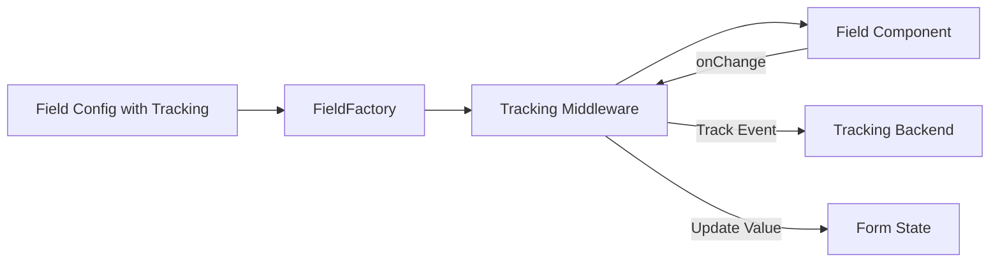

# Event Tracking Integration Plan
## Form Generation Library Enhancement

**Context**: Legacy LoanExtraInfoForm has comprehensive event tracking for analytics. Need to integrate tracking into the new form-generation library in a smart, reusable way.

---

## 🎯 Current Tracking Patterns

### Legacy Code Pattern
```typescript
// Direct tracking calls in event handlers
onChange={(value) => {
  eventTracking(EventType.lending_page_input_name, { name: value });
  setUserLoanData("full_name", value);
}}

onBlur={() => {
  if (valid) {
    eventTracking(EventType.lending_page_input_name_valid, { name: fullName });
  }
}}
```

**Problems**:
- ❌ Tightly coupled to business logic
- ❌ Repetitive code in every field
- ❌ Hard to maintain/update tracking
- ❌ Difficult to test

---

## ✨ Proposed Solution: Declarative Tracking Configuration

### Architecture Overview



### Key Principles

1. **Declarative**: Define tracking in field config, not code
2. **Decoupled**: Tracking is middleware, not part of field logic
3. **Flexible**: Support multiple tracking backends
4. **Type-Safe**: Full TypeScript support
5. **Opt-In**: Only track if configured

---

## 📐 Implementation Design

### 1. Field-Level Tracking Config

Add tracking configuration to [BaseFieldConfig](file:///Users/trung.ngo/Documents/projects/dop-fe/src/components/form-generation/types.ts#341-429):

```typescript
// types.ts

export interface FieldTrackingConfig {
  /**
   * Track input events (onChange)
   */
  trackInput?: {
    /**
     * Event name/type to track
     */
    eventName: string;
    
    /**
     * Transform value before tracking
     */
    transformValue?: (value: any) => any;
    
    /**
     * Additional static data to include
     */
    metadata?: Record<string, any>;
    
    /**
     * Debounce tracking (ms)
     */
    debounce?: number;
  };

  /**
   * Track validation success
   */
  trackValidation?: {
    eventName: string;
    transformValue?: (value: any) => any;
    metadata?: Record<string, any>;
  };

  /**
   * Track field blur events
   */
  trackBlur?: {
    eventName: string;
    transformValue?: (value: any) => any;
    metadata?: Record<string, any>;
  };

  /**
   * Track selection changes (for select/radio/checkbox)
   */
  trackSelection?: {
    eventName: string;
    transformValue?: (value: any) => any;
    metadata?: Record<string, any>;
  };

  /**
   * Custom tracking function
   */
  customTracking?: (event: FieldTrackingEvent) => void;
}

export interface FieldTrackingEvent {
  fieldId: string;
  fieldName: string;
  eventType: 'input' | 'validation' | 'blur' | 'selection' | 'focus';
  value: any;
  isValid?: boolean;
  metadata?: Record<string, any>;
}

export interface BaseFieldConfig {
  // ... existing fields
  
  /**
   * Tracking configuration
   */
  tracking?: FieldTrackingConfig;
}
```

---

### 2. Tracking Context Provider

```typescript
// tracking/TrackingProvider.tsx

import { createContext, useContext, useCallback } from 'react';
import type { FieldTrackingEvent } from '../types';

export interface TrackingBackend {
  /**
   * Track a generic event
   */
  trackEvent(eventName: string, data: Record<string, any>): void;
  
  /**
   * Track field-specific event
   */
  trackField(event: FieldTrackingEvent): void;
}

interface TrackingContextValue {
  backend?: TrackingBackend;
  enabled: boolean;
}

const TrackingContext = createContext<TrackingContextValue>({
  enabled: false,
});

export interface FormTrackingProviderProps {
  /**
   * Tracking backend implementation
   */
  backend?: TrackingBackend;
  
  /**
   * Enable/disable tracking
   */
  enabled?: boolean;
  
  children: React.ReactNode;
}

export function FormTrackingProvider({
  backend,
  enabled = true,
  children,
}: FormTrackingProviderProps) {
  return (
    <TrackingContext.Provider value={{ backend, enabled }}>
      {children}
    </TrackingContext.Provider>
  );
}

export function useFormTracking() {
  return useContext(TrackingContext);
}
```

---

### 3. Tracking Middleware Hook

```typescript
// tracking/useFieldTracking.ts

import { useCallback, useRef, useEffect } from 'react';
import { useFormTracking } from './TrackingProvider';
import type { FieldTrackingConfig, FieldTrackingEvent } from '../types';

export function useFieldTracking(
  fieldId: string,
  fieldName: string,
  trackingConfig?: FieldTrackingConfig
) {
  const { backend, enabled } = useFormTracking();
  const debounceTimers = useRef<Map<string, NodeJS.Timeout>>(new Map());

  // Cleanup timers on unmount
  useEffect(() => {
    return () => {
      debounceTimers.current.forEach(timer => clearTimeout(timer));
      debounceTimers.current.clear();
    };
  }, []);

  const trackEvent = useCallback(
    (event: FieldTrackingEvent) => {
      if (!enabled || !backend || !trackingConfig) return;

      // Call custom tracking if provided
      if (trackingConfig.customTracking) {
        trackingConfig.customTracking(event);
        return;
      }

      // Use backend tracking
      backend.trackField(event);
    },
    [enabled, backend, trackingConfig]
  );

  const trackInput = useCallback(
    (value: any) => {
      if (!trackingConfig?.trackInput) return;

      const { eventName, transformValue, metadata, debounce = 0 } = trackingConfig.trackInput;

      const performTracking = () => {
        const transformedValue = transformValue ? transformValue(value) : value;
        
        if (eventName) {
          backend?.trackEvent(eventName, {
            field_id: fieldId,
            field_name: fieldName,
            value: transformedValue,
            ...metadata,
          });
        }

        trackEvent({
          fieldId,
          fieldName,
          eventType: 'input',
          value: transformedValue,
          metadata,
        });
      };

      if (debounce > 0) {
        // Clear existing timer
        const existingTimer = debounceTimers.current.get('input');
        if (existingTimer) clearTimeout(existingTimer);

        // Set new timer
        const timer = setTimeout(performTracking, debounce);
        debounceTimers.current.set('input', timer);
      } else {
        performTracking();
      }
    },
    [trackingConfig, fieldId, fieldName, backend, trackEvent]
  );

  const trackValidation = useCallback(
    (value: any, isValid: boolean) => {
      if (!trackingConfig?.trackValidation || !isValid) return;

      const { eventName, transformValue, metadata } = trackingConfig.trackValidation;
      const transformedValue = transformValue ? transformValue(value) : value;

      if (eventName) {
        backend?.trackEvent(eventName, {
          field_id: fieldId,
          field_name: fieldName,
          value: transformedValue,
          ...metadata,
        });
      }

      trackEvent({
        fieldId,
        fieldName,
        eventType: 'validation',
        value: transformedValue,
        isValid,
        metadata,
      });
    },
    [trackingConfig, fieldId, fieldName, backend, trackEvent]
  );

  const trackBlur = useCallback(
    (value: any) => {
      if (!trackingConfig?.trackBlur) return;

      const { eventName, transformValue, metadata } = trackingConfig.trackBlur;
      const transformedValue = transformValue ? transformValue(value) : value;

      if (eventName) {
        backend?.trackEvent(eventName, {
          field_id: fieldId,
          field_name: fieldName,
          value: transformedValue,
          ...metadata,
        });
      }

      trackEvent({
        fieldId,
        fieldName,
        eventType: 'blur',
        value: transformedValue,
        metadata,
      });
    },
    [trackingConfig, fieldId, fieldName, backend, trackEvent]
  );

  const trackSelection = useCallback(
    (value: any) => {
      if (!trackingConfig?.trackSelection) return;

      const { eventName, transformValue, metadata } = trackingConfig.trackSelection;
      const transformedValue = transformValue ? transformValue(value) : value;

      if (eventName) {
        backend?.trackEvent(eventName, {
          field_id: fieldId,
          field_name: fieldName,
          value: transformedValue,
          ...metadata,
        });
      }

      trackEvent({
        fieldId,
        fieldName,
        eventType: 'selection',
        value: transformedValue,
        metadata,
      });
    },
    [trackingConfig, fieldId, fieldName, backend, trackEvent]
  );

  return {
    trackInput,
    trackValidation,
    trackBlur,
    trackSelection,
  };
}
```

---

### 4. Update FieldFactory

Integrate tracking into FieldFactory:

```typescript
// factory/FieldFactory.tsx (additions)

import { useFieldTracking } from '../tracking/useFieldTracking';

export function FieldFactory({
  field,
  value,
  onChange,
  onBlur,
  // ... other props
}: FieldFactoryProps) {
  // ... existing code

  // Initialize tracking
  const {
    trackInput,
    trackValidation,
    trackBlur,
    trackSelection,
  } = useFieldTracking(field.id, field.name, field.tracking);

  // Wrap onChange with tracking
  const handleChange = useCallback(
    (newValue: any) => {
      // Track input if configured
      trackInput(newValue);

      // Call original onChange
      onChange(newValue);
    },
    [onChange, trackInput]
  );

  // Wrap onBlur with tracking
  const handleBlur = useCallback(
    async () => {
      // Track blur if configured
      trackBlur(value);

      // Call original onBlur
      onBlur?.();

      // Validate and track validation success
      if (field.validation) {
        const result = await ValidationEngine.validateField(value, field.validation);
        if (result.valid) {
          trackValidation(value, true);
        }
      }
    },
    [onBlur, value, trackBlur, trackValidation, field.validation]
  );

  // For select/radio fields, track selection
  const handleSelectionChange = useCallback(
    (newValue: any) => {
      trackSelection(newValue);
      onChange(newValue);
    },
    [onChange, trackSelection]
  );

  // Determine which onChange handler to use
  const fieldOnChange = [FieldType.SELECT, FieldType.RADIO, FieldType.CHECKBOX].includes(field.type)
    ? handleSelectionChange
    : handleChange;

  // Pass to field component
  const fieldProps: FieldComponentProps = {
    field,
    value,
    onChange: fieldOnChange,
    onBlur: handleBlur,
    // ... other props
  };

  // ... rest of FieldFactory
}
```

---

### 5. Tracking Backend Adapter

Create adapter for existing tracking system:

```typescript
// tracking/adapters/LibTrackingAdapter.ts

import { trackEvent as libTrackEvent } from '@/lib/tracking';
import type { TrackingBackend, FieldTrackingEvent } from '../../types';

export class LibTrackingAdapter implements TrackingBackend {
  trackEvent(eventName: string, data: Record<string, any>): void {
    // Use existing tracking library
    libTrackEvent(eventName as any, data);
  }

  trackField(event: FieldTrackingEvent): void {
    // Map field events to library events
    const eventName = this.mapFieldEventToLibEvent(event);
    if (eventName) {
      this.trackEvent(eventName, {
        field_id: event.fieldId,
        field_name: event.fieldName,
        value: event.value,
        is_valid: event.isValid,
        ...event.metadata,
      });
    }
  }

  private mapFieldEventToLibEvent(event: FieldTrackingEvent): string | null {
    // Map generic field events to specific event names
    // This can be customized per project
    return `form_field_${event.eventType}`;
  }
}
```

---

## 🎯 Usage Example: Loan Wizard

```typescript
// app/[locale]/loan-wizard/page.tsx

import { FormTrackingProvider } from '@/components/form-generation/tracking/TrackingProvider';
import { LibTrackingAdapter } from '@/components/form-generation/tracking/adapters/LibTrackingAdapter';

const trackingBackend = new LibTrackingAdapter();

export default function LoanWizardPage() {
  const wizardConfig: DynamicFormConfig = {
    steps: [
      {
        id: "personal",
        fields: [
          {
            id: "full_name",
            type: FieldType.TEXT,
            label: "Họ và tên",
            
            // Declarative tracking config
            tracking: {
              trackInput: {
                eventName: "lending_page_input_name",
                debounce: 300, // Debounce for 300ms
              },
              trackValidation: {
                eventName: "lending_page_input_name_valid",
              },
            },
          },
          {
            id: "national_id",
            type: FieldType.TEXT,
            label: "Căn cước công dân",
            
            tracking: {
              trackInput: {
                eventName: "lending_page_input_nid",
                debounce: 300,
              },
              trackValidation: {
                eventName: "lending_page_input_nid_valid",
              },
            },
          },
          {
            id: "province",
            type: FieldType.SELECT,
            label: "Tỉnh thành",
            
            tracking: {
              trackSelection: {
                eventName: "lending_page_select_province",
                metadata: { step: "personal" },
              },
            },
          },
        ],
      },
    ],
  };

  return (
    <FormTrackingProvider backend={trackingBackend} enabled={true}>
      <FormThemeProvider theme={legacyLoanTheme}>
        <StepWizard config={wizardConfig} />
      </FormThemeProvider>
    </FormTrackingProvider>
  );
}
```

---

## 📋 Implementation Checklist

### Phase 1: Core Infrastructure (Week 1)
- [ ] Add `FieldTrackingConfig` to [types.ts](file:///Users/trung.ngo/Documents/projects/dop-fe/src/components/form-generation/types.ts)
- [ ] Create `TrackingProvider.tsx` with context
- [ ] Create `useFieldTracking.ts` hook
- [ ] Update [FieldFactory](file:///Users/trung.ngo/Documents/projects/dop-fe/src/components/form-generation/wizard/__tests__/StepWizard.test.tsx#9-20) to integrate tracking
- [ ] Create `LibTrackingAdapter.ts`

### Phase 2: Testing & Validation (Week 1)
- [ ] Unit tests for `useFieldTracking`
- [ ] Integration tests with DynamicForm
- [ ] Test debouncing behavior
- [ ] Test validation tracking

### Phase 3: Apply to Loan Wizard (Week 2)
- [ ] Add tracking config to all Loan Wizard fields
- [ ] Create custom tracking backend if needed
- [ ] Verify all events match legacy implementation
- [ ] Performance testing

### Phase 4: Documentation (Week 2)
- [ ] Update form-generation docs
- [ ] Add tracking examples
- [ ] Create migration guide from legacy

---

## ✅ Benefits

1. **Declarative**: Tracking config lives with field definition
2. **DRY**: No repetitive tracking code
3. **Type-Safe**: Full TypeScript support
4. **Testable**: Easy to mock tracking backend
5. **Flexible**: Support any tracking library
6. **Maintainable**: Change tracking without touching components
7. **Opt-In**: Only track configured fields
8. **Performance**: Built-in debouncing

---

## 🔄 Migration Path

### Before (Legacy)
```typescript
onChange={(value) => {
  eventTracking(EventType.lending_page_input_name, { name: value });
  setData("full_name", value);
}}
```

### After (New)
```typescript
{
  id: "full_name",
  type: FieldType.TEXT,
  tracking: {
    trackInput: {
      eventName: "lending_page_input_name",
    },
  },
}
```

**Result**: 90% less code, fully declarative, easy to maintain!
