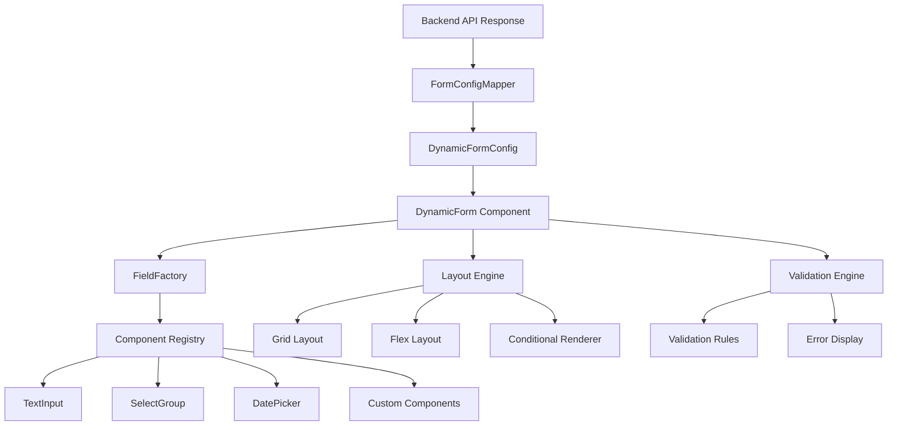

# Dynamic Form Generation System

A comprehensive, type-safe system for generating forms from backend configuration with complete UI control.

## User Review Required

> [!IMPORTANT]
> **Full UI Control Architecture**
> 
> This implementation provides complete control over:
> - **Field Rendering**: Custom components for each field type
> - **Layout Control**: Grid, flex, inline, and custom layouts
> - **Conditional Logic**: Field visibility, enabling/disabling based on conditions
> - **Styling**: Full control using **TailwindCSS** (already in project)
> - **Validation**: Custom validators with real-time feedback
> - **i18n**: Integrated with **next-intl** (already configured)
> 
> The system uses a **Factory Pattern** with **Component Registry** for maximum flexibility and extensibility.

> [!NOTE]
> **Project Integration**
> 
> - **Styling**: Uses existing TailwindCSS v4 with class-variance-authority (CVA) for component variants
> - **i18n**: Uses existing next-intl setup with custom cache system at `@/lib/i18n`
> - **Forms**: Uses existing react-hook-form + zod for validation
> - **Components**: Can leverage existing Radix UI components from `@/components/ui`

## Proposed Changes

### Architecture Overview



---

### Core Types & Configuration

#### [NEW] [types.ts](file:///Users/trung.ngo/Documents/projects/dop-fe/src/components/form-generation/types.ts)

Complete type definitions for the form generation system:

- **`FieldType`**: Enum for all supported field types (text, number, select, date, checkbox, radio, custom, etc.)
- **`LayoutType`**: Enum for layout options (grid, flex, inline, stack)
- **`ValidationRule`**: Type-safe validation rule interface
- **`FieldConfig`**: Base configuration for all fields with:
  - `id`, `name`, `label`, `type`
  - `placeholder`, `defaultValue`, `disabled`
  - `validation`: array of validation rules
  - `dependencies`: conditional logic based on other fields
  - `layout`: field-specific layout overrides
  - `className`, `style`: custom TailwindCSS classes and inline styles
  - **[i18n](file:///Users/trung.ngo/Documents/projects/dop-fe/src/i18n)**: Translation configuration:
    - `labelKey`: Custom translation key for label
    - `placeholderKey`: Custom translation key for placeholder
    - `helpKey`: Custom translation key for help text
    - `namespace`: Override default namespace
    - `enabled`: Enable/disable auto-translation (default: true)
- **`FormField`**: Union type of all specific field configurations
- **`FormSection`**: Groups of fields with layout control
- **`DynamicFormConfig`**: Complete form configuration including:
  - `fields`: array of FormField
  - `sections`: optional grouping
  - `layout`: global layout settings
  - `submitButton`: customization
  - `onSubmit`, `onChange`: callbacks
  - **[i18n](file:///Users/trung.ngo/Documents/projects/dop-fe/src/i18n)**: Form-level i18n config (namespace, locale)

---

### Mapper Layer

#### [NEW] [mappers/FormConfigMapper.ts](file:///Users/trung.ngo/Documents/projects/dop-fe/src/components/form-generation/mappers/FormConfigMapper.ts)

Transforms backend API responses to typed form configurations:

- **`mapApiToFormConfig(apiResponse: any): DynamicFormConfig`**
  - Validates and transforms API schema
  - Maps field types to internal field types
  - Applies default values and layout rules
  - Normalizes validation rules
- **`mapFieldValidation(apiValidation: any): ValidationRule[]`**
  - Converts backend validation to frontend format
- **`inferFieldType(apiField: any): FieldType`**
  - Smart field type detection from API schema
- Error handling for malformed API responses

---

### Component Registry & Factory

#### [NEW] [registry/ComponentRegistry.ts](file:///Users/trung.ngo/Documents/projects/dop-fe/src/components/form-generation/registry/ComponentRegistry.ts)

Centralized registry for field components:

- **Registry Interface**:
  ```typescript
  type FieldComponent = React.ComponentType<FieldComponentProps>
  
  class ComponentRegistry {
    register(type: FieldType, component: FieldComponent)
    get(type: FieldType): FieldComponent | undefined
    has(type: FieldType): boolean
    override(type: FieldType, component: FieldComponent)
  }
  ```
- Singleton pattern for global access
- Support for custom component registration
- Type-safe component props

#### [NEW] [factory/FieldFactory.tsx](file:///Users/trung.ngo/Documents/projects/dop-fe/src/components/form-generation/factory/FieldFactory.tsx)

Factory component for rendering fields:

- **`FieldFactory` Component**:
  - Receives `field: FormField` config
  - Looks up component from registry
  - Renders with proper props and error handling
  - Wraps with field wrapper (label, error message, help text)
- **`FieldWrapper`**: Common wrapper for all fields
  - Label rendering
  - Error message display
  - Help text
  - Required indicator
  - Custom className support

---

### UI Components Library

All components in `src/components/form-generation/fields/`:

#### [NEW] [fields/TextInput.tsx](file:///Users/trung.ngo/Documents/projects/dop-fe/src/components/form-generation/fields/TextInput.tsx)
- Text, email, password, url input types
- Character count
- Prefix/suffix icons
- Clear button

#### [NEW] [fields/NumberInput.tsx](file:///Users/trung.ngo/Documents/projects/dop-fe/src/components/form-generation/fields/NumberInput.tsx)
- Number input with step controls
- Min/max validation
- Currency formatting option
- Percentage mode

#### [NEW] [fields/SelectGroup.tsx](file:///Users/trung.ngo/Documents/projects/dop-fe/src/components/form-generation/fields/SelectGroup.tsx)
- Single/multi-select dropdown
- Searchable option
- Group support
- Custom option rendering

#### [NEW] [fields/DatePicker.tsx](file:///Users/trung.ngo/Documents/projects/dop-fe/src/components/form-generation/fields/DatePicker.tsx)
- Date/datetime/time picker
- Min/max date constraints
- Custom date formats

#### [NEW] [fields/CheckboxGroup.tsx](file:///Users/trung.ngo/Documents/projects/dop-fe/src/components/form-generation/fields/CheckboxGroup.tsx)
- Single checkbox
- Multiple checkboxes
- Select all option

#### [NEW] [fields/RadioGroup.tsx](file:///Users/trung.ngo/Documents/projects/dop-fe/src/components/form-generation/fields/RadioGroup.tsx)
- Radio button group
- Inline/stacked layout

#### [NEW] [fields/TextArea.tsx](file:///Users/trung.ngo/Documents/projects/dop-fe/src/components/form-generation/fields/TextArea.tsx)
- Multi-line text input
- Auto-resize option
- Character limit

---

### Layout System

#### [NEW] [layouts/LayoutEngine.tsx](file:///Users/trung.ngo/Documents/projects/dop-fe/src/components/form-generation/layouts/LayoutEngine.tsx)

Flexible layout engine for form fields:

- **Grid Layout**:
  - Configurable columns (1-12)
  - Responsive breakpoints
  - Gap control
  - Field spanning
  
- **Flex Layout**:
  - Direction (row/column)
  - Alignment options
  - Wrap control
  - Custom spacing

- **Conditional Rendering**:
  - Show/hide based on field values
  - Enable/disable fields
  - Dynamic required fields
  - Field dependencies

#### [NEW] [layouts/FormSection.tsx](file:///Users/trung.ngo/Documents/projects/dop-fe/src/components/form-generation/layouts/FormSection.tsx)
- Section grouping with title
- Collapsible sections
- Bordered/card styling
- Custom section layouts

---

### Validation System

#### [NEW] [validation/ValidationEngine.ts](file:///Users/trung.ngo/Documents/projects/dop-fe/src/components/form-generation/validation/ValidationEngine.ts)

Type-safe validation framework:

- **Built-in Validators**:
  - `required`, `minLength`, `maxLength`
  - `pattern` (regex)
  - `email`, `url`, `phone`
  - `min`, `max` (numbers)
  - `minDate`, `maxDate`
  - Custom validator functions

- **Validation Engine**:
  - Field-level validation
  - Form-level validation
  - Async validation support
  - Dependent field validation
  - Real-time vs. on-blur validation

#### [NEW] [validation/validators.ts](file:///Users/trung.ngo/Documents/projects/dop-fe/src/components/form-generation/validation/validators.ts)
- Pre-built validator functions
- Composable validators
- Custom error messages
- i18n support for messages

---

### Main Form Component

#### [NEW] [DynamicForm.tsx](file:///Users/trung.ngo/Documents/projects/dop-fe/src/components/form-generation/DynamicForm.tsx)

Main orchestrator component:

- Receives `DynamicFormConfig`
- Manages form state (using React Hook Form or custom)
- Renders sections and fields using FieldFactory
- Handles validation
- Manages submission
- Provides form context for field communication
- Loading and error states

---

### Example Implementation

#### [NEW] [examples/LoanExtraInfoForm.tsx](file:///Users/trung.ngo/Documents/projects/dop-fe/src/components/form-generation/examples/LoanExtraInfoForm.tsx)

Example usage with loan extra info:

- Fetches config from backend API
- Uses FormConfigMapper to transform
- Renders DynamicForm with config
- Custom submit handler
- Error handling

---

### Utilities & Hooks

#### [NEW] [hooks/useFormConfig.ts](file:///Users/trung.ngo/Documents/projects/dop-fe/src/components/form-generation/hooks/useFormConfig.ts)
- Hook for fetching and caching form configs
- Loading and error states
- Config validation

#### [NEW] [utils/formHelpers.ts](file:///Users/trung.ngo/Documents/projects/dop-fe/src/components/form-generation/utils/formHelpers.ts)
- Field ID generation
- Value transformations
- Deep merge utilities
- Type guards

---

### Styling & Theming

#### [NEW] [styles/variants.ts](file:///Users/trung.ngo/Documents/projects/dop-fe/src/components/form-generation/styles/variants.ts)

Component variants using TailwindCSS and CVA:

- **Field Wrapper Variants**:
  ```typescript
  const fieldWrapperVariants = cva(
    "flex flex-col gap-1.5 w-full",
    {
      variants: {
        size: {
          sm: "text-sm",
          md: "text-base",
          lg: "text-lg"
        },
        variant: {
          default: "",
          inline: "flex-row items-center gap-4"
        }
      },
      defaultVariants: {
        size: "md",
        variant: "default"
      }
    }
  )
  ```

- **Input Variants**: Shared input styling for consistency
- **Label Variants**: Different label styles (default, inline, floating)
- **Error Variants**: Error message styling
- **Helper Text Variants**: Help text styling

Each component uses TailwindCSS classes with variant control for maximum flexibility.

---

### i18n Integration

#### [NEW] [i18n/useFormTranslations.ts](file:///Users/trung.ngo/Documents/projects/dop-fe/src/components/form-generation/i18n/useFormTranslations.ts)

Hook for form field translations using next-intl:

- **`useFormTranslations(namespace?: string)`**:
  - Gets translations for form labels, placeholders, errors
  - Uses existing `next-intl` setup
  - Caches translations using `@/lib/i18n` cache system
  - Format: `forms.{namespace}.{fieldId}.label`

#### [NEW] [i18n/translations.ts](file:///Users/trung.ngo/Documents/projects/dop-fe/src/components/form-generation/i18n/translations.ts)

Translation key generators and utilities:

- **Key Generation**:
  ```typescript
  // Generate translation keys
  getFieldLabel(namespace, fieldId) → 'forms.{namespace}.{fieldId}.label'
  getFieldPlaceholder(namespace, fieldId) → 'forms.{namespace}.{fieldId}.placeholder'
  getFieldError(namespace, fieldId, errorType) → 'forms.{namespace}.{fieldId}.errors.{errorType}'
  getValidationMessage(rule) → 'forms.validation.{rule}'
  ```

- **Translation Structure**:
  ```json
  {
    "forms": {
      "loan": {
        "amount": {
          "label": "Loan Amount",
          "placeholder": "Enter amount",
          "help": "Amount you want to borrow",
          "errors": {
            "required": "Amount is required",
            "min": "Minimum amount is ${min}",
            "max": "Maximum amount is ${max}"
          }
        }
      },
      "validation": {
        "required": "This field is required",
        "email": "Please enter a valid email",
        "minLength": "Minimum {min} characters required"
      }
    }
  }
  ```

- **Fallback Support**: Returns field ID if translation missing
- **Dynamic Interpolation**: Supports variables in error messages

#### [NEW] [i18n/FormTranslationProvider.tsx](file:///Users/trung.ngo/Documents/projects/dop-fe/src/components/form-generation/i18n/FormTranslationProvider.tsx)

Context provider for form-level translation configuration:

- Sets default namespace for all fields
- Provides translation helpers to child components
- Handles locale switching
- Pre-warms cache with common form translations

---

### Index & Exports

#### [NEW] [index.ts](file:///Users/trung.ngo/Documents/projects/dop-fe/src/components/form-generation/index.ts)

Clean public API:
```typescript
export { DynamicForm } from './DynamicForm'
export { FormConfigMapper } from './mappers/FormConfigMapper'
export { ComponentRegistry } from './registry/ComponentRegistry'
export type * from './types'
```

## Verification Plan

### Automated Tests

```bash
# Unit tests for mapper
npm test -- FormConfigMapper.test.ts

# Component tests
npm test -- FieldFactory.test.tsx
npm test -- DynamicForm.test.tsx

# Validation tests
npm test -- ValidationEngine.test.ts
```

### Manual Verification

1. **Create Mock API Response**
   - Create example backend response JSON
   - Test mapper transformation

2. **Test Field Rendering**
   - Verify all field types render correctly
   - Test validation display
   - Check error states

3. **Test Layout Control**
   - Grid layouts with different columns
   - Flex layouts with different directions
   - Conditional field visibility

4. **Test Form Submission**
   - Valid data submission
   - Validation error handling
   - Loading states

5. **Test Custom Components**
   - Register custom field type
   - Verify rendering and validation

### Example Configuration

Create a comprehensive example with:
- Multiple field types
- Complex validation rules
- Conditional logic
- Custom layouts
- Sections and grouping
